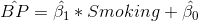
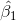
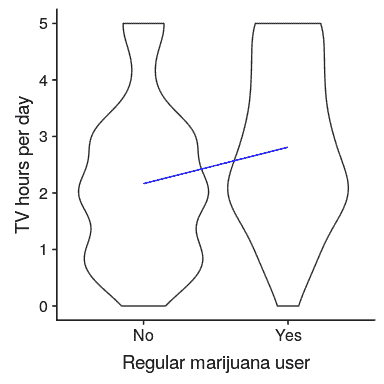
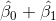
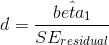
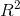

## 15.2 t 检验作为线性模型

t 检验是比较平均值的一种专用工具，但也可以看作是一般线性模型的一种应用。在这种情况下，模型如下所示：



然而，吸烟是一个二元变量，因此我们将其作为一个 _ 虚拟变量 _，正如我们在上一章中讨论的那样，将其设置为吸烟者为 1，不吸烟者为零。在这种情况下，只是两组之间平均值的差，是编码为零的组的平均值。我们可以使用`lm()`函数来拟合这个模型，并看到它给出与上面的 t 检验相同的 t 统计量：

```r
# print summary of linear regression to perform t-test
s <- summary(lm(TVHrsNum ~ RegularMarij, data = NHANES_sample))
s
```

```r
## 
## Call:
## lm(formula = TVHrsNum ~ RegularMarij, data = NHANES_sample)
## 
## Residuals:
##    Min     1Q Median     3Q    Max 
## -2.810 -1.165 -0.166  0.835  2.834 
## 
## Coefficients:
##                 Estimate Std. Error t value Pr(>|t|)    
## (Intercept)        2.165      0.115   18.86   <2e-16 ***
## RegularMarijYes    0.645      0.213    3.02   0.0028 ** 
## ---
## Signif. codes:  0 '***' 0.001 '**' 0.01 '*' 0.05 '.' 0.1 ' ' 1
## 
## Residual standard error: 1.4 on 198 degrees of freedom
## Multiple R-squared:  0.0441, Adjusted R-squared:  0.0393 
## F-statistic: 9.14 on 1 and 198 DF,  p-value: 0.00282
```

我们还可以以图形方式查看 lm（）结果（参见图[15.2](#fig:ttestFig)）：



图 15.2 显示每组数据的小提琴图，蓝色线连接每组的预测值，根据线性模型的结果计算。

在这种情况下，不吸烟者的预测值为（2.17），吸烟者的预测值为（2.81）。

为了计算这个分析的标准误差，我们可以使用与线性回归完全相同的方程——因为这实际上只是线性回归的另一个例子。事实上，如果将上述 t 检验中的 p 值与大麻使用变量的线性回归分析中的 p 值进行比较，您会发现线性回归分析中的 p 值正好是 t 检验中的 p 值的两倍，因为线性回归分析正在执行双尾测试。

### 15.2.1 比较两种方法的效果大小

两种方法之间比较最常用的效果大小是 Cohen's D（如您在第[10](#ci-effect-size-power)章中所记得的），它是用标准误差单位表示效果的表达式。对于使用上文概述的一般线性模型（即使用单个虚拟编码变量）估计的 t 检验，其表示为：



我们可以从上面的分析输出中获得这些值，得出 d=0.47，我们通常将其解释为中等大小的效果。

我们也可以计算这个分析的，它告诉我们看电视的差异有多大。这个值（在 lm（）分析的摘要中报告）是 0.04，这告诉我们，虽然效果在统计上有显著意义，但它在电视观看方面的差异相对较小。