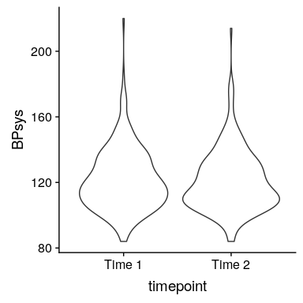
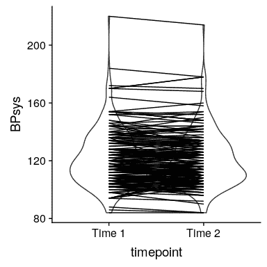
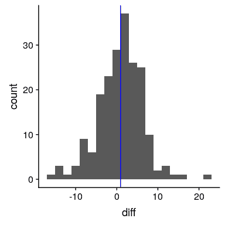
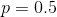

## 15.4 配对 t 检验

在实验研究中，我们经常在受试者设计中使用 _，在设计中我们比较同一个人的多个测量值。例如，在 nhanes 数据集中，血压测量了三次。假设我们有兴趣测试第一次和第二次测量之间的平均血压是否存在差异（图[15.3](#fig:BPfig)）。_



图 15.3 NHANES 第一次和第二次记录的收缩压小提琴图。

我们发现，在不同的时间点（大约一点）之间，平均血压似乎没有太大的差异。首先，让我们使用一个独立的样本 t 检验来测试差异，它忽略了数据点对来自同一个人的事实。

```r
t.test(
  BPsys ~ timepoint,
  data = NHANES_sample_tidy,
  paired = FALSE, 
  var.equal = TRUE
)
```

```r
## 
##  Two Sample t-test
## 
## data:  BPsys by timepoint
## t = 0.5, df = 400, p-value = 0.6
## alternative hypothesis: true difference in means is not equal to 0
## 95 percent confidence interval:
##  -2.8  4.6
## sample estimates:
## mean in group BPSys1 mean in group BPSys2 
##                  122                  121
```

这一分析显示没有显著差异。然而，这种分析是不适当的，因为它假定两个样本是独立的，而事实上它们不是独立的，因为数据来自同一个人。我们可以用每一个人的一行来绘制数据来显示这一点（参见图[15.4](#fig:BPLinePlot)）。



图 15.4 每一次记录的收缩压小提琴图，每一次记录的两个数据点之间都有连接线。

在这个分析中，我们真正关心的是两次测量之间每个人的血压是否有系统的变化，所以表示数据的另一种方法是计算每个人的两个时间点之间的差异，然后分析这些差异。而不是分析单个测量值。在图[15.5](#fig:BPDiffHist)中，我们显示了这些差异分数的柱状图，蓝色线表示平均差异。



图 15.5 第一次和第二次血压测量的差分柱状图。

### 15.4.1 标志试验

测试差异的一个简单方法是使用一个名为 _ 符号测试 _ 的测试，它询问正差异的比例（忽略它们的大小）是否不同于我们所期望的偶然性。为了做到这一点，我们利用这些差异计算它们的符号，然后我们使用二项式测试来询问阳性符号的比例是否与 0.5 不同。

```r
# compute sign test for differences between first and second measurement
npos <- sum(NHANES_sample$diffPos)
bt <- binom.test(npos, nrow(NHANES_sample))
bt
```

```r
## 
##  Exact binomial test
## 
## data:  npos and nrow(NHANES_sample)
## number of successes = 100, number of trials = 200, p-value = 0.4
## alternative hypothesis: true probability of success is not equal to 0.5
## 95 percent confidence interval:
##  0.46 0.60
## sample estimates:
## probability of success 
##                   0.53
```

在这里我们看到，在无效假设下，有阳性迹象的个体比例（0.53）不足以令人惊讶。然而，符号测试的一个问题是它丢弃了关于差异大小的信息，因此可能遗漏了一些东西。

### 15.4.2 配对 t 检验

更常见的策略是使用 _ 对 t 检验 _，这相当于一个样本 t 检验，以确定测量值之间的平均差是否为零。我们可以使用 r 中的`t.test()`函数和设置`paired=TRUE`来计算这个值。

```r
# compute paired t-test
t.test(BPsys ~ timepoint, data = NHANES_sample_tidy, paired = TRUE)
```

```r
## 
##  Paired t-test
## 
## data:  BPsys by timepoint
## t = 2, df = 200, p-value = 0.02
## alternative hypothesis: true difference in means is not equal to 0
## 95 percent confidence interval:
##  0.17 1.69
## sample estimates:
## mean of the differences 
##                    0.93
```

通过这些分析，我们发现两个测量值实际上存在显著差异。让我们计算一下贝叶斯因子，看看这种影响有多强：

```r
# compute Bayes factor for paired t-test
ttestBF(x = NHANES_sample$BPSys1, y = NHANES_sample$BPSys2, paired = TRUE)
```

```r
## Bayes factor analysis
## --------------
## [1] Alt., r=0.707 : 1.3 ±0%
## 
## Against denominator:
##   Null, mu = 0 
## ---
## Bayes factor type: BFoneSample, JZS
```

这表明，虽然在配对 t 检验中效果显著，但实际上它几乎没有提供支持替代假设的证据。

### 15.4.3 配对 t 检验作为线性模型

我们也可以用一般线性模型来定义配对 t 检验。为了做到这一点，我们将每个主题的所有度量都作为数据点（在整洁的数据框架内）。然后，我们在模型中包含一个变量，该变量编码每个人的身份（在本例中，是包含每个人的主题 ID 的 ID 变量）。这被称为 _ 混合模型 _，因为它包括独立变量的影响以及个体的影响。标准模型拟合程序`lm()`不能做到这一点，但我们可以使用流行的 R 包 _lme4_ 中的`lmer()`函数来实现这一点，该包专门用于估计混合模型。公式中的`(1|ID)`告诉`lmer()`为`ID`变量的每个值（即数据集中的每个个体）估计一个单独的截距（即`1`所指的截距），然后估计一个与 bp 相关的公共斜率。

```r
# compute mixed model for paired test

lmrResult <- lmer(BPsys ~ timepoint + (1 | ID), data = NHANES_sample_tidy)
summary(lmrResult)
```

```r
## Linear mixed model fit by REML. t-tests use Satterthwaite's method [
## lmerModLmerTest]
## Formula: BPsys ~ timepoint + (1 | ID)
##    Data: NHANES_sample_tidy
## 
## REML criterion at convergence: 2982
## 
## Scaled residuals: 
##     Min      1Q  Median      3Q     Max 
## -2.6985 -0.4478  0.0058  0.3996  2.7395 
## 
## Random effects:
##  Groups   Name        Variance Std.Dev.
##  ID       (Intercept) 342      18.49   
##  Residual              15       3.87   
## Number of obs: 400, groups:  ID, 200
## 
## Fixed effects:
##                 Estimate Std. Error      df t value Pr(>|t|)    
## (Intercept)      121.770      1.336 207.545    91.2   <2e-16 ***
## timepointBPSys2   -0.930      0.387 199.000    -2.4    0.017 *  
## ---
## Signif. codes:  0 '***' 0.001 '**' 0.01 '*' 0.05 '.' 0.1 ' ' 1
## 
## Correlation of Fixed Effects:
##             (Intr)
## tmpntBPSys2 -0.145
```

您可以看到，这向我们显示了一个 p 值，它非常接近于使用`t.test()`函数计算的成对 t 检验的结果。