## 17.3 科学中的再现性危机

人们可能希望布莱恩·万辛克是一个罕见的异类，但越来越清楚的是，在科学中，再现性问题比以前想象的要普遍得多。这一点在 2015 年变得清晰起来，当时一大群研究人员在名为“评估心理科学的再现性”的杂志 _Science_ 上发表了一项研究（开放科学合作 2015）。在这项研究中，研究者们选取了 100 项已发表的心理学研究成果，并试图复制论文最初报道的结果。他们的发现令人震惊：尽管 97%的原始论文报告了具有统计学意义的发现，但在复制研究中只有 37%的这些影响具有统计学意义。尽管心理学中的这些问题受到了广泛关注，但它们似乎存在于几乎所有科学领域，从癌症生物学（Errington 等人 2014 年）和化学（Baker 2017 年）到经济学（Christensen 和 Miguel 2016 年）和社会科学（Camerer 等人 2018 年）。

2010 年之后出现的再现性危机实际上是由斯坦福大学的一位医生约翰·伊奥尼迪斯预测的，他在 2005 年写了一篇题为“为什么大多数发表的研究结果都是错误的”（伊奥尼迪斯，2005 年）的论文。在本文中，伊奥尼迪斯认为，在现代科学的背景下使用零假设统计检验必然会导致高水平的错误结果。

### 17.3.1 阳性预测值及统计意义

ioannidis 的分析侧重于一个被称为 _ 阳性预测值 _ 的概念，定义为阳性结果（通常翻译为“统计显著结果”）的比例，这是正确的：

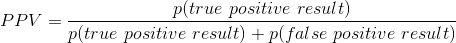

假设我们知道我们的假设是正确的概率（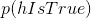），那么一个真正的正结果的概率就是乘以研究的统计能力：

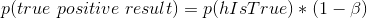

were为假阴性率。假阳性结果的概率由和假阳性率决定：

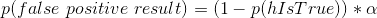

PPV 的定义如下：

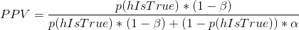

我们先举一个例子，假设为真的概率很高，比如说 0.8——但是请注意，一般来说，我们不能真正知道这个概率。假设我们使用标准值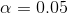和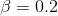进行研究。我们可以将 ppv 计算为：

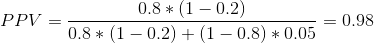

这意味着，如果我们在一项假设很可能是真实的、权力很高的研究中发现一个积极的结果，那么它成为真实的可能性很高。然而，请注意，假设具有如此高的真实可能性的研究领域可能不是一个非常有趣的研究领域；当研究告诉我们一些新的东西时，它是最重要的！

让我们对一个字段进行相同的分析，其中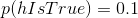——也就是说，测试的大多数假设都是错误的。在这种情况下，PPV 是：

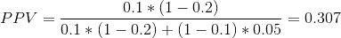

这意味着，在一个大多数假设都可能是错误的领域（也就是说，一个有趣的科学领域，研究人员正在测试风险假设），即使我们发现了一个积极的结果，也更可能是错误的，而不是真的！事实上，这只是我们在假设检验中讨论的基础利率效应的另一个例子——当结果不太可能出现时，几乎可以肯定的是，大多数积极的结果将是假阳性。

我们可以模拟这一点，以显示 ppv 与统计功率的关系，作为假设为真的先验概率的函数（参见图[17.1](#fig:PPVsim)）

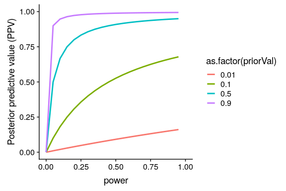

图 17.1 后验预测值作为统计功率函数（绘制在 x 轴上）的模拟，假设的前验概率为真（绘制为单独的线）。

不幸的是，许多科学领域的统计能力仍然很低（Smaldino 和 McElreath，2016 年），这表明许多已发表的研究结果都是错误的。

### 17.3.2 胜利者的诅咒

另一种错误也可能发生在统计能力较低的时候：我们对影响大小的估计将被夸大。这种现象经常被称为“赢家的诅咒”，它来自经济学，它指的是，对于某些类型的拍卖（每个人的价值都是一样的，就像一罐 25 美分的硬币，而竞拍是私人的），赢家几乎总是支付比好的东西更高的价格。.在科学中，赢家的诅咒是指根据重大结果（即赢家）估计的效果大小几乎总是高估真实效果大小的事实。

我们可以对此进行模拟，以了解重要结果的估计效果大小与实际潜在效果大小之间的关系。让我们生成真实效果大小为 0.2 的数据，并在检测到显著效果的情况下估计这些结果的效果大小。图[17.2](#fig:CurseSim)显示，当功率较低时，与实际效果大小相比，显著结果的估计效果大小可能会大大膨胀。

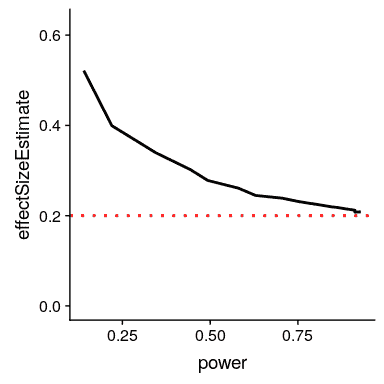

图 17.2 胜利者诅咒作为统计幂函数（x 轴）的模拟。黑线显示估计的效果大小，红色虚线显示实际的效果大小。

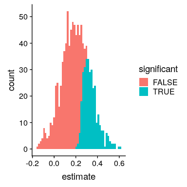

图 17.3 一个柱状图，显示数据集中若干样本的样本大小，显著结果以蓝色显示，非显著结果以红色显示。

我们可以通过一个模拟来了解为什么会出现这种情况。在图[17.3](#fig:curseSimSingle)中，您可以看到 1000 个样本的估计效果大小的柱状图，通过测试是否具有统计意义来分隔。从图中可以清楚地看到，如果我们仅仅根据显著的结果来估计效果大小，那么我们的估计就会膨胀；只有当大多数结果都是显著的（即功率高，效果相对较大）时，我们的估计才会接近实际的效果大小。