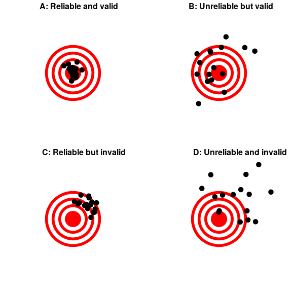

## 2.3 什么是良好的测量？

在心理学等许多领域，我们所测量的不是物理特征，而是一个不可观测的理论概念，我们通常称之为 _ 结构 _。例如，假设我想测试一下您对上述四种不同测量尺度之间的区别有多了解。我可以给你一个弹出测试，问你几个关于这些概念的问题，并计算你有多少是正确的。这个测试可能是或者可能不是对你实际知识结构的一个很好的度量——例如，如果我用一种令人困惑的方式编写测试或者使用你不理解的语言，那么这个测试可能会建议你在真正的时候不理解这些概念。另一方面，如果我给你一个有着非常明显错误答案的多选测试，那么你可能在测试中表现得很好，即使你并不真正理解材料。

在没有一定误差的情况下，通常不可能测量结构。在上面的例子中，您可能知道答案，但您可能误读了问题并弄错了。在其他情况下，被测物本身存在误差，例如，当我们测量一个人在一个简单的反应时间测试中需要多长时间做出反应时，由于许多原因，从一个试验到另一个试验都会有所不同。我们通常希望我们的测量误差尽可能低。

有时有一个标准可以用来测试其他的测量，我们可以称之为“黄金标准”——例如，睡眠的测量可以用许多不同的设备（例如测量床上运动的设备）来完成，但它们通常被认为不如多导睡眠图的黄金标准（使用脑电波测量来量化一个人在睡眠的每个阶段所花费的时间）。通常金本位制的执行难度更大或成本更高，即使可能存在更大的误差，也会使用更便宜的方法。

当我们思考什么是一个好的度量时，我们通常会区分一个好度量的两个不同方面。

### 2.3.1_ 可靠性 _

可靠性量化了我们测量结果的一致性。一种常见的可靠性形式被称为“测试-再测试可靠性”，它测量如果相同的测量进行两次，测量结果的一致性。例如，我可能会给你一份关于你今天对统计的态度的调查问卷，明天重复同样的调查问卷，并在两天内比较你的答案；我们希望它们彼此非常相似，除非在两次测试之间发生了一些应该改变了你对统计的看法（比如读这本书！）.

另一种评估可靠性的方法是在数据包括主观判断的情况下。例如，假设一个研究人员想确定一种治疗是否会改变自闭症儿童与其他儿童的互动程度，这是通过让专家观察儿童并对他们与其他儿童的互动进行评级来衡量的。在这种情况下，我们希望确保答案不依赖于评级机构——也就是说，我们希望有高 _ 的评级机构间可靠性 _。这可以通过让多个评级者执行评级来评估，然后比较他们的评级，以确保他们之间的一致性。

如果我们想将一个测量值与另一个测量值进行比较，可靠性是很重要的。两个不同测量值之间的关系不能比两个测量值之间的关系强（即其可靠性）。这意味着一个不可靠的度量永远不会与任何其他度量有很强的统计关系。因此，研究人员开发一种新的测量方法（如一项新的调查），通常会花很大的时间来测试它的可靠性。

图 2.1 使用靶心射击，显示可靠性和有效性之间的区别的图。可靠性是指射击位置的一致性，有效性是指射击相对于靶心的准确性。

### 2.3.2_ 有效性 _

可靠性很重要，但就其本身而言还不够：毕竟，我可以用一个数字对每个答案进行编码，从而在人格测试中创建一个高度可靠的衡量标准，不管这个人如何回答。我们希望我们的测量结果也是 _ 有效的 _——也就是说，我们希望确保我们实际测量的是我们认为我们正在测量的构造（图[2.1](#fig:ReliabilityValidity)）。有许多不同类型的有效性被普遍讨论；我们将集中讨论其中的三种。

_ 人脸有效性 _。测量值在表面上有意义吗？如果我告诉你我要通过观察一个人的舌头的颜色来测量他的血压，你可能会认为这不是一个有效的测量方法。另一方面，使用血压袖带将具有面部有效性。这通常是我们深入到更复杂的有效性方面之前的第一个现实检查。

_ 构造有效性 _。测量是否以适当的方式与其他测量相关？这通常被细分为两个方面。_ 收敛有效性 _ 意味着度量应该与其他被认为反映相同构造的度量密切相关。假设我有兴趣通过问卷调查或面试来衡量一个人的外向程度。如果这两个不同的度量值彼此密切相关，则可以证明收敛有效性。另一方面，被认为反映不同结构的度量应该是不相关的，即 _ 发散效度 _。如果我的人格理论认为外向性和责任感是两个不同的结构，那么我也应该看到我对外向性的测量与责任感的测量是无关的。

_ 预测有效性 _。如果我们的测量结果确实有效，那么它们也应该是对其他结果的预测。例如，假设我们认为，情感寻求的心理特征（对新体验的渴望）与现实世界中的冒险有关。为了检验感觉寻求测量的预测有效性，我们将在一项不同的测量现实风险的调查中，测试测试分数对预测分数的影响。