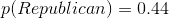
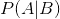
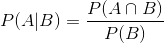

## 3.4 条件概率

到目前为止，我们只局限于简单的概率——即单个事件或事件组合的概率。然而，我们通常希望确定某些事件发生的概率，因为已经发生了一些其他事件，这些事件被称为 _ 条件概率 _。

让我们以 2016 年美国总统大选为例。我们可以用两个简单的概率来描述选民。首先，我们知道美国选民与共和党有关联的可能性：。我们也知道选民投票支持唐纳德·特朗普的可能性。但是，假设我们想知道以下情况：一个人投给唐纳德·特朗普（Donald Trump）的票的概率是多少，因为他们是共和党人？

要计算给定 b 的条件概率（我们写为，“a 的概率，给定 b”），我们需要知道 _ 联合概率 _（即概率 a 和 b）以及 b 的总体概率：

也就是说，我们想知道两件事都是真的概率，前提是被制约的一件事是真的。

图 3.4 条件概率的图形描述，显示了条件概率如何限制我们对数据子集的分析。

从图形的角度考虑这一点很有用。图[3.4](#fig:conditionalProbability)显示了一个流程图，描绘了全体选民如何分解为共和党和民主党，以及条件概率（对政党的条件）如何根据他们的投票进一步分解每一个政党的成员。