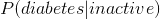
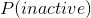

## 3.5 根据数据计算条件概率

对于本课程中的许多例子，我们将使用从国家健康和营养检查调查（NHANES）获得的数据。NHANES 是美国疾病控制中心组织的一项正在进行的大型研究，旨在全面了解美国成人和儿童的健康和营养状况。每年，这项调查都会通过访谈和身体和医学测试，对美国大约 5000 人的样本进行调查。nhanes 数据作为一个包包含在 r 中，使其易于访问和使用。它还为我们提供了一个大型的、现实的数据集，作为许多不同统计工具的示例。

假设我们对以下问题很感兴趣：考虑到某人身体不活跃，他们患糖尿病的可能性有多大？--这就是。nhanes 记录了两个变量，解决了这个问题的两个部分。第一个（`Diabetes`）询问患者是否被告知患有糖尿病，第二个（`PhysActive`）记录患者是否从事至少中等强度的运动、健身或娱乐活动。我们先计算一下简单的概率。

```r
# Summarize NHANES data for diabetes and physical activity

# drop duplicated IDs within the NHANES dataset
NHANES_diabetes_activity <- 
  NHANES %>% 
  distinct(ID, .keep_all = TRUE) %>% 
  drop_na(PhysActive, Diabetes)

pander('Summary data for diabetes')
```

糖尿病汇总数据

```r
NHANES_diabetes_activity %>%
  count(Diabetes) %>% 
  mutate(
    prob = n / sum(n)
  ) %>% 
  pander()
```

<colgroup><col style="width: 15%"> <col style="width: 9%"> <col style="width: 9%"></colgroup> 
| 糖尿病 | N 号 | 问题 |
| --- | --- | --- |
| 不 | 4893 个 | 0.899 个 |
| 是的 | 550 个 | 0.101 个 |

```r
pander('Summary data for physical activity')
```

体育活动汇总数据

```r
NHANES_diabetes_activity %>%
  count(PhysActive) %>%
  mutate(
    prob = n / sum(n)
  ) %>% 
  pander()
```

<colgroup><col style="width: 18%"> <col style="width: 9%"> <col style="width: 9%"></colgroup> 
| 物理激活 | n | prob |
| --- | --- | --- |
| No | 2472 个 | 0.454 个 |
| Yes | 2971 年 | 0.546 个 |

这表明 nhanes 数据集中的某个人患糖尿病的概率是 0.101，而某个人不活跃的概率是 0.454。

为了计算，我们还需要知道糖尿病 _ 和 _ 不活动的联合概率，除了以下两种情况的简单概率：

```r
# compute joint probabilities for diabetes and physical activity

NHANES_diabetes_stats_by_activity <- 
  NHANES_diabetes_activity %>% 
  count(Diabetes, PhysActive) %>% 
  mutate(
    prob = n / sum(n)
  ) 

pander(NHANES_diabetes_stats_by_activity)
```

<colgroup><col style="width: 15%"> <col style="width: 18%"> <col style="width: 9%"> <col style="width: 9%"></colgroup> 
| Diabetes | PhysActive | n | prob |
| --- | --- | --- | --- |
| No | No | 2123 个 | 0.39 分 |
| No | Yes | 2770 个 | 0.509 个 |
| Yes | No | 349 个 | 0.064 个 |
| Yes | Yes | 201 年 | 0.037 个 |

基于这些联合概率，我们可以计算：

```r
# compute conditional probability p(diabetes|inactive)

P_inactive <- 
  NHANES_diabetes_activity %>% 
  summarise(
    mean(PhysActive == "No")
  ) %>% 
  pull()

P_diabetes_and_inactive <-
  NHANES_diabetes_stats_by_activity %>% 
  dplyr::filter(Diabetes == "Yes", PhysActive == "No") %>% 
  pull(prob)

P_diabetes_given_inactive <-
  P_diabetes_and_inactive / P_inactive

P_diabetes_given_inactive
```

```r
## [1] 0.1411812
```

该块中的第一行代码通过测试每个独立的 physactive 变量是否等于“no”来计算。这个技巧是有效的，因为 r 将真/假值分别视为 1/0；因此，如果我们想知道某个事件的可能性，我们可以生成一个布尔变量来测试该事件，然后简单地取该变量的平均值。然后我们用这个值来计算条件概率，我们发现一个人患糖尿病的概率是 0.141。