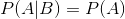
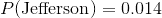
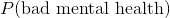
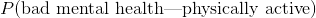

## 3.6 独立性

“独立”一词在统计学中有着非常具体的含义，这与该词的常用用法有些不同。两个变量之间的统计独立性意味着知道一个变量的值并不能告诉我们关于另一个变量的值。这可以表示为：



也就是说，给定某个 b 值的概率与 a 的总体概率相同。这样看，我们看到世界上许多我们称之为“独立”的情况实际上并不是统计上独立的。例如，目前有一个由加利福尼亚州公民组成的小组宣布成立一个新的独立州杰斐逊，该州将包括加利福尼亚州北部和俄勒冈州的一些县。如果发生这种情况，那么当前加利福尼亚州居民现在居住在杰斐逊州的概率将是，而他们仍然是加利福尼亚州居民的概率将是。新的国家在政治上可能是独立的，但他们在统计上不会是独立的，因为（HTG4）！也就是说，虽然公共语言中的独立性通常指的是排他的集合，但是统计独立性指的是这样一种情况，即人们不能从另一个变量的值中预测关于一个变量的任何东西。例如，知道一个人的头发颜色不太可能告诉你他们喜欢巧克力还是草莓冰淇淋。

让我们来看另一个例子，使用 nhanes 数据：身体健康和心理健康是相互独立的吗？NHANES 包括两个相关问题：【htg0】physactive【htg1】，询问个人是否有体力活动；以及【htg2】daysmenthlthbad【htg3】，询问个人在过去 30 天中有多少天的精神健康状况不佳。我们将定义一个新的变量，称为“不良心理健康”，即在上个月有超过 7 天的不良心理健康，然后通过询问简单的不良心理健康概率是否与不良心理健康的条件概率不同来确定它们是否独立。即使身体很活跃。

```r
# compute probabilities for mental health and physical activity
NHANES_adult <- 
  NHANES %>%
  dplyr::filter(
    Age >= 18,
    !is.na(PhysActive),
    !is.na(DaysMentHlthBad)
  ) %>% 
  mutate(badMentalHealth = DaysMentHlthBad > 7)

NHANES_MentalHealth_summary <-
  NHANES_adult %>%
  summarize(badMentalHealth = mean(badMentalHealth))

pander(NHANES_MentalHealth_summary)
```

<colgroup><col style="width: 23%"></colgroup> 
| 心理健康 |
| --- |
| 0.164 个 |

```r
NHANES_MentalHealth_by_PhysActive <-
  NHANES_adult %>%
  group_by(PhysActive) %>%
  summarize(badMentalHealth = mean(badMentalHealth)) 

pander(NHANES_MentalHealth_by_PhysActive)
```

<colgroup><col style="width: 18%"> <col style="width: 23%"></colgroup> 
| 物理激活 | badMentalHealth |
| --- | --- |
| 不 | 0.2 条 |
| 是的 | 0.132 个 |

由此我们可以看出是 0.1640567，而是 0.1320808。因此，条件概率似乎比总概率小一些，这表明它们不是独立的，尽管我们不能通过观察数字来确定。在课程的后面，我们将遇到一些工具，这些工具将使我们更直接地量化两个变量是否独立。