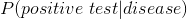
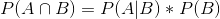
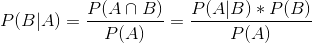
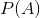
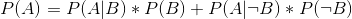
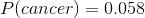
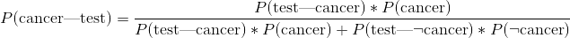
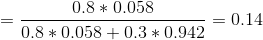

## 3.7 逆转条件概率：贝叶斯规则

在许多情况下，我们知道，但我们真的想知道。这通常发生在医学筛查中，我们知道（htg2），但我们想知道的是（htg3）。例如，一些医生建议 50 岁以上的男性接受前列腺特异性抗原（PSA）检测，以筛查可能的前列腺癌。在试验被批准用于医疗实践之前，制造商需要测试试验性能的两个方面。首先，他们需要展示（htg4）是如何敏感的（htg5），也就是说，当疾病出现时，它有多大可能找到它。他们还需要展示 _ 的特异性 _ 是如何的：也就是说，当没有疾病存在时，它有多可能产生阴性结果。对于变压吸附试验，我们知道敏感性约为 80%，特异性约为 70%。然而，这些并不能回答医生想要回答的问题：如果检测结果呈阳性，他们患癌症的可能性有多大？这要求我们颠倒定义灵敏度的条件概率：而不是我们想要知道的。

为了逆转条件概率，我们可以使用 _ 贝叶斯规则 _：

根据本章前面所学的概率规则，贝叶斯规则相当容易推导。首先，记住计算条件概率的规则：

我们可以重新排列，得到用条件计算联合概率的公式：

利用这一点，我们可以计算反概率：

如果我们只有两个结果，我们可以用更清晰的方式表达，使用和规则重新定义：

利用这个，我们可以重新定义贝叶斯规则：

我们可以将相关的数字插入到这个方程中，以确定一个 PSA 结果为阳性的个体确实患有癌症的可能性——但要注意，为了做到这一点，我们还需要知道这个人患癌症的总概率，我们通常将其称为 _ 基 r。吃了 _。让我们以一个 60 岁的男人为例，他在未来 10 年中患前列腺癌的概率是。利用我们上面概述的敏感性和特异性值，我们可以通过阳性测试来计算患者患癌症的可能性：

那太小了——你觉得奇怪吗？许多人这样做，事实上，有大量的心理学文献表明，人们在判断时系统地忽视了 _ 基本比率 _（即总体患病率）。