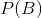
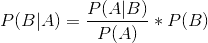
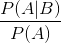

## 3.8 数据学习

另一种看待 Bayes 法则的方法是根据数据更新我们的信仰——也就是说，利用数据了解世界。让我们再看一下贝叶斯法则：

Bayes 规则的不同部分有特定的名称，这与它们在使用 Bayes 规则更新我们信仰中的作用有关。我们首先对 b（）的概率进行初步猜测，我们称之为 _ 先验 _ 概率。在变压吸附的例子中，我们使用了之前的基本速率，因为在我们知道测试结果之前这是我们最好的猜测。然后我们收集一些数据，在我们的示例中是测试结果。数据 A 与结果 B 的一致程度由给出，我们称之为 _ 可能性 _。你可以把这看作是数据的可能性，考虑到特定的假设正在被检验。在我们的例子中，被测试的假设是个体是否患有癌症，可能性是基于我们对测试特殊性的了解。分母（）被称为 _ 边际似然 _，因为它表示数据的总体似然性，在 a 的所有可能值（在我们的示例中是正的和负的测试结果）中取平均值。左边的结果（）被称为 _ 后面的 _——因为它是计算的后端。

有另一种方法来编写贝叶斯规则，使这一点更加清晰：

左边的部分（）告诉我们，相对于数据的总体（边际）可能性，A 被赋予的可能性有多大，或者更少；右边的部分（）告诉我们，我们认为 B（在我们了解数据之前）的可能性有多大。这就更清楚了，贝叶斯定理的作用是根据数据比整体更可能被赋予 b 的程度来更新我们的先验知识。