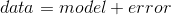

## 5.1 什么是模型？

在物理世界中，“模型”通常是对现实世界中事物的简化，尽管如此，它还是传达了被建模事物的本质。建筑物的模型传递建筑物的结构，同时又小又轻，足以用手拿起；生物学中的细胞模型比实际物体大得多，但又传递了细胞的主要部分及其关系。

在统计学中，模型的目的是提供一个类似的简明描述，但用于数据而不是物理结构。与物理模型一样，统计模型通常比所描述的数据简单得多；它旨在尽可能简单地捕获数据的结构。在这两种情况下，我们都意识到，模型是一种方便的虚构，它必然掩盖了被建模的实际事物的一些细节。正如统计学家乔治博克斯所说：“所有的模型都是错误的，但有些模型是有用的。”

统计模型的基本结构是：

这表明数据可以用一个统计模型来描述，这个模型描述了我们期望在数据中发生的事情，以及模型和数据之间的差异，我们称之为 _ 错误 _。