## 5.9 Z 分数

```r
crimeData <- 
  read.table(
    "data/CrimeOneYearofData_clean.csv", 
    header = TRUE, 
    sep = ","
  )

# let's drop DC since it is so small
crimeData <- 
  crimeData %>%
  dplyr::filter(State != "District of Columbia")

caCrimeData <- 
  crimeData %>%
  dplyr::filter(State == "California")
```

以分布的中心趋势和变异性为特征后，通常有助于根据个体分数相对于总体分布的位置来表示。假设我们有兴趣描述不同州犯罪的相对水平，以确定加利福尼亚是否是一个特别危险的地方。我们可以使用来自[FBI 统一犯罪报告网站](https://www.ucrdatatool.gov/Search/Crime/State/RunCrimeOneYearofData.cfm)的 2014 年数据来问这个问题。图[5.8](#fig:crimeHist)的左面板显示了每个州暴力犯罪数量的柱状图，突出了加州的价值。从这些数据来看，加利福尼亚州似乎非常危险，当年共有 153709 起犯罪。

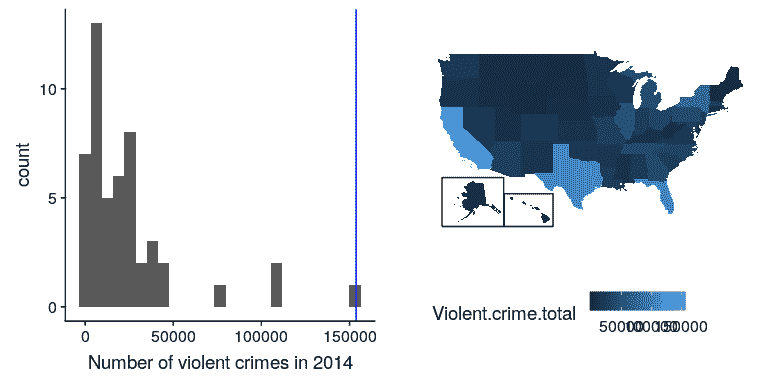

图 5.8 左：暴力犯罪数量的柱状图。CA 的值以蓝色绘制。右图：一张相同数据的地图，用彩色绘制每个州的犯罪数量。

使用 r，还可以很容易地生成一个显示变量跨状态分布的地图，如图[5.8](#fig:crimeHist)右面板所示。

然而，你可能已经意识到加州在美国任何一个州的人口都是最多的，所以它也会有更多的犯罪是合理的。如果我们将这两种情况相提并论（参见图[5.9](#fig:popVsCrime)的左面板），我们就会发现人口与犯罪数量之间存在直接关系。

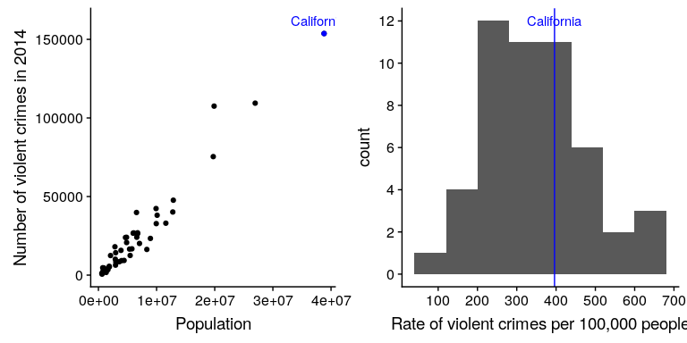

图 5.9 左：按州划分的犯罪数量与人口的关系图。对：人均犯罪率的柱状图，以每 10 万人的犯罪率表示。

我们不应使用犯罪的原始数量，而应使用人均暴力犯罪率，即犯罪数量除以国家人口所得的比率。FBI 的数据集已经包含了这个值（以每 100000 人的比率表示）。

```r
# print crime rate statistics, normalizing for population

sprintf("rate of 2014 violent crimes in CA: %.2f", caCrimeData$Violent.Crime.rate)
```

```r
## [1] "rate of 2014 violent crimes in CA: 396.10"
```

```r
sprintf("mean rate: %.2f", mean(crimeData$Violent.Crime.rate))
```

```r
## [1] "mean rate: 346.81"
```

```r
sprintf("std of rate: %.2f", sd(crimeData$Violent.Crime.rate))
```

```r
## [1] "std of rate: 128.82"
```

从右图[5.9](#fig:popVsCrime)中我们可以看出，加利福尼亚毕竟没有那么危险——它每 10 万人的犯罪率为 396.1，略高于 346.81 的平均值，但在许多其他州的范围内。但是，如果我们想更清楚地了解它与发行版的其他部分有多远呢？

_z-score_ 允许我们以一种方式表示数据，从而更深入地了解每个数据点与整体分布的关系。如果我们知道总体平均值和标准差的值，则计算数据点 z 得分的公式为：

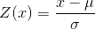

直观地说，你可以把 z 值看作是告诉你离任何数据点的平均值有多远，以标准偏差为单位。我们可以根据犯罪率数据来计算，如图[5.10](#fig:crimeZplot)所示。

```r
## [1] "mean of Z-scored data: 1.4658413372004e-16"
```

```r
## [1] "std deviation of Z-scored data: 1"
```

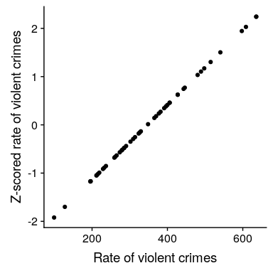

图 5.10 原始犯罪率数据与 Z 评分数据的散点图。

散点图表明，z-得分的过程并没有改变数据点的相对分布（可以看到原始数据和 z-得分数据在相互作图时落在一条直线上），只是将它们移动到一个平均值为零和一个标准差。一个。然而，如果你仔细观察，你会发现平均值并不完全为零——只是非常小。这里所发生的是，计算机以一定的 _ 数字精度 _ 表示数字，这意味着有些数字不完全为零，但小到 R 认为它们为零。

```r
# examples of numerical precision

print(paste("smallest number such that 1+x != 1", .Machine$double.eps))
```

```r
## [1] "smallest number such that 1+x != 1 2.22044604925031e-16"
```

```r
# We can confirm this by showing that adding anything less than that number to
# 1 is treated as 1 by R
print((1 + .Machine$double.eps) == 1)
```

```r
## [1] FALSE
```

```r
print((1 + .Machine$double.eps / 2) == 1)
```

```r
## [1] TRUE
```

```r
# we can also look at the largest number
print(paste("largest number", .Machine$double.xmax))
```

```r
## [1] "largest number 1.79769313486232e+308"
```

```r
# similarly here, we can see that adding 1 to the largest possible number
# is no different from the largest possible number, in R's eyes at least.
print((1 + .Machine$double.xmax) == .Machine$double.xmax)
```

```r
## [1] TRUE
```

图[5.11](#fig:crimeZmap)显示了使用地理视图的 Z 评分犯罪数据。

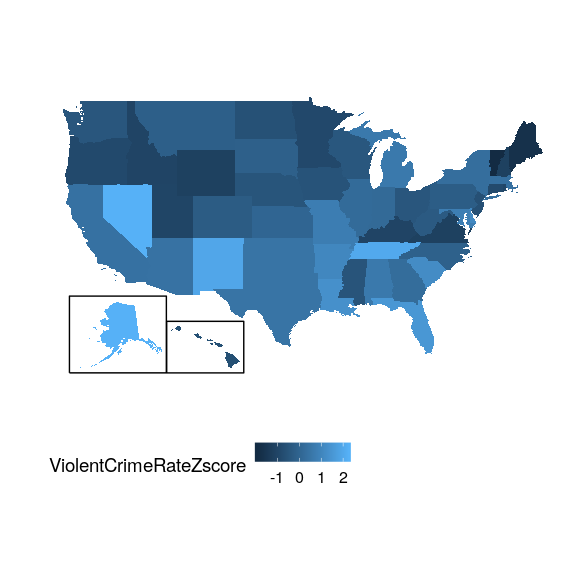

图 5.11 呈现在美国地图上的犯罪数据，以 z 分数表示。

这为我们提供了一个稍微更具解释性的数据视图。例如，我们可以看到内华达州、田纳西州和新墨西哥州的犯罪率都比平均值高出大约两个标准差。

### 5.9.1 解释 z-分数

“z-得分”中的“z”源于标准正态分布（即平均值为零且标准偏差为 1 的正态分布）通常被称为“z”分布。我们可以使用标准正态分布来帮助我们了解相对于分布的其余部分，特定的 z 分数告诉我们数据点的位置。

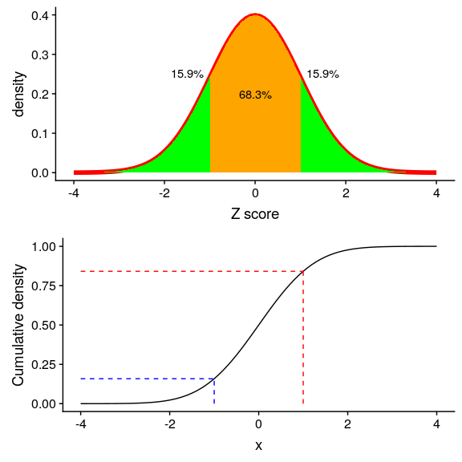

图 5.12 标准正态分布的密度（顶部）和累积分布（底部），在平均值以上/以下的一个标准偏差处进行截止。

图[5.12](#fig:zDensityCDF)中的上面板显示，我们预计约 16%的值会落在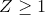中，同样的比例也会落在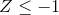中。

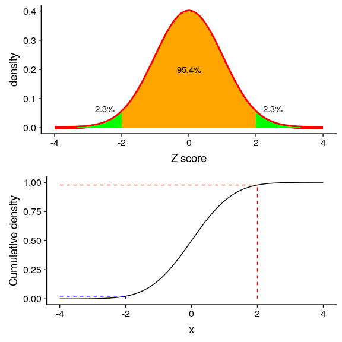

图 5.13 标准正态分布的密度（顶部）和累积分布（底部），平均值以上/以下两个标准偏差处的截止值

图[5.13](#fig:zDensity2SD)显示了两个标准偏差的相同曲线图。在这里，我们看到只有约 2.3%的值落在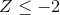中，同样的也落在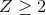中。因此，如果我们知道特定数据点的 z 值，我们可以估计找到一个值的可能性或可能性有多大，至少与该值一样极端，这样我们就可以将值放入更好的上下文中。

### 5.9.2 标准化评分

假设我们希望生成平均值为 100、标准差为 10 的标准化犯罪评分，而不是 Z 评分。这类似于用智力测验的分数来产生智力商数（IQ）的标准化。我们可以简单地将 z 分数乘以 10，然后再加 100。

```r
## [1] "mean of standardized score data: 100"
```

```r
## [1] "std deviation of standardized score data: 10"
```

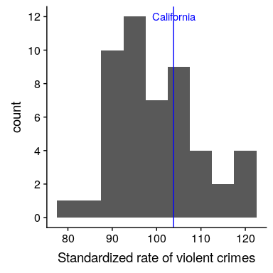

图 5.14 犯罪数据以标准化分数呈现，平均值为 100，标准差为 10。

#### 5.9.2.1 使用 z 分比较分布

z 值的一个有用的应用是比较不同变量的分布。假设我们想比较暴力犯罪和财产犯罪在各州的分布情况。在图[5.15](#fig:crimeTypePlot)的左面板中，我们将这些图形绘制在一起，用蓝色绘制 CA。正如你所看到的，财产犯罪的原始率远远高于暴力犯罪的原始率，所以我们不能直接比较数字。但是，我们可以将这些数据的 z 值相互绘制出来（图[5.15](#fig:crimeTypePlot)的右面板）——这里我们再次看到数据的分布没有改变。把每一个变量的数据放入 z 值后，就可以进行比较了，让我们看到加州实际上处于暴力犯罪和财产犯罪分布的中间。

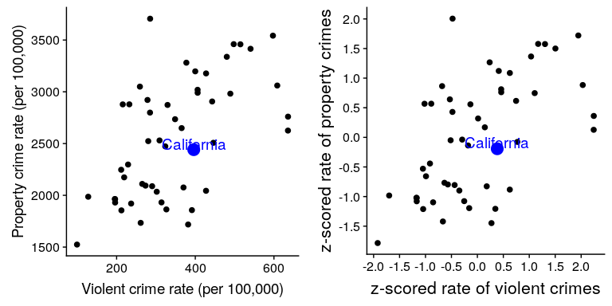

图 5.15 暴力与财产犯罪率（左）和 Z 得分率（右）的曲线图。

让我们再给情节加一个因素：人口。在图[5.16](#fig:crimeTypePopPlot)的左面板中，我们使用绘图符号的大小来显示这一点，这通常是向绘图添加信息的一种有用方法。

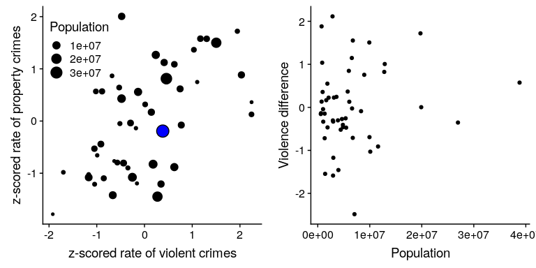

图 5.16 左图：暴力犯罪率与财产犯罪率的对比图，人口规模以绘图符号的大小表示；加利福尼亚州以蓝色表示。对：针对人口的暴力和财产犯罪的得分差异。

因为 z 分数是直接可比的，所以我们也可以计算“暴力差异”分数，该分数表示各州暴力与非暴力（财产）犯罪的相对比率。然后我们可以将这些得分与人口进行对比（参见图[5.16](#fig:crimeTypePopPlot)的右面板）。这说明我们如何使用 z-分数将不同的变量放在一个共同的尺度上。

值得注意的是，最小的国家在两个方向上的差异似乎最大。虽然这可能会吸引我们去观察每一个状态，并试图确定为什么它有一个高或低的差异分数，但这可能反映了这样一个事实，即从较小的样本中获得的估计值必然会有更多的变量，正如我们将在几章中更详细地讨论的那样。