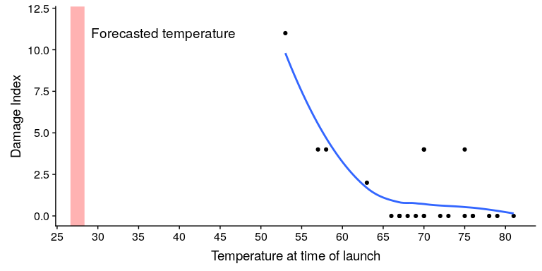

## 6.1 数据可视化如何拯救生命

1986 年 1 月 28 日，挑战者号航天飞机在起飞 73 秒后爆炸，机上 7 名宇航员全部遇难。事故发生后，对事故原因进行了正式调查，发现连接固体火箭助推器两段的 O 形圈发生泄漏，导致大型液体燃料箱接头失效、爆炸（见图[6.1[HTG1 页）。](#fig:srbLeak)

![An image of the solid rocket booster leaking fuel, seconds before the explostion. By NASA (Great Images in NASA Description) [Public domain], via Wikimedia Commons](img/file29.jpg)

图 6.1 爆炸前几秒固体火箭助推器泄漏燃料的图像。由美国国家航空航天局（美国国家航空航天局描述的伟大图像）【公共领域】，通过维基共享资源

调查发现，美国航天局决策过程的许多方面都存在缺陷，特别是在美国航天局工作人员和建造固体火箭助推器的承包商莫顿·齐奥科尔的工程师之间举行的一次会议上。这些工程师特别关注，因为据预测，发射当天早上的温度很低，而且他们从先前发射的数据中发现，O 型环的性能在较低的温度下受到了影响。在发射前一天晚上的一次会议上，工程师们向美国宇航局的管理人员展示了他们的数据，但无法说服他们推迟发射。

可视化专家 EdwardTufte 认为，如果能正确地展示所有数据，工程师们可能会更有说服力。特别是，他们可以展示一个像图[6.2](#fig:challengerTemps)所示的数字，这突出了两个重要事实。首先，它表明，O 型环的损伤量（定义为固体火箭助推器在以前的飞行中从海洋中回收后在环外发现的腐蚀和烟尘量）与起飞时的温度密切相关。第二，它显示 1 月 28 日上午的预测温度范围（显示在红色阴影区域）远远超出了之前所有发射的范围。虽然我们不能确定，但至少似乎可以相信，这可能更有说服力。

图 6.2 复刻凝灰岩损伤指数数据。蓝色的线显示了数据的趋势，红色的补丁显示了发射早晨的预计温度。