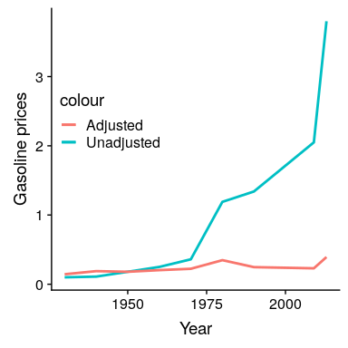

## 6.10 其他因素的修正

通常，我们对绘制感兴趣的变量受我们感兴趣的因素以外的其他因素影响的数据感兴趣。例如，假设我们想了解汽油价格随时间的变化。图[6.16](#fig:gasPrices)显示了历史天然气价格数据，绘制了通货膨胀调整或不调整。虽然未经调整的数据显示大幅增长，但经调整的数据显示，这主要是通胀的反映。其他需要根据其他因素调整数据的例子包括人口规模（如前一章中的犯罪率示例所示）和不同季节收集的数据。

图 6.16 美国 1930-201 年汽油价格（从[http://www.thepoplehistory.com/70yearsofpricechange.html](http://www.thepeoplehistory.com/70yearsofpricechange.html)获得），有无通货膨胀修正（基于消费者价格指数）。