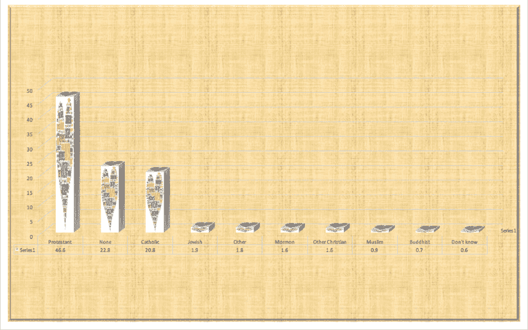

## 6.6 避免图表垃圾

特别常见的是，在流行媒体中看到数据的展示，这些展示带有许多视觉元素，这些元素在主题上与内容相关，但与实际数据无关。这被称为 _chartjunk_，应该不惜一切代价避免。

避免图表垃圾的一个好方法是避免使用流行的电子表格程序绘制数据。例如，图[6.9](#fig:chartJunk)（使用 Microsoft Excel 创建）中的图表描绘了美国不同宗教的相对流行程度。这个数字至少有三个问题：

*   它在每根与实际数据无关的条上都覆盖了图形。
*   它有一个分散的背景纹理。
*   它使用三维条形图

图 6.9 图表垃圾示例。