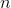
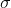
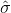
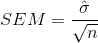

## 7.3 平均值的标准误差

在课程的后面，能够描述我们的样本是如何变化的将变得非常重要，以便对样本统计进行推断。对于平均值，我们使用一个称为平均值（sem）的 _ 标准误差 _ 的量来实现这一点，我们可以将其视为采样分布的标准偏差。如果我们知道总体标准偏差，那么我们可以使用以下公式计算标准误差：


其中是样本的大小。我们通常不知道（总体标准差），因此我们通常会插入我们对的估计，这是根据样本（）计算的标准差：



但是，如果我们的样本很小（少于 30 个），我们必须小心使用估计的标准偏差计算 SEM。

因为我们有许多来自 nhanes 总体的样本，并且我们实际上知道总体参数，所以我们可以确认使用总体参数估计的 SEM 非常接近我们从 nhanes 数据集中采集的样本的观测标准偏差。

```r
# compare standard error based on population to standard deviation 
# of sample means

sprintf(
  'Estimated standard error based on population SD: %.2f',
  sd(NHANES_adult$Height)/sqrt(sampSize)
)
```

```r
## [1] "Estimated standard error based on population SD: 1.44"
```

```r
sprintf(
  'Standard deviation of sample means = %.2f',
  sd(sampMeans)
)
```

```r
## [1] "Standard deviation of sample means = 1.43"
```

平均值的标准误差公式表明，我们的测量质量涉及两个量：总体变异性和样本大小。当然，因为样本大小是 sem 公式中的分母，当保持总体变异性常数时，较大的样本大小将产生较小的 sem。我们无法控制种群的变异性，但是我们 _ 确实可以控制样本的大小。因此，如果我们希望改进样本统计（通过减少样本变异性），那么我们应该使用更大的样本。然而，这个公式也告诉我们关于统计抽样的一些非常基本的东西——也就是说，较大样本的效用随样本大小的平方根而减小。这意味着双倍的样本量将 _ 而不是 _ 使统计数据的质量加倍；相反，它将把统计数据的质量提高一倍。在[10.3 节](#statistical-power)中，我们将讨论与此观点密切相关的统计能力。_