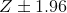
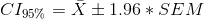

## 7.5 置信区间

大多数人都熟悉政治民意调查“误差幅度”的概念。这些民意测验通常试图提供一个准确率在+/-3%以内的答案。例如，当一个候选人被估计以 9 个百分点赢得选举，误差幅度为 3 时，他们将赢得的百分比被估计在 6-12 个百分点之内。在统计学中，我们将这一范围的值称为 _ 置信区间 _，它提供了对我们的估计与总体参数的接近程度的不确定性程度的度量。条件区间越大，我们的不确定性就越大。

在上一节中我们看到，有了足够的样本量，平均值的抽样分布是正态分布的，标准误差描述了这个抽样分布的标准偏差。利用这些知识，我们可以问：我们期望在什么范围内获取所有平均值估计值的 95%？为了回答这个问题，我们可以使用正态分布，我们知道我们期望 95%的样本均值在正态分布之间下降。具体来说，我们使用正态分布的 _ 分位数 _ 函数（`qnorm()`in r）来确定正态分布在分布中 2.5%和 97.5%点的值。我们选择这些点是因为我们想要找到分布中心的 95%的值，所以我们需要在每个端部截取 2.5%个，以便最终在中间有 95%个。图[7.4](#fig:normalCutoffs)显示了发生在上的情况。


图 7.4 正态分布，中间橙色部分表示我们预计所有值 95%会下降的范围。绿色部分显示了分布中更极端的部分，我们希望在不到 5%的时间内发生。

使用这些截止值，我们可以为平均值的估计创建一个置信区间：



让我们计算 nhanes 高度数据的置信区间，

```r
# compute confidence intervals

NHANES_sample <- sample_n(NHANES_adult,250)

sample_summary <- NHANES_sample %>%
    summarize(mean=mean(Height),
            sem=sd(Height)/sqrt(sampSize)) %>%
    mutate(CI_lower=mean-1.96*sem,
           CI_upper=mean+1.96*sem)
pander(sample_summary)
```

<colgroup><col style="width: 13%"> <col style="width: 11%"> <col style="width: 15%"> <col style="width: 15%"></colgroup> 
| 意思是 | 扫描电镜 | Ci_ 下 | Ci_ 上部 |
| --- | --- | --- | --- |
| 166.869 年 | 1.446 个 | 164.036 年 | 169.702 个 |

置信区间是出了名的混乱，主要是因为它们并不代表我们希望它们的含义。很自然地认为，95%的置信区间告诉我们，人口平均值有 95%的概率落在区间内。然而，正如我们将在整个课程中看到的，统计中的概念通常并不意味着我们认为它们应该意味着什么。在置信区间的情况下，我们不能用这种方式解释它们，因为总体参数有一个固定值——要么在区间内，要么不在区间内。95%置信区间的正确解释是，它将捕获 95%时间的真实总体平均值。我们可以通过重复对 nhanes 数据重新采样并计算间隔包含真实总体平均值的频率来确认这一点。

```r
# compute how often the confidence interval contains the true population mean
nsamples <- 2500
sampSize <- 100

ci_contains_mean <- array(NA,nsamples)

for (i in 1:nsamples) {
  NHANES_sample <- sample_n(NHANES_adult, sampSize)
  sample_summary <- 
    NHANES_sample %>%
    summarize(
      mean = mean(Height),
      sem = sd(Height) / sqrt(sampSize)
    ) %>%
    mutate(
      CI_upper = mean + 1.96 * sem,
      CI_lower = mean - 1.96 * sem
    )
  ci_contains_mean[i] <- 
    (sample_summary$CI_upper > mean(NHANES_adult$Height)) & 
    (sample_summary$CI_lower < mean(NHANES_adult$Height))
}

sprintf(
  'proportion of confidence intervals containing population mean: %.3f',
  mean(ci_contains_mean)
)
```

```r
## [1] "proportion of confidence intervals containing population mean: 0.953"
```

这证实了置信区间确实捕获了 95%左右的人口平均值。