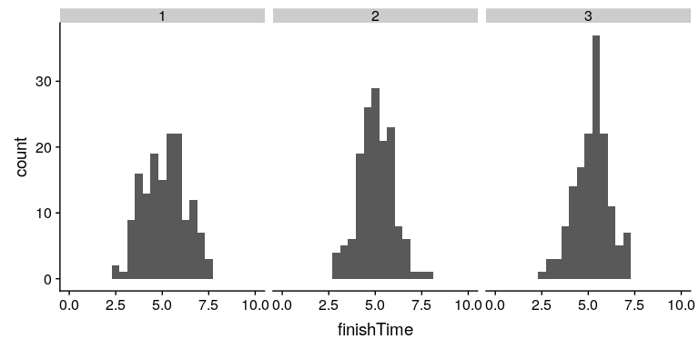
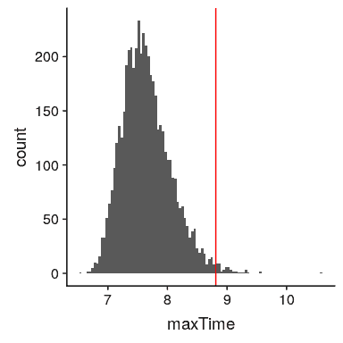

## 8.4 使用蒙特卡罗模拟

让我们回到考试结束时间的例子。假设我管理三个测验，并记录每个学生每次考试的完成时间，这可能类似于图[8.2](#fig:finishingTimes)所示的分布。



图 8.2 模拟完成时间分布。

然而，我们真正想知道的不是完成时间的分布是什么样子的，而是每个测验的 _ 最长 _ 完成时间的分布是什么样子的。为了做到这一点，我们可以模拟大量的测验（假设完成时间是正态分布的，如上所述）；对于每个模拟的测验，我们可以记录最长的完成时间。为此，我们在 r 中创建了一个名为`sampleMax()`的新函数，该函数从适当的分布（即正态分布）中模拟适当大小的样本（即班级中的学生数），并返回样本中的最大值。然后，我们使用`replicate()`函数重复此模拟大量次（应该足够 5000 次），该函数将所有输出存储到一个变量中。整理时间分布见图[8.3](#fig:finishTimeSim)。

```r
# sample maximum value 5000 times and compute 99th percentile
nRuns <- 5000
sampSize <- 150

sampleMax <- function(sampSize = 150) {
  samp <- rnorm(sampSize, mean = 5, sd = 1)
  return(max(samp))
}

maxTime <- replicate(nRuns, sampleMax())

cutoff <- quantile(maxTime, 0.99)
sprintf("99th percentile of maxTime distribution: %.2f", cutoff)
```

```r
## [1] "99th percentile of maxTime distribution: 8.81"
```



图 8.3 模拟中最大完成时间的分布。

这表明完成时间分布的第 99 个百分点下降到了 8.81，这意味着如果我们为测验留出这么多时间，那么每个人都应该完成 99%的时间。务必记住，我们的假设很重要——如果它们是错误的，那么模拟的结果是无用的。在这种情况下，我们假设完成时间分布为正态分布，具有特定的平均值和标准偏差；如果这些假设不正确（而且几乎可以肯定），那么真正的答案可能会非常不同。