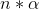
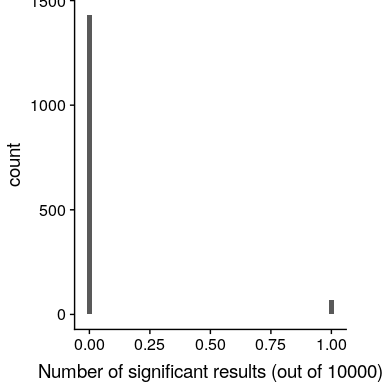

## 9.4 现代环境下的 NHST：多重测试

到目前为止，我们已经讨论了一些例子，其中我们对检验一个单一的统计假设感兴趣，这与传统科学是一致的，后者通常一次只测量几个变量。然而，在现代科学中，我们通常可以测量每个个体数百万个变量。例如，在量化整个基因组的基因研究中，每个个体可能有数百万个测量单位，在大脑成像中，我们常常同时从大脑中超过 100000 个位置收集数据。当标准假设检验应用于这些环境中时，除非我们采取适当的措施，否则会发生不好的事情。

让我们看一个例子来看看这是如何工作的。理解能使个人易患诸如精神分裂症等重大精神疾病的遗传因素是很有兴趣的，因为我们知道，在精神分裂症患者中，大约 80%的个体差异是由于遗传差异造成的。人类基因组计划和随后的基因组科学革命为研究人类在基因组上的差异提供了工具。近年来使用的一种方法被称为全基因组关联研究（GWAS），其中每个个体的基因组在其基因组中的 100 万个或更多的位置上进行特征化，以确定他们所拥有的遗传密码的字母（我们称之为“变体”）。在那个地方。在确定了这些之后，研究人员在基因组的每个位置进行了统计测试，以确定被诊断为精神分裂症的人在该位置是否或多或少有一个特定的变异。

让我们想象一下，如果研究人员简单地问，在每个地点的 P&lt；.05 测试是否有意义，而实际上在任何地点都没有真正的效果，会发生什么。为此，我们从一个空分布生成大量的模拟 t 值，并询问其中有多少在 p&lt；.05 处是重要的。让我们这样做很多次，每次都计算出有多少测试结果是重要的（参见图[9.9](#fig:nullSim)）。

```r
# simulate 1500 studies with 10,000 tests each, thresholded at p < .05

nRuns <- 1500 # number of simulated studies to run
nTests <- 10000 # number of simulated genes to test in each run

uncAlpha <- 0.05 # alpha level

uncOutcome <- replicate(nRuns, sum(rnorm(nTests) < qnorm(uncAlpha)))

sprintf("mean proportion of significant tests per run: %0.2f", mean(uncOutcome) / nTests)
```

```r
## [1] "mean proportion of significant tests per run: 0.05"
```

```r
# compute proportion of studies with at least one false positive result,
# known as the familywise error rate
sprintf("familywise error rate: %0.3f", mean(uncOutcome > 0))
```

```r
## [1] "familywise error rate: 1.000"
```


图 9.9：每组 100 万统计试验中，当事实上没有真实效果时，有效结果数量的柱状图。

这表明，所有测试中约有 5%在每次运行中都是显著的，这意味着如果我们使用 p&lt；.05 作为统计显著性的阈值，那么即使没有真正显著的关系存在，我们仍然会“找到”大约 500 个看似显著的基因。NT（预期的重要结果数只是）。这是因为当我们控制每个测试的错误时，我们没有控制 _ 系列错误 _，或者所有测试中的错误，这是我们真正想要控制的，如果我们要查看大量测试的结果。使用 p&lt；.05，在上面的例子中，我们的家庭错误率是一个——也就是说，我们几乎可以保证在任何特定的研究中至少出现一个错误。

控制家族误差的一个简单方法是将 alpha 水平除以测试次数；这被称为 _bonferroni_ 修正，以意大利统计学家 Carlo Bonferroni 的名字命名。利用上述示例中的数据，我们在图[9.10](#fig:bonferroniSim)中看到，只有约 5%的研究显示使用校正后的α水平 0.000005 而不是名义水平 0.05 的任何显著结果。我们已经有效地控制了家族误差，这样我们研究中的 _ 任何 _ 误差发生的概率控制在 0.05 左右。

```r
# compute Bonferroni-corrected alpha
corAlpha <- 0.05 / nTests

corOutcome <- replicate(nRuns, sum(rnorm(nTests) < (qnorm(corAlpha))))

sprintf("corrected familywise error rate: %0.3f", mean(corOutcome > 0))
```

```r
## [1] "corrected familywise error rate: 0.046"
```



图 9.10 在多次试验中应用 Bonferroni 校正后，所有模拟运行的重要结果数量的柱状图。