# 一、仿真模型简介

仿真模型是一种能够处理信息和数据并预测真实系统对某些输入的响应的工具，从而成为分析、性能评估和决策过程的有效支持。术语仿真是指再现系统的行为。一般来说，我们在使用具体模型的情况下，以及在使用抽象模型使用计算机再现现实的情况下，都谈论仿真。混凝土模型的一个例子是飞机的比例模型，然后将其放置在风洞中进行仿真试验，以估算合适的性能指标。

尽管多年来，物理学家们已经发展出了理论定律，我们可以利用这些定律来获取有关动态系统性能的信息，但通常，将这些定律应用到实际案例中需要花费太长时间。在这些情况下，可以方便地建立一个数值仿真模型，使我们能够仿真系统在特定条件下的行为。这个精心设计的模型将使我们能够以一种简单而直接的方式测试系统的功能，从而节省大量的时间和金钱资源。

在本章中，我们将介绍以下主要主题：

*   引入仿真模型
*   分类仿真模型
*   一个基于仿真的问题探讨
*   Dynamical systems modeling

    重要提示

    本章将介绍仿真技术。为了处理手头的主题，你必须具备代数和数学建模的基本知识。

# 引入仿真模型

仿真使用抽象的模型来复制系统的特征。使用概率分布随机生成系统事件来仿真系统的运行，并从仿真系统中获得统计观测值。它起着非常重要的作用，特别是在随机系统的设计和其操作程序的定义中。

通过不直接在真实系统上工作，许多场景可以通过简单地更改输入参数来仿真，从而限制了如果不使用此解决方案将产生的成本，并最终减少了所需的时间。通过这种方式，可以通过研究其行为和随时间的演变，快速尝试替代策略和设计选择，并为高度复杂的系统建模。

重要提示

由于成本高、技术上不可能以及真实系统不存在，在实际系统上工作不方便时，使用仿真。仿真允许您预测如果使用某些输入，真实系统会发生什么。更改这些输入参数可以仿真不同的场景，使我们能够从不同的角度确定最方便的场景。

## 决策流程

在决策过程中，出发点是确定需要改变的问题背景，从而做出决策。然后对确定的背景进行分析，以突出需要研究的内容，以便做出决策；也就是说，选择那些看起来最相关的元素，突出显示它们之间的关系，并定义要实现的目标。在这一点上，我们构建了一个正式的模型，它允许我们仿真已识别的系统，以了解其行为，并确定要做出的决策。下图描述了允许我们从观察有问题的上下文开始做出决策的工作流：

图 1.1–决策制定工作流程

这是一种传播知识的方式，涉及到各种行动者。构建模型是一个双向过程：

*   概念模型的定义
*   通过比较，模型与现实之间持续互动

此外，学习还具有参与性特征：它通过不同行为者的参与进行。这些模型还允许您分析并提出有组织的行动，以便您可以修改当前情况并生成所需的解决方案。

## 建模与仿真对比

首先，我们将澄清建模和仿真之间的区别。模型是物理系统的一种表示，而仿真是观察基于模型的系统在特定条件下如何工作的过程。

建模是一种设计方法，它基于生成实现系统并表示其功能的模型。通过这种方式，可以预测系统的行为以及对其进行的变化或修改的影响。即使模型是系统的简化表示，它也必须足够接近真实系统的功能性质，但不会变得太复杂和难以处理。

重要提示

仿真是将模型投入运行并允许您在特定条件下评估其行为的过程。仿真是建模的基本工具，因为开发人员无需借助物理原型，就可以根据项目规范验证建模系统的功能。

仿真允许我们通过广泛的条件来研究系统，以便我们能够了解模型对其所指系统的代表性。

## 仿真建模的利弊

仿真是一种工具，广泛应用于从运筹学到应用行业的各个领域。这项技术可以通过克服每个复杂过程所包含的困难而获得成功。以下是仿真建模的优缺点。让我们从使用仿真模型（**pros**的具体优势开始：

*   它根据无法直接体验的情况再现系统的行为。
*   它代表了真实的系统，甚至是复杂的系统，同时也考虑了不确定性的来源。
*   它需要有限的数据资源。
*   它允许在有限的时间范围内进行实验。
*   得到的模型很容易证明。

正如预期的那样，由于它是一种能够再现复杂场景的技术，因此它有一些局限性（**缺点**：

*   仿真提供了系统行为的指示，但不是精确的结果。
*   仿真输出的分析可能很复杂，很难确定哪种配置可能是最佳配置。
*   仿真模型的实现可能非常困难，而且，执行重要的仿真可能需要很长的计算时间。
*   仿真返回的结果取决于输入数据的质量：在输入数据不准确的情况下，它无法提供准确的结果。
*   仿真模型的复杂性取决于它打算再现的系统的复杂性。

然而，仿真模型是分析复杂场景的最佳解决方案。

## 仿真建模术语

在本节中，我们将分析构成模型的要素和描述仿真过程的要素。我们将对每种方法进行简要描述，以便您了解它们的含义以及它们在数值仿真过程中所起的作用。

### 系统

调查的背景通过一个系统来表示；也就是说，相互作用的元素集。与此要素相关的主要问题涉及系统边界，即，哪些现实要素必须插入到代表它的系统中，哪些要素被忽略，以及它们之间存在的关系。

### 状态变量

一个系统在每一时刻都由一组变量来描述。这些被称为状态变量。例如，对于天气系统，温度是一个状态变量。在离散系统中，变量在有限的精确时刻瞬间变化。在连续系统中，变量随时间的连续性而变化。

### 事件

事件定义为导致至少一个状态变量的值发生变化的任何瞬时事件。暴风雪的到来对于一个天气系统来说是一个事件，因为它会导致温度突然下降。既有外部事件，也有内部事件。

### 参数

参数表示建立模型时的基本术语。在模型仿真过程中对其进行调整，以确保结果进入必要的收敛范围。可通过灵敏度分析或在模型校准阶段对其进行迭代修改。

### 标定

校准代表调整模型参数的过程，以使结果与以最佳方式观察到的数据相适应。在校准模型时，我们试图获得尽可能高的精度。一个好的校准需要消除或最小化数据收集中的错误，并选择一个能够最好地描述现实的理论模型。模型参数的选择是决定性的，在应用于历史数据时，必须尽可能减少其结果的偏差。

### 精确

准确度是从一系列计算值与实际数据推断出的仿真结果的对应程度，即平均建模值与真实值或参考值之间的差值。准确度在计算时提供了对预测预期质量的定量估计。有几个指示器可用于测量精度。使用最多的是**平均绝对误差**（**MAE**）、**平均绝对百分比误差**（**MAPE**）和**均方误差**（**MSE**）。

### 体贴

模型的灵敏度表示所选输入参数的变化对模型输出的影响程度。敏感性分析确定了模型输出的敏感参数。它允许我们确定哪些参数需要进一步调查，以便我们对模型的输出值进行更现实的评估。此外，它允许我们确定哪些参数对生成特定输出不重要，因此可能从模型中消除。最后，它告诉我们在对模型提供的输出值的不确定性进行可能的和后续的分析时应考虑哪些参数。

### 验证

这是验证所提出模型准确性的过程。模型必须经过验证，才能用作支持决策的工具。它的目的是验证正在分析的模型在概念上是否符合我们的意图。模型的验证基于多元分析的各种技术，这些技术不时地研究一类对象中属性的可变性和相互依赖性。

# 分类仿真模型

仿真模型可以根据不同的标准进行分类。第一个区别是静态系统和动态系统。那么，让我们看看它们的区别。

## 比较静态和动态模型

静态模型是系统在瞬间的表示，或时间变量不起作用的系统的代表性模型。静态仿真的一个例子是蒙特卡罗模型。

另一方面，动态模型描述了系统随时间的演变。在最简单的情况下，系统在时间*t*的状态由函数*x（t）*描述。例如，在种群动力学中，*x（t）*表示在*t*时刻存在的种群。调节系统的方程是动态的：描述种群的瞬时变化或固定时间间隔内的变化。

## 比较确定性模型和随机模型

当模型随时间的演化由其初始条件和特征唯一确定时，模型是确定性的。这些模型不考虑随机元素，并用数学分析得出的精确方法来求解。在确定性模型中，一旦指定了输入数据和构成模型的关系，就可以很好地确定输出，尽管数据处理所需的时间特别长。对于这些系统，转换规则单向地决定了系统状态的变化。在一些生产和自动化系统中可以观察到确定性系统的例子。

另一方面，随机模型可以通过在进化过程中插入随机元素来进化。这些是通过从统计分布中提取得到的。在这些模式的运作特征中，并非只有一种关系适用于所有人。还有概率密度函数，这意味着数据和系统历史之间没有一一对应的关系。

最后一个区别是基于系统如何随时间演化：这就是我们区分连续和离散仿真模型的原因。

## 比较连续和离散模型

连续模型表示变量状态随时间不断变化的系统。例如，在道路上行驶的汽车代表一个连续的系统，因为识别它的变量（如位置和速度）可以随时间不断变化。

在离散模型中，系统由重叠的物理操作序列描述，其间穿插着不活动暂停。这些操作在定义良好的实例（事件）中开始和结束。当每个事件发生时，系统会发生状态变化，在两个后续事件之间的整个间隔期间保持相同的状态。这种类型的操作很容易用仿真方法处理。

重要提示

模型的随机性或确定性、连续性或离散性不是其绝对属性，而是取决于观察者对系统本身的看法。这取决于研究的目标和方法，以及观察者的经验。

现在我们已经详细分析了不同类型的模型，我们将学习如何开发一个数值仿真模型。

# 探讨基于仿真的问题

为了解决返回准确结果的数值仿真过程，严格遵循一系列程序至关重要，这些程序部分先于系统的实际建模，部分遵循系统的实际建模。我们可以将仿真过程工作流分为以下各个步骤：

1.  问题分析
2.  数据收集
3.  建立仿真模型
4.  仿真软件选择
5.  软件解决方案的验证
6.  仿真模型的验证
7.  仿真与结果分析

为了充分理解整个仿真过程，有必要深入分析基于仿真的研究的各个阶段。

## 问题分析

在这一初始步骤中，目标是通过确定研究目标和基本组成部分，以及他们感兴趣的绩效指标来理解问题。仿真不仅仅是一种优化技术，因此没有需要最大化或最小化的参数。然而，必须验证一系列性能指标对输入变量的依赖性。如果系统的操作版本已经可用，则工作将简化，因为观察该系统足以推断其基本特性。

## 数据采集

这是整个过程中的一个关键步骤，因为仿真模型的质量取决于输入数据的质量。这一步与前一步密切相关。事实上，一旦确定了研究的目标，就会收集数据并随后进行处理。处理收集的数据是将其转换为模型可以使用的格式所必需的。数据的来源可能不同：有时，数据是从公司数据库检索的，但通常情况下，现场的直接测量必须通过一系列传感器进行，这些传感器近年来变得越来越智能。这些操作减轻了整个研究过程的负担，从而延长了执行时间。

## 建立仿真模型

这是整个仿真过程的关键步骤；因此，有必要密切关注它。为了建立一个仿真模型，有必要知道感兴趣的变量的概率分布。事实上，为了生成系统如何工作的各种代表性场景，仿真必须从这些分布生成随机观测值。

例如，在管理库存时，需要分发所请求的产品以及从订单到收到货物之间的时间分配。另一方面，当使用偶尔会发生故障的机器管理生产系统时，有必要了解机器发生故障前的时间分布和维修时间分布。

如果系统还不可用，则只能通过推导这些分布来估计这些分布，例如，通过观察类似的、已经存在的系统。如果从数据分析中可以看出，这种分布形式近似于标准型分布，则可以通过进行统计测试来使用标准理论分布，以验证该概率分布是否能够很好地代表数据。如果没有可观测数据的类似系统，则必须使用其他信息来源：机器规格、机器说明书、实验研究等。

正如我们已经提到的，构建仿真模型是一个复杂的过程。参照仿真离散事件，构建模型包括以下步骤：

1.  定义状态变量
2.  确定状态变量可以采用的值
3.  识别改变系统状态的可能事件
4.  实现仿真时间测量，即记录仿真时间流的仿真时钟
5.  实现一种随机生成事件的方法
6.  识别由事件生成的状态转换

完成这些步骤后，我们将准备好仿真模型以供使用。此时，有必要在专用软件平台上实现该模型；让我们看看如何。

## 仿真软件选择

选择软件平台进行数值仿真是项目成功的基础。在这方面，我们可以采取若干解决办法。这一选择将基于我们的编程知识。让我们看看有哪些解决方案可用：

*   **仿真器**：这些是面向应用的仿真包。有许多用于仿真的交互式软件包，如 MATLAB、COMSOL Multiphysics、Ansys、SolidWorks、Simulink、Arena、AnyLogic 和 SimScale。这些软件代表了优秀的仿真平台，其性能因所提供的应用程序解决方案而异。这些仿真器允许我们使用图形菜单详细描述仿真环境，而无需编程。它们易于使用，但其中许多都具有出色的建模功能，即使您仅使用它们的标准功能。它们中的一些提供了动画来显示实际的仿真，这使您可以轻松地向非专家演示仿真。该软件解决方案的局限性在于许可证的高成本（这只能由大公司面对），以及标准未预见到的解决方案建模的困难。
*   **仿真语言**：不同的仿真语言提供了更通用的解决方案。有一些解决方案可以帮助程序员完成任务，使用这些语言，程序员可以使用几行代码开发整个模型或子模型，否则将需要更长的起草时间，从而增加错误概率。仿真语言的一个例子是**通用仿真系统**（**GPSS**）。这是 IBM 在 1965 年开发的一种通用编程语言。在它中，仿真时钟以离散的步骤前进，在事务进入系统并从一个服务传递到另一个服务时对系统进行建模。它主要用作面向过程流的仿真语言，特别适合于应用问题。仿真语言的另一个例子是 SimScript，它是在 1963 年作为 Fortran 的扩展而开发的。SimScript 是一种基于事件的脚本语言，因此脚本的不同部分由不同的事件触发。
*   **GPSS**：通用编程语言设计为能够在众多应用领域创建软件。它们特别适合于系统软件的开发，如驱动程序、内核以及任何直接与计算机硬件通信的软件。由于这些语言不是专门用于仿真活动的，它们要求程序员更加努力地实现仿真器中所需的所有机制和数据结构。另一方面，通过提供高级编程语言的所有潜力，它们为程序员提供了一个更通用的编程环境。通过这种方式，您可以开发一个完全适合研究人员需要的数值仿真模型。在本书中，我们将通过致力于使用 Python 编程来使用此解决方案。这个软件平台提供了一系列由世界各地的研究人员创建的工具，使数值建模系统的精化变得特别容易。此外，用 Python 编写的项目的开源性质使得该解决方案特别便宜。

现在，我们已经选择了我们将要使用的软件平台，并详细阐述了数值模型，我们需要验证软件解决方案。

## 软件解决方案的验证

在此阶段，对数字代码进行检查。这就是所谓的调试，它包括确保代码正确地遵循所需的逻辑流，没有意外的块或中断。必须在创建阶段实时提供验证，因为随着模型复杂性的增加，纠正任何概念或语法错误变得更加困难。

尽管验证在理论上很简单，但由于虚拟竞争，调试大规模仿真代码是一项困难的任务。执行的正确与否取决于时间以及大量潜在的逻辑路径。开发仿真模型时，应将代码划分为模块或子例程，以便于调试。还有一个建议是让多个人来检查代码，因为一个程序员可能不是一个好的批评家。此外，在考虑各种输入参数并检查输出是否合理时，进行仿真也很有帮助。

重要提示

可用于验证离散事件仿真程序的最佳技术之一是基于跟踪的技术。系统状态、事件列表内容、仿真时间、状态变量和统计计数器在每个事件发生后显示，然后与手工计算进行比较，以检查代码的操作。

磁道通常会产生大量的输出，需要逐个事件检查错误。可能会出现以下问题：

*   可能有分析员没有要求的信息。
*   其他有用信息可能丢失，或者在有限的调试运行期间无法检测到某种类型的错误。

验证过程结束后，有必要验证仿真模型。

## 仿真模型的验证

在这一步中，需要检查已创建的模型是否为相关系统提供了有效的结果。我们必须检查真实系统的性能测量值是否与仿真模型生成的测量值非常接近。复杂系统的仿真模型只能对其进行近似。始终为一组目标开发仿真模型。对一个目的有效的模型可能对另一个目的无效。

重要提示

验证是一种尊重模型和系统之间准确性水平的方法。有必要确定模型是否充分代表了系统的行为。模型的值只能根据其用途来定义。因此，验证是一个旨在确定仿真模型是否准确代表系统实现设定目标的过程。

在此步骤中，确定模型再现系统实际功能的能力；也就是说，可以确保相对于校准场景的校准参数可用于正确仿真其他系统情况。一旦验证阶段结束，该模型可被视为可转移，因此可用于任何新控制策略和新干预方案的仿真。正如关于这一主题的文献中广泛讨论的那样，重要的是验证先前根据数据校准的模型参数，而不是用于校准模型的数据，始终参考所分析情景的特定现象。

## 仿真及结果分析

仿真是一个在实现过程中不断发展的过程，初始结果有助于将仿真引向更复杂的配置。应该注意一些细节。例如，如果需要在全容量下测量系统的性能，则必须在达到静止状态之前确定系统的瞬态长度。在系统达到平衡后，还需要确定仿真的持续时间。事实上，必须始终记住，仿真不会产生系统性能度量的精确值，因为每次仿真都是一个统计实验，生成有关系统性能的统计观察值。然后利用这些观察结果对绩效指标进行评估。增加仿真的持续时间可以提高这些估计的准确性。

仿真结果返回系统性能度量的统计估计。一个基本点是，每个测量都伴随着置信区间，在该置信区间内它可以变化。这些结果可能会立即突出显示比其他系统配置更好的系统配置，但更常见的情况是，将识别多个候选配置。在这种情况下，可能需要进一步调查以比较这些配置。

# 动态系统建模

在本节中，我们将分析一个生产过程建模的真实案例。通过这种方式，我们将学习如何处理系统的元素，以及如何将生产实例转换为模型的元素。创建一个模型来研究系统随时间的行为。它由一组关于系统行为的假设组成，这些假设使用数学-逻辑-符号关系表示。这些关系是组成系统的实体之间的关系。回想一下，模型用于仿真系统中的变化，并预测这些变化对真实系统的影响。简单模型通过数学方法解析，而复杂模型则在计算机上进行数值仿真，其中数据被视为真实系统的数据。

## 车间机械管理

在本节中，我们将看一个简单的示例，说明如何创建动态系统的离散事件仿真。离散事件系统是一个动态系统，其状态可以采用逻辑或符号值，而不是数字值，其行为的特点是在不规则的时间序列中发生瞬时事件，而不一定是先验已知的。这些系统的行为用状态和事件来描述。

在车间里，有两台机器，我们称之为 A1 和 A2。在一天的开始，需要进行五项工作：W1、W2、W3、W4 和 W5。下表显示了我们需要在机器上工作多长时间（分钟）：

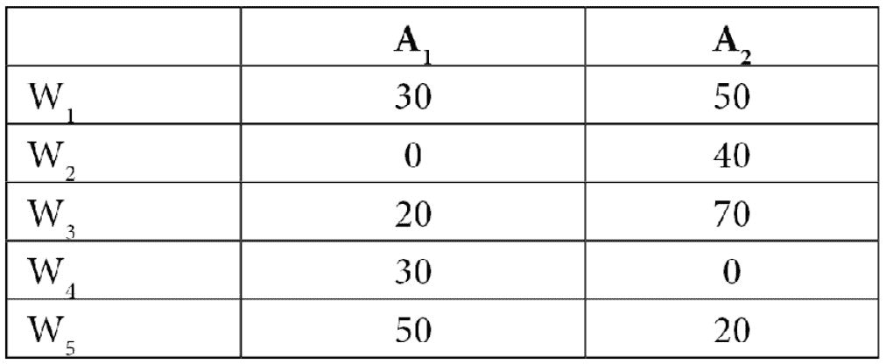

图 1.2–显示机器工作时间的表格

零表示作业不需要该机器。需要两台机器的作业必须先通过 A1，然后通过 A2。假设我们决定通过将作业分配给每台机器来执行作业，这样当它们可用时，第一个可执行作业将首先启动，顺序为 1 到 5。如果同时在同一台机器上可以执行更多的作业，我们将首先执行带有次要索引的作业。

建模的目的是确定完成所有工作所需的最短时间。系统中可能发生状态更改的事件如下：

1.  作业可用于机器。
2.  机器开始工作。
3.  机器结束工作。

根据这些规则和上表中指示的评估时间，我们可以将作业的顺序以及根据执行时间安排的事件插入表中：

图 1.3–工作顺序表

此表按顺序显示事件的时间，指示车间内两台可用机器相关工作的开始和结束。在每个作业结束时，将根据前面设置的规则向每台机器发送一个新作业。这样，工作的截止日期和随后开始的另一项工作都会清楚地显示出来。这与确定每台机器使用的时间间隔以及何时重新可用一样容易。我们提出的表解代表了一种仿真简单动态离散系统的简单而直接的方法。

我们刚才讨论的例子是一个典型的动态系统的例子，在这个动态系统中，时间以离散的方式分步进行。然而，许多动态系统最好通过假设时间连续地流逝来描述。在下一节中，我们将分析连续动态系统的情况。

## 简谐振荡器

考虑一个质量的 T1，m，T2，在水平面上休息，没有摩擦，并用理想弹簧附在一个壁上，弹性常数为：假设当水平坐标*x*为零时，弹簧处于静止状态。下图显示了简单谐振子的方案：

图 1.4–谐振子方案

如果质量块*m*相对于其平衡位置向右侧移动（*x>0*，弹簧被拉长，将其调到左侧。相反，如果将块放置在其平衡位置的左侧（*x<0*），则弹簧被压缩并将块推向右侧。在这两种情况下，我们可以根据以下公式表示弹簧力沿*x*轴的分量：

在这里，我们有以下几点：

*   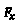是原力。
*   是弹性常数。
*   是表示质量*m 位置的水平坐标。*

根据动力学第二定律，我们可以推导出沿*x*方向的加速度分量，如下所示：

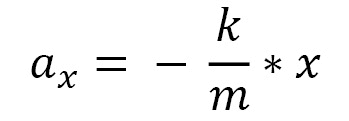

在这里，我们有以下几点：

*   是加速度。
*   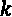是弹性常数。
*   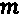是块体的质量。
*   是表示质量*m 位置的水平坐标。*

如果我们用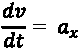表示速度的变化率，用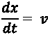表示速度，我们可以得到动力系统的演化方程，如下所示：

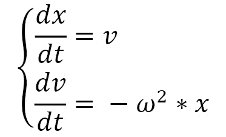

在这里，我们有以下几点：

*   

对于这些方程，我们必须关联系统的初始条件，我们可以用以下方式书写：

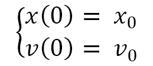

前面微分方程的解如下所示：

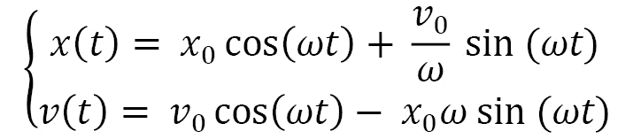

通过这种方法，我们得到了所分析系统的数学模型。为了研究质量块*m*的振荡现象随时间的演变，改变时间并计算质量块在该时刻的位置及其速度就足够了。

在具有高度复杂性的决策过程中，不可能使用分析模型。在这些情况下，有必要使用不同于分析类型的模型，以便将计算器用作工具，不仅用于计算（如数学规划模型），而且还用于表示构成现实的元素，为什么要研究它们之间的关系。

## 捕食-被捕食模型

在仿真领域，仿真生产和物流流程的功能相当重要。事实上，这些系统的特点是高度复杂，通过它们的不同过程之间存在大量的相互关系，段故障，不可用，以及系统参数的随机性。

为了理解某些现象的分析建模有多复杂，让我们分析一个普遍存在的生物学模型。这是捕食者-食饵模型，由意大利研究人员维托·沃尔特拉（Vito Volterra）和美国生物物理学家阿尔弗雷德·洛特卡（Alfred Lotka）独立开发。

在一个岛上，有两种动物：猎物和捕食者。岛上的植被为猎物提供了数量可观的营养，我们可以认为它们是无限的，而猎物是食肉动物唯一的食物。我们可以考虑随着时间的推移，猎物的出生率是恒定的；这意味着在没有捕食者的情况下，猎物将按指数规律增长。另一方面，它们的死亡率取决于它们成为捕食者猎物的概率，因此取决于单位面积内捕食者的数量。

至于捕食者，死亡率是恒定的，而它们的增长率取决于食物的供应，因此取决于岛上每单位面积的猎物数量。我们希望从已知的初始情况（猎物和捕食者的数量）开始，研究这两个种群的大小随时间的变化趋势。

为了对该生物系统进行仿真，我们可以通过以下有限差分方程组对其进行建模，其中*x（t）*和*y（t）*分别是*t*时刻的猎物和捕食者数量：

在这里，我们有以下几点：

*   α、 β、γ、δ是与两个物种相互作用相关的正实参数
*   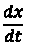是猎物的瞬时增长率。
*   是捕食者的瞬时增长率。

该模型的基础假设如下：

*   在没有捕食者的情况下，猎物的数量按照指数规律增加，即以恒定速率增加。
*   同样，在没有猎物的情况下，捕食者的数量以恒定的速度减少。

这是一个确定性和连续的仿真模型。事实上，系统的状态（由每个时间实例中两个总体的大小表示）是由初始状态和模型的参数单方面决定的。此外，至少在原则上，变量——即人口规模——随着时间的推移不断变化。

微分系统为标准形式，可针对最大阶导数求解，但不能分解为变量。不可能用解析形式来解决这个问题，但用数值方法可以立即解决（龙格-库塔法）。解显然取决于四个常数的值和初始值。

# 总结

在本章中，我们学习了什么是仿真建模。我们理解了建模和仿真之间的区别，发现了仿真模型的优点，比如缺陷。为了理解这些概念，我们澄清了在处理这些主题时最常出现的术语的含义。

然后，我们分析了不同类型的模型：静态与动态、确定性与随机、连续与离散。然后，我们探讨了与数值仿真过程相关的工作流，并强调了关键步骤。最后，我们研究了一些实际的建模案例，以了解如何从初始考虑出发详细阐述模型。

在下一章中，我们将学习如何处理随机过程并理解随机数仿真的概念。然后，我们将探讨伪随机数和非均匀随机数之间的差异，以及可用于随机分布评估的方法。