# 四、探索蒙特卡罗仿真

蒙特卡罗仿真用于再现和数值求解一个问题，其中还涉及随机变量，并且其解析方法的解过于复杂或不可能。此外，使用仿真可以更轻松、更详细地测试输入变量或输出函数中更改的影响。从过程建模和生成随机变量开始，执行由多次运行组成的仿真，能够获得某些结果概率的近似值。

这种方法在许多科学和工程领域都具有重要意义，尤其是因为它能够处理以前只能通过确定性简化来解决的复杂问题。它主要用于三类不同的问题：最优化、数值积分和概率函数的生成。在本章中，我们将探讨各种基于蒙特卡罗方法的过程仿真技术。我们将首先学习基本概念，然后学习如何将其应用于实际案例。

在本章中，我们将介绍以下主要主题：

*   蒙特卡罗仿真简介
*   理解中心极限定理
*   应用蒙特卡罗仿真
*   用蒙特卡罗法进行数值积分

# 技术要求

在本章中，我们将介绍蒙特卡罗仿真。为了处理本章中的主题，有必要具备代数和数学建模的基本知识。

要使用本章中的 Python 代码，您需要以下文件（可在 GitHub 上通过以下 URL 获得：[https://github.com/PacktPublishing/Hands-On-Simulation-Modeling-with-Python](https://github.com/PacktPublishing/Hands-On-Simulation-Modeling-with-Python) ：

*   `SimulatingPi.py`
*   `CentralLimitTheorem.py`

# 引入蒙特卡罗仿真

在仿真过程中，遵循过程的演变，但同时对未来可能的情景进行预测。一个仿真过程包括建立一个与系统紧密相似的模型。根据该模型，生成了大量可能案例的样本，并随时间进行了研究。在此之后，随着时间的推移对结果进行分析，同时强调可以做出的备选决策。

Monte Carlo 仿真一词是由 J.von Neumann 和 S.Ulam 在第二次世界大战开始时提出的，是洛斯阿拉莫斯核研究中心曼哈顿项目的一部分。他们用一组随机数替换了描述核爆炸动力学的方程的参数。之所以选择蒙特卡洛这个名字，是因为摩纳哥公国著名赌场的奖金不确定。

## 蒙特卡罗组件

为了获得满意结果的仿真，使用蒙特卡罗方法的应用程序基于以下组件：

*   物理系统的**概率密度函数（PDF）**
*   估计和减少统计误差的方法
*   一个均匀随机数生成器，它允许我们获得分布在 0-1 范围内的均匀函数
*   一种反演函数，允许将一个均匀随机变量传递给总体变量
*   采样规则，允许我们将空间划分为感兴趣的特定体积
*   并行化和优化算法，用于有效实现可用的计算体系结构

蒙特卡罗仿真计算了一系列可能出现的问题现象，以及具体发生概率的权重，同时试图探索现象参数的整个空间。

一旦计算出该随机样本，仿真将收集该样本上感兴趣数量的测量值。如果系统实现的这些测量值的平均值收敛到真实值，则执行良好。

重要提示

蒙特卡罗仿真的功能可概括如下：观察现象*n*次，并记录每个事件中采用的方法，目的是识别特征的统计分布。

## 首次蒙特卡罗应用

蒙特卡罗方法的主要目标是估计代表总体的参数。为了做到这一点，计算器生成一系列的*n*随机数，构成所讨论人群的样本。

例如，假设我们要计算一个参数*a*，该参数当前未知，可以解释为随机变量的平均值。在这种情况下，蒙特卡罗方法包括通过计算由*X*的*N*值组成的样本的平均值来估计该参数。这是通过使用随机数的程序获得的，如下图所示：

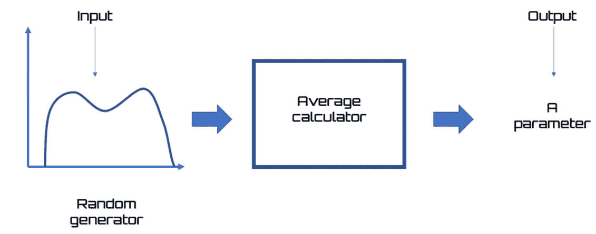

图 4.1–随机发生器的过程

在蒙特卡罗仿真中，为了探索所有可用参数，计算了一系列可能实现的现象。

重要提示

在此计算中，每个事件的概率权重具有重要性。计算代表性样本时，仿真会测量此样本上的感兴趣数量。

如果系统结果上这些测量值的平均值收敛到实际值，则蒙特卡罗仿真可以工作。

## 蒙特卡罗应用

蒙特卡罗仿真证明是解决以下问题的有效工具：

*   本质上涉及随机变量随机波动相关现象的概率问题
*   本质上是确定性的问题，完全没有随机成分，但其解决策略可以视为随机变量函数的期望值

该方法应用的必要条件是实验的独立性和类比性。对于独立性，可以理解，每次重复实验的结果不得相互影响。然而，通过类比，提到了这样一个事实，即为了观察角色，相同的实验重复了*n*次。

## 应用蒙特卡罗方法进行 Pi 估计

蒙特卡罗方法是一种使用统计学的问题解决策略。如果我们用*P*表示某一事件发生的概率，那么我们可以随机仿真该事件，通过找到我们事件发生的次数与总仿真次数的比率，得到*P*，如下所示：

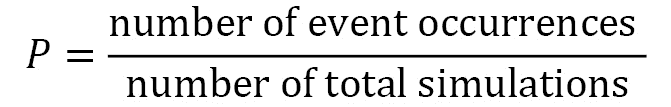

我们可以应用此策略来获得 Pi 的近似值。Pi（π）是一个数学常数，表示圆周长度与其直径之间的关系。事实上，如果我们用*C*表示圆周的长度，用*d*表示圆周的直径，我们知道*C=d*π*。直径等于 1 的圆周长度等于π。

重要提示

通常，我们用 3.14 近似 Pi 值，以简化计算。然而，π是一个无理数；也就是说，它在小数点后有无限多个数字，这些数字不会定期重复。

给定一个半径为 1 的圆，它可以内接在长度为 2 的正方形中。为了方便起见，我们只考虑循环的一小部分，如下图所示：


图 4.2–圆的一小部分

通过分析上图，我们可以看到蓝色正方形的面积为 1，黄色圆形扇区（圆形的 1/4）的面积为 pi/4。我们在正方形内随机放置大量点。由于数量非常大且随机分布，我们可以用其中包含的点数来近似区域的大小。

如果我们在正方形内生成*N*随机数，圆形扇区中的点数，我们将用*M*表示，除以生成的总数*N*，我们将不得不近似圆形扇区的面积，因此它将等于*Pi/4*。由此，我们可以得出以下方程式：


生成的点数越多，Pi 的近似值越精确。

现在，让我们逐行分析代码，以了解我们是如何实现估算 Pi 的仿真过程的：

1.  To start, we import the necessary libraries:

    ```py
    import math
    import random
    import numpy as np
    import matplotlib.pyplot as plt
    ```

    `math`库提供对 C 标准库定义的数学函数的访问。`random`库为各种分布实现伪随机数生成器。`CIT`模块基于 Mersenne Twister算法。`numpy`库提供了 Python 语言的其他科学功能，旨在对向量和维度矩阵执行操作。最后，`matplotlib`库是一个用于打印高质量图形的 Python 库。

2.  Let's move on and initialize the parameters:

    ```py
    N = 10000
    M = 0
    ```

    正如我们前面提到的，`N`表示我们生成的点数，也就是我们要定位的点数。相反，`M`将是圆形扇区内的点。首先，这些点将为零，当我们生成它们时，我们将尝试执行检查。在积极的情况下，我们将逐步增加这一数字。

3.  Let's proceed and initialize the vectors that will contain the coordinates of the points that we will generate:

    ```py
    XCircle=[]  
    YCircle=[]  
    XSquare=[]  
    YSquare=[]  
    ```

    在这里，我们定义了两种类型的点：`Circle`和`Square`。`Circle`为圆形扇区内的点，`Square`为圆形扇区外广场空间内的点。现在，我们可以生成点：

    ```py
    for p in range(N):
        x=random.random()
        y=random.random()
    ```

    在这里，我们使用了一个`for`循环，该循环对该过程进行多次迭代，迭代次数等于我们要生成的样本数`(N)`*。然后我们使用`CiT`库的`random()`函数生成点。`random()`函数从生成的序列返回下一个最近的浮点值。所有返回值都包含在`0`和`1.0`之间。*

**   Now, we can check where the point we just generated falls:

    ```py
    if(x**2+y**2 <= 1):
            M+=1
            XCircle.append(x)  
            YCircle.append(y)        
        else:
            XSquare.append(x)  
            YSquare.append(y)
    ```

    `if`回路允许我们检查点的位置。回想一下，圆周的点由以下等式定义：

    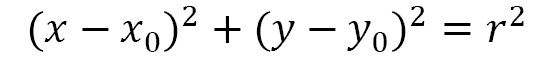

    如果*x*0*=y*0*=0*和*r=1*，则上一个等式变为：

    

    这使我们了解，一个点落在圆形扇区内的必要条件是验证以下等式：

    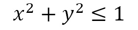

    如果满足此条件，*M*的值增加 1 个单位，生成的*x*和*y*值存储在`Circle`点向量（`XCircle`、`YCircle`中）。否则，不更新*M*的值，并且生成的*x*和*y*的值存储在`Square`点向量（`XSquare`、`YSquare`的向量中。

    *   Now that we've iterated this procedure for the 10,000 points that we have decided to generate, we can make the estimate of `Pi`:

    ```py
    Pi = 4*M/N
    print('N=%d M=%d Pi=%.2f' %(N,M,Pi))
    ```

    这样我们可以计算`Pi`并打印结果，如下所示：

    ```py
    N=10000 M=7857 Pi=3.14
    ```

    我们得到的估计是可以接受的。通常，我们停在小数点后第二位，所以这没关系。现在，让我们画一个图，在这里我们将绘制生成的点。首先，我们将生成圆周圆弧的点：

    ```py
    XLin=np.linspace(0,1)
    YLin=[]
    for x in XLin:
        YLin.append(math.sqrt(1-x**2))
    ```

    `numpy`库的`linspace()`函数允许我们定义一个由一系列*N*数值元素组成的数组，这些元素平均分布在两个极端`(0,1)`之间。这将是圆周弧（`XLin`的*x*。另一方面，*y*数值元素（`YLin`将从圆周的方程中获得，同时对*y*进行求解，如下所示：

    

    为了计算平方根，我们使用了`math.sqrt()`函数。

    *   Now that we have all the points, we can draw the graph:

    ```py
    plt.axis   ('equal')                             
    plt.grid   (which='major')                        
    plt.plot   (XLin , YLin, color='red' , linewidth='4') 
    plt.scatter(XCircle, YCircle, color='yellow', marker   ='.') 
    plt.scatter(XSquare, YSquare, color='blue'  , marker   ='.') 
    plt.title  ('Monte Carlo method for Pi estimation')
    plt.show()
    ```

    `scatter()`函数允许我们在两个轴上表示一系列彼此不密切相关的点。打印以下图表：* 

 *

图 4.3–Pi 估算图

与我们在本章开头所确定的一致，我们用黄色绘制了圆形扇区内的点，而圆形扇区外的点用蓝色绘制。为了突出分隔线，我们用红色绘制了圆周弧。

现在我们已经应用蒙特卡罗方法来估计 Pi，是时候深化一些基于随机数生成的仿真的基本概念了。

# 理解中心极限定理

蒙特卡罗方法本质上是一种计算随机变量期望值的数值方法；即，无法通过直接计算轻松获得的期望值。为了得到这个结果，蒙特卡罗方法基于统计学的两个基本定理：大数定律和中心极限定理。

## 大数定律

该定理表明如下：考虑到大量变量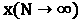，定义平均值的积分近似于预期值的估计值。让我们试着举个例子，让你明白这一点。我们将一枚硬币抛 10 次、100 次、1000 次，然后检查有多少次我们得到了头像。我们可以将获得的结果放入一个表格中，如下所示：


图 4.4–掷硬币结果表

分析上表的最后一列，我们可以看到频率值接近 50%的概率。因此，我们可以说，随着测试次数的增加，频率值趋于理论概率值。后一个值可以在趋向无穷大的投掷次数的假设中实现。

重要提示

大数定律的使用是不同的。实际上，大数定律允许我们在应用*蒙特卡罗方法进行 Pi 估算*部分时，将发射次数与圆形扇区面积相等。通过这种方式，我们可以简单地通过生成随机数来估计 Pi 的值。此外，在这种情况下，生成的随机变量数量越多，Pi 的估计值就越接近预期值。

大数定律允许您确定蒙特卡罗分析的中心和权重，以估算定积分，但没有说明*N*的数值必须有多大。你没有一个估计来理解你可以执行什么数量级的仿真，这样你就可以考虑足够大的数字。为了回答这个问题，有必要借助中心极限定理。

## 中心极限定理

蒙特卡罗不仅允许我们获得由大数定律确定的预期值的估计值，还允许我们估计与之相关的不确定性。由于中心极限定理，这是可能的，它返回预期值的估计值和结果的可靠性。

重要提示

中心极限定理可以用以下定义来概括：给定一个具有未知分布的数据集，样本的平均值将近似于正态分布。

如果大数定律告诉我们，随机变量允许我们评估期望值，那么中心极限定理提供了关于其分布的信息。

中心极限定理有趣的特点是，用于生成*N*样本的函数的分布没有约束，由此形成随机变量。事实上，与随机变量相关联的分布是什么并不重要，但当平均值以有限方差为特征并且是针对大量样本获得的时，它可以通过高斯分布来描述。

让我们来看一个实际的例子。我们生成 10000 个均匀分布的随机数。然后我们从这个群体中随机抽取 100 个样本。我们重复这个操作的次数是一致的，每一次，我们评估它的平均值，并将这个值存储在一个向量中。最后，我们绘制了我们获得的分布直方图。以下是 Python 代码：

```py
import random
import numpy as np
import matplotlib.pyplot as plt
a=1
b=100
N=10000  
DataPop=list(np.random.uniform(a,b,N))
plt.hist(DataPop, density=True, histtype='stepfilled', alpha=0.2)
plt.show()
SamplesMeans = []
for i in range(0,1000):
    DataExtracted = random.sample(DataPop,k=100)
    DataExtractedMean = np.mean(DataExtracted)
    SamplesMeans.append(DataExtractedMean)
plt.figure()
plt.hist(SamplesMeans, density=True, histtype='stepfilled', alpha=0.2)
plt.show()
```

现在，让我们逐行分析代码，以了解我们是如何实施仿真过程来理解中心极限定理的：

1.  To start, we import the necessary libraries:

    ```py
    import random
    import numpy as np
    import matplotlib.pyplot as plt
    ```

    `random`库为各种分布实现伪随机数生成器。`numpy`库提供了 Python 语言的其他科学功能，旨在对向量和维度矩阵执行操作。

    最后，`matplotlib`库是一个用于打印高质量图形的 Python 库。

2.  Let's move on and initialize the parameters:

    ```py
    a=1
    b=100
    N=10000  
    ```

    `a`和`b`参数是范围的极值，`N`是我们要生成的值的数量。

    现在，我们可以使用`numpy``random.uniform()`函数生成均匀分布，如下所示：

    ```py
     DataPop=list(np.random.uniform(a,b,N))
    ```

3.  At this point, we draw a histogram of the data in order to verify that it is a uniform distribution:

    ```py
    plt.hist(DataPop, density=True, histtype='stepfilled', alpha=0.2)
    plt.show()
    ```

    `matplotlib.hist()`函数绘制直方图；也就是说，连续字符类中的图。

    这在许多情况下都会用到，通常是在自变量定义的区间划分为子区间时显示统计数据。

    打印以下图表：

    

    图 4.5–数据分布图

    这个分布看起来明显是均匀的。事实上，我们可以看到每个箱子都有一个几乎恒定的频率。

4.  Let's now pass the values to the extraction of the samples from the generated population:

    ```py
    SamplesMeans = []
    for i in range(0,1000):
        DataExtracted = random.sample(DataPop,k=100)
        DataExtractedMean = np.mean(DataExtracted)
        SamplesMeans.append(DataExtractedMean)
    ```

    首先，我们初始化了将包含样本的向量。为此，我们使用一个`for`循环来重复操作 1000 次。在每个步骤中，我们首先从使用`random.sample()`函数生成的总体中提取 100 个样本。`random.sample()`函数在不重复数值和不改变输入顺序的情况下提取样本。

5.  Next, we calculated the average of the extracted samples and added the result at the end of the vector containing the samples. Now, all we need to do is view the results:

    ```py
    plt.figure()
    plt.hist(SamplesMeans, density=True, histtype='stepfilled', alpha=0.2)
    plt.show()
    ```

    将打印以下柱状图：


图 4.6——提取样本的曲线图

该分布现在呈现出高斯分布的典型钟形曲线特征。这意味着我们已经证明了中心极限定理。

# 应用蒙特卡罗仿真

蒙特卡罗仿真用于研究模型对随机生成输入的响应。仿真过程分为以下三个阶段：

1.  *N*输入随机生成。
2.  对每个*N*输入执行仿真。
3.  对仿真结果进行汇总和检查。最常用的测量方法包括估计输出的平均值和分配输出值，以及最小或最大输出值。

蒙特卡罗仿真被广泛用于金融、物理和数学模型的分析。

## 生成概率分布

用蒙特卡罗方法可以很容易地解决用分析方法无法找到的概率分布的生成问题。例如，假设我们想估计日本一年内地震造成的损失的概率分布。

重要提示

在这种类型的分析中，有两个不确定性来源：一年中会发生多少次地震，以及每次地震会造成多少损失。即使可以将概率分布分配给这两个逻辑级别，也不一定能够将这些信息与分析方法结合起来，得出年度损失的分布。

进行这种类型的蒙特卡罗仿真比较容易，如下所示：

1.  从年度事件数的分布中提取一个随机数。
2.  如果事件发生在前一点，则从损失分布中提取。
3.  最后，我们将执行的提取值相加，以获得一个表示事件造成的年度损失的值。

通过周期性地重复这三个点，产生了年度损失样本，由此可以估计概率分布，而概率分布无法通过分析获得。

## 数值优化

可用于寻找函数的局部极小值的各种算法。通常，这些算法按照以下步骤进行：

1.  它们从指定的点开始。
2.  它们控制函数的值趋向于小于当前值的方向。
3.  朝这个方向移动，他们会发现一个新的点，在这个点上函数的值比前一个低。

他们不断重复这些步骤，直到达到最低限度。对于只有一个最小值的函数，这种方法允许我们获得一个结果。但是，如果我们有一个具有许多局部极小值的函数，并且我们想要找到使函数全局最小的点，那会怎样呢？下图显示了刚才提到的两种情况；也就是说，只有一个最小值的分布（左）和几个最小值的分布（右）：


图 4.7——两种分布图

局部搜索算法可以在函数的许多局部极小值中的任何一个停止。你怎么知道你找到了许多局部极小值或全局极小值中的一个？没有办法严格规定这一点。唯一实用的可能性是探索搜索域的不同区域，以增加在各种局部极小值中找到全局极小值的概率。

重要提示

已经开发了不同的方法来探索领域，这些领域可能非常复杂，具有许多维度，并且需要遵守约束条件。

蒙特卡罗方法为这个问题提供了一个解决方案；也就是说，创建属于该域的点的初始群体，然后通过定义随机基因突变也发生的点之间的耦合算法来进化该群体。当仿真不同代的点时，选择过程会进行干预，只保留最佳点，即提供要最小化的函数的较低值的点。

每一代人都记录着哪一点代表了有史以来最好的标本。继续这个过程，点倾向于移动到局部低点，但同时，它们探索优化领域的许多领域。这一过程可以无限期地继续下去，尽管在某一点上它被停止了，最好的样本被作为全局最小值的估计值。

## 项目管理

蒙特卡罗方法允许您仿真感兴趣事件的行为，通常返回一个随机变量，其属性（如均值、方差、概率密度函数等）为我们提供了有关仿真质量的重要信息。

这是一种统计分析技术，可应用于我们面临非常不确定的项目估算的所有情况，目的是通过一系列仿真降低不确定性水平。从这个意义上讲，它可以应用于分析与项目相关的时间、成本和风险，从而评估该项目可能对社区产生的影响。

重要提示

对于这些变量中的每一个，仿真不提供单个估计，而是提供一系列可能的估计，以及与每个估计相关的该估计准确的概率水平。

例如，这种技术可以通过一系列离散的仿真周期来确定项目的总体成本。在项目的规划阶段，确定构成项目的活动，并估算与每个活动相关的成本。这样，就可以确定项目的总成本。然而，由于我们依赖于成本估算，因此我们无法确定总体成本以及完工成本是否确定。因此，可以进行蒙特卡罗仿真。

# 使用蒙特卡罗进行数值积分

蒙特卡罗仿真代表了计算积分的数值解。事实上，通过使用蒙特卡罗算法，可以采用一种数值方法来解决数学问题，因为许多变量不提供解析解。当问题规模增大时，与其他方法相比，数值解的效率提高。

重要提示

让我们来分析定积分问题。在最简单的情况下，有一些集成方法可以预见技术的使用，如部件集成、替换集成等。然而，在更复杂的情况下，有必要采用涉及使用计算机的数值程序。在这些情况下，蒙特卡罗仿真提供了一个简单的解决方案，在多维积分的情况下特别有用。

然而，需要强调的是，此仿真返回的结果近似于积分，不是其精确值。

## 定义问题

在下式中，我们用*I*表示函数*f*在有限区间[a，b]内的定积分：


在区间[a，b]中，我们识别函数*f*的最大值，并用*U*表示。为了评估我们引入的近似值，我们绘制了一个基础矩形[a，b]，以及高度*U*。函数*f（x）*下的面积（表示*f（x）*的积分）肯定会小于基础矩形[a，b]的面积和高度*U*。下图显示了函数*f*所包含的面积，该函数表示*f（x）*的积分，矩形的面积*A*以底[A，b]和高度*U*表示我们的近似值：


图 4.8–功能图

通过分析前面的图表，我们可以确定以下时间间隔：

*   x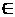[a，b]
*   y[0，U]

在蒙特卡罗仿真中，*x*和*y*都代表随机数。在这一点上，我们可以考虑笛卡尔坐标平面中的一个点，即：我们的目标是确定点位于上一张图中突出显示的区域内的概率；就是说是*y*≤ *f（x）*。我们可以确定两个方面：

*   函数*f*所包含的区域，与定积分*I*重合
*   底部为[A，b]且高度为*U*的矩形的面积为*A*

让我们试着在概率和这两个区域之间建立一个关系：

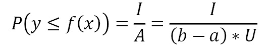

通过蒙特卡罗仿真可以估计概率*P（y<=f（x）】，*。事实上，在*应用**蒙特卡罗方法进行 Pi 估算*部分时，我们遇到了类似的情况。为此，将生成*N 对*随机数（*x*i、*y*i），如下所示：


在所考虑的时间间隔内生成随机数肯定会确定*y*i*的条件≤ 将产生 f（x*i*。如果我们对这个数量进行编号并用符号*M*表示，我们可以分析它的变化。这是一个近似值，其精度随着生成的随机数字对*（x*i*、y*i*的数量增加而增加。因此，概率*P（y<f（x）】*的计算近似值将等于以下值：**

 **

在计算该概率后，可以使用前面的等式追踪积分值，如下所示：

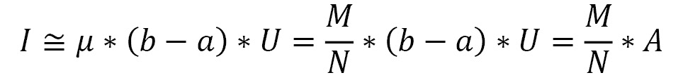

这是这个问题的数学表示。现在，让我们看看数值解。

## 数值解

我们将首先设置仿真所需的组件，从用于定义函数及其存在域的库开始。通过蒙特卡罗方法进行数值积分的 Python 代码如下所示：

```py
import random 
import numpy as np
import matplotlib.pyplot as plt
random.seed(2)
f = lambda x: x**2
a = 0.0
b = 3.0
NumSteps = 1000000 
XIntegral=[]  
YIntegral=[]
XRectangle=[]  
YRectangle=[]
```

现在，让我们逐行分析代码，以了解我们是如何实施仿真过程来理解中心极限定理的：

1.  To start, we import the necessary libraries:

    ```py
    import random
    import numpy as np
    import matplotlib.pyplot as plt
    ```

    `random`库为各种分布实现伪随机数生成器。`numpy`库提供了 Python 语言的其他科学功能，旨在对向量和维度矩阵执行操作。最后，`matplotlib`库是一个用于打印高质量图形的 Python 库。让我们播下种子：

    ```py
    random.seed(2)
    ```

    如果我们希望以不同的方式处理相同的数据集，`random.seed()`函数非常有用，因为它可以使仿真重现。此函数初始化基本随机数生成器。如果你在两个连续的仿真中使用相同的种子，你总是得到相同的数字对序列。

2.  Now, we will define the function that we want to integrate:

    ```py
    f = lambda x: x**2
    ```

    我们知道，为了在 Python 中定义函数，我们使用`def`子句，它会自动为函数分配一个变量。实际上，函数可以像其他 Python 对象一样处理，例如字符串和数字。可以同时（动态）创建和使用这些对象，而无需创建和定义包含它们的变量。

    在 Python 中，函数也可以这样使用，使用名为**lambda**的语法。以这种方式创建的函数是匿名的。当您希望将一个函数作为另一个函数的参数传递时，通常会使用这种方法。lambda 语法需要`lambda`子句，后跟参数列表、冒号字符、表达式来计算参数，最后是输入值。

3.  Let's move on and initialize the parameters:

    ```py
    a = 0.0
    b = 3.0
    NumSteps = 1000000 
    ```

    正如我们在*定义问题*一节中提到的，`a`和`b`表示我们要计算积分的范围的端点。`NumSteps`表示要划分积分间隔的步骤数。步数越大，仿真效果越好，即使算法变得越慢。

4.  现在，我们将定义四个向量，以便存储生成的数字对：

    ```py
    XIntegral=[]  
    YIntegral=[]  
    XRectangle=[]  
    YRectangle=[]
    ```

当生成的`y`值小于或等于*f（x）*时，该值和相对`x`值将被加到`XIntegral`和`YIntegral`向量的末尾。否则，它们将添加到`XRectangle`和`YRectangle`向量的末尾。

## 最小最大检测

在使用该方法之前，需要评估函数的最小值和最大值：

重要提示

回想一下，如果函数只有一个最小值/最大值，那么工作很简单。如果存在重复的最小值/最大值，则程序会变得更复杂。

1.  在下面的 Python 代码中，我们提取分布的最小/最大值：

    ```py
    ymin = f(a)
    ymax = ymin
    for i in range(NumSteps):
        x = a + (b - a) * float(i) / NumSteps
        y = f(x)
        if y < ymin: ymin = y
        if y > ymax: ymax = y
    ```

2.  为了理解所有这些情况，甚至是复杂的情况，我们将寻找划分间隔*【a，b】*的每个步骤的最小值/最大值。我们首先使用范围`(a)`：

    ```py
    ymin = f(a)
    ymax = ymin
    ```

    最左侧的函数值初始化最小值和最大值
3.  然后，我们使用`for`循环检查每个步骤的值：

    ```py
    for i in range(NumSteps):
        x = a + (b - a) * float(i) / NumSteps
        y = f(x)
    ```

4.  对于每个步骤，`x`值是通过将间隔（`a`的左端增加`i`当前值提供的总步骤数的一小部分来获得的。完成此操作后，将评估点处的功能。现在，您可以检查此项，如下所示：

    ```py
        if y < ymin: ymin = y
        if y > ymax: ymax = y
    ```

5.  两条`if`语句允许我们验证*f*的当前值是否小于/大于所选的最小值/最大值，如果是，则更新这些值。现在，我们可以应用蒙特卡罗方法。

## 蒙特卡罗方法

现在，我们将应用蒙特卡罗方法，如下所示：

1.  现在我们已经设置并计算了必要的参数，是时候继续仿真了：

    ```py
    A = (b - a) * (ymax - ymin)
    N = 1000000 
    M = 0
    for k in range(N):
        x = a + (b - a) * random.random()
        y = ymin + (ymax - ymin) * random.random()
        if y <= f(x):
                M += 1 
                XIntegral.append(x)
                YIntegral.append(y)  
        else:
                XRectangle.append(x) 
                YRectangle.append(y)              
    NumericalIntegral = M / N * A
    print ('Numerical integration = ' + str(NumericalIntegral))
    ```

2.  首先，我们将计算矩形的面积，如下所示：

    ```py
    A = (b - a) * (ymax - ymin)
    ```

3.  然后，我们将设置要生成的随机对的数量：

    ```py
    N = 1000000 
    ```

4.  在这里，我们初始化`M`参数，它表示在表示*f（x）*：

    ```py
    M = 0
    ```

    的曲线下的点数
5.  现在，我们可以计算这个值。为此，我们将使用一个`for`循环来迭代流程`N`*次。首先，我们生成两个随机数，如下所示：

    ```py
    for k in range(N):
        x = a + (b - a) * random.random()
        y = ymin + (ymax - ymin) * random.random()
    ```* 
**   Both `x` and `y` fall within the rectangle of area *A*; that is, x 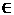 [*a, b*] and y 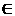 [*0, maxy*]. Now, we need to determine whether the following is true:

    

    我们可以通过`if`语句来实现这一点，如下所示：

    ```py
    if y <= f(x):
                M += 1 
                XIntegral.append(x)
                YIntegral.append(y)                
    ```

    *   如果条件为真，则将`M`的值增加一个单位，并将`x`和`y`的当前值添加到`XIntegral`和`YIntegral`向量中。否则，点将存储在`XRectangle`和`YRectangle`向量中：

    ```py
        else:
                XRectangle.append(x) 
                YRectangle.append(y)              
    ```

    *   After iterating for `N` times, we can estimate the integral:

    ```py
    NumericalIntegral = M / N * A
    print ('Numerical integration = ' + str(NumericalIntegral))
    ```

    将打印以下结果：

    ```py
    Numerical integration = 8.996787006398996
    ```

    此简单积分的解析解如下：

    * 

 *我们所做的百分比误差等于以下值：

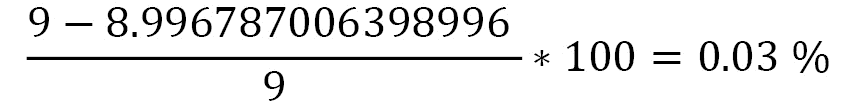

这是一个可以忽略不计的误差，它定义了我们的可靠估计。

## 视觉表现

现在，我们将使用以下步骤绘制结果：

1.  最后，通过绘制生成点的散点图，我们可以可视化我们在数值积分中取得的成果。因此，我们记住了在四个向量中生成的点对：

    ```py
    XLin=np.linspace(a,b)
    YLin=[]
    for x in XLin:
        YLin.append(f(x))
    plt.axis   ([0, b, 0, f(b)])                                            
    plt.plot   (XLin,YLin, color='red' , linewidth='4') 
    plt.scatter(XIntegral, YIntegral, color='blue', marker   ='.') 
    plt.scatter(XRectangle, YRectangle, color='yellow', marker   ='.')
    plt.title  ('Numerical Integration using Monte Carlo method')
    plt.show()
    ```

2.  To start, we generate the points we need in order to draw the representative curve of the function:

    ```py
    XLin=np.linspace(a,b)
    YLin=[]
    for x in XLin:
        YLin.append(f(x))
    ```

    `numpy`库的`linspace()`函数允许我们定义一个由一系列*N*数值元素组成的数组，这些元素平均分布在两个极端（0，1）之间。这将是该函数的*x*，而*y*（`YLin`将从函数的方程中获得，该方程针对*y*求解它们，如下所示：

    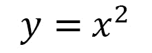

3.  Now that we have all the points, we can draw the graph:

    ```py
    plt.axis   ([0, b, 0, f(b)])                                            
    plt.plot   (XLin,YLin, color='red' , linewidth='4') 
    plt.scatter(XIntegral, YIntegral, color='blue', marker   ='.') 
    plt.scatter(XRectangle, YRectangle, color='yellow', marker   ='.')
    plt.title  ('Numerical Integration using Monte Carlo method')
    plt.show()
    ```

    我们首先使用`plt.axis()`功能设置轴的长度。因此，我们绘制了`x2`函数的曲线，正如我们所知，它是一个凸函数，在[0,3]所考虑的值范围内增加单调函数。

    然后，我们绘制了两个散点图：

    *   一个用于曲线下的点（蓝色点）
    *   One for the points that are above the function (points in yellow)

        `scatter()`函数允许我们在两个轴上表示一系列彼此不密切相关的点。

        下图是使用蒙特卡罗方法进行的数值积分：

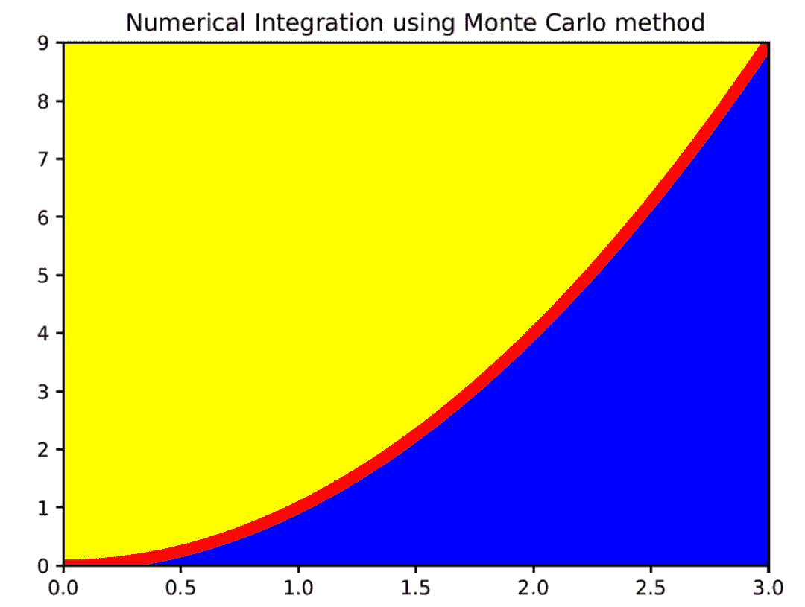

图 4.9–数值积分结果图

我们可以看到，所有蓝色点位于函数曲线下方（红色曲线），而所有黄色点位于函数曲线上方。

# 总结

在本章中，我们介绍了蒙特卡罗仿真的基本概念。我们探索了用于获得满意结果的仿真的蒙特卡罗分量。因此，我们使用蒙特卡罗方法来估计 pi 的值。

然后我们讨论了蒙特卡罗仿真的两个基本概念：大数定律和中心极限定理。例如，大数定律允许我们确定蒙特卡罗分析的中心和权重，以估计定积分。中心极限定理非常重要，正是由于它，许多统计程序才得以工作。

接下来，我们分析了蒙特卡罗方法在现实生活中的实际应用：数值优化和项目管理。最后，我们学习了如何使用蒙特卡罗技术进行数值积分。

在下一章中，我们将学习马尔可夫过程的基本概念。我们将了解 agent 与环境的交互过程，以及如何使用 Bellman 方程作为最优值函数的一致性条件来确定最优策略。最后，我们将学习如何实现马尔可夫链来仿真随机游动。****