# 五、基于仿真的马尔可夫决策过程

**马尔可夫决策过程**（**MDPs**）在结果部分随机，部分受决策者控制的情况下，对决策进行建模。MDP 是一个由五个要素构成的随机过程：决策时期、状态、行动、转移概率和奖励。马尔可夫过程的特征要素是系统发现自己的状态以及决策者可以对这些状态执行的可用操作。这些元素确定了两组：可以找到系统的状态集和每个特定状态可用的操作集。决策者选择的行动决定了系统的随机响应，从而使系统进入新状态。这种转变会带来回报，决策者可以用它来评估他们选择的好处。在本章中，我们将学习如何用马尔可夫链处理决策过程。我们将分析马尔可夫过程的基本概念，然后分析一些实际应用，以了解如何为系统的不同状态之间的过渡选择正确的操作。

在本章中，我们将介绍以下主要主题：

*   马尔可夫过程综述
*   引入马尔可夫链
*   马尔可夫链的应用
*   贝尔曼方程解释
*   多智能体仿真

# 技术要求

本章将介绍 MDP。为了处理本章中的主题，您必须具备代数和数学建模的基本知识。

要使用本章中的 Python 代码，您需要以下文件（可在 GitHub 上通过以下 URL 获得：[https://github.com/PacktPublishing/Hands-On-Simulation-Modeling-with-Python](https://github.com/PacktPublishing/Hands-On-Simulation-Modeling-with-Python) ：

*   `SimulatingRandomWalk.py`
*   `WeatherForecasting.py`

# 马尔可夫过程概述

马尔可夫决策过程被定义为一个离散时间随机控制过程。在*[*第二章*](02.html#_idTextAnchor040)*【了解随机性和随机数】*中，我们说随机过程是用于根据随机规律仿真系统演化的数值模型。自然现象，无论是自然现象还是观测误差，都具有随机因素的特点。这些因素在系统的观测中引入了一个随机数。这种随机因素决定了观测结果的不确定性，因为不可能确定地预测结果。在这种情况下，我们只能说它将以一定的概率假设许多可能值中的一个。*

 *如果从对系统进行观察的瞬间*t*开始，则过程的演变将仅取决于*t*，而不受先前瞬间的影响。这里，我们可以说随机过程是马尔可夫过程。

重要提示

一个过程被称为**马尔可夫**，当过程的未来演化仅取决于系统的观察瞬间，而不以任何方式依赖于过去时。

马尔可夫过程的特征要素包括系统发现自己的状态以及决策者可以对这些状态执行的可用操作。这些元素确定了两组：可以找到系统的状态集和每个特定状态可用的操作集。决策者选择的动作决定了系统的随机响应，从而使其进入新状态。这种转变会带来回报，决策者可以用它来评估他们选择的好处。

## agent 环境接口

为了实现目标，马尔可夫过程具有两个元素之间相互作用问题的特征。这种相互作用的两个特征元素是**主体**和**环境**。agent是必须达到目标的元素，而环境是 agent 必须与之交互的元素。环境对应于代理外部的所有内容。

代理是一个软件，以完全自动和智能的方式执行另一个软件所需的服务。它们被称为智能代理。

代理人的基本特征如下所示：

*   代理会持续监视环境，此操作会导致环境状态发生变化。
*   可用操作属于连续或离散的集合。
*   代理的行为选择取决于环境的状态，这种选择需要一定程度的智能，因为它不是微不足道的。
*   代理具有所做选择的记忆–智能记忆。

代理的行为以试图实现特定目标为特征。要做到这一点，它会在事先不知道或至少不完全知道的环境中执行操作。这种不确定性通过代理和环境之间的交互作用来填补。在这个阶段，代理通过测量环境来学习了解环境的状态，以这种方式规划其未来的行动。

agent 采用的策略是基于错误理论的原理：证明行为和记忆可能犯的错误，以便反复尝试，直到目标实现。代理不断重复这些操作，导致环境发生变化，从而改变其状态。

重要提示

奖励的概念对代理人未来的选择至关重要，它代表了环境对所采取行动的反应。这一反应与行动在实现目标中所决定的权重成正比：如果行动导致正确的行为，它将是积极的，而如果行动不正确，它将是消极的。

引导代理人实现其目标的决策过程可概括为三个要点：

*   代理人的目的
*   与环境的互动
*   环境的全部或部分不确定性

在此过程中，代理通过传感器进行的测量接收来自环境的刺激。代理根据从环境接收到的刺激来决定要采取什么行动。作为代理人行为的结果，确定环境状态的变化将获得奖励。

决策过程中的关键要素如下图所示：


图 5.1——代理人的决策过程

当选择动作时，对环境进行正式描述变得至关重要。此描述必须返回有关环境属性的基本信息，而不是环境的精确表示。

## 探索 MDP

我们在前一节中讨论过的 agent 与环境的交互，被看作是一个马尔可夫决策过程。这种选择取决于加载问题和计算困难。如*马尔可夫过程概述*一节所述，马尔可夫决策过程被定义为离散时间随机控制过程。

在这里，我们需要执行一系列操作，每个操作都会导致环境状态的不确定性变化。通过观察环境，我们知道它在执行一个动作后的状态。另一方面，如果无法对环境进行观察，则即使在执行操作后，我们也无法了解状态。在这种情况下，状态是环境所有可能状态的概率分布。在这种情况下，可以将更改过程视为快照序列。

时间*t*的状态由随机变量*s*t 表示。决策被解释为一个离散时间随机过程。离散时间随机过程是一系列随机变量*x*t，其中 tN。我们可以定义如下一些元素：

*   **状态空间**：随机变量可以假设的值的集合
*   **随机过程的历史（路径）**：随机变量序列的实现

环境对某一行为的反应表现为奖励。马尔可夫决策过程中的代理-环境交互可通过下图进行总结：


图 5.2–MDP 中的代理环境交互

代理环境交互的基本步骤如上图所示，如下所示：

1.  代理和环境之间的交互在一段时间内的离散瞬间发生。
2.  在每一瞬间，代理通过获取其状态*st**S*来监控环境，其中*S*是可能的状态集。
3.  代理执行动作*a*a（st），其中 a（st）是状态*st*可用的一组可能动作。
4.  代理根据要实现的目标选择一种可能的行动。
5.  该选择由策略π（*s，a）*决定，它表示动作*a*在*s*状态下执行的概率。
6.  在时间*t*+1 时，代理收到与先前选择的动作对应的数字奖励*r*t+1r。
7.  由于选择，环境进入了新的状态。
8.  代理必须监视环境状态并执行新操作。
9.  此迭代将重复，直到达到目标。

在我们描述的迭代过程中，*s*t+1 状态取决于之前的状态和所采取的动作。此功能将流程定义为 MDP，可通过以下等式表示：

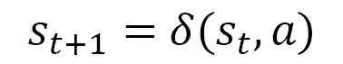

在前面的等式中，*δ*表示状态函数。我们可以将 MDP 总结如下：

1.  代理监控环境的状态并执行一系列操作。
2.  在离散时间*t*时，代理检测到当前状态并决定在*a*执行动作*。*
3.  The environment reacts to this action by returning a reward *r*t= *r* (*s*t*, a*t) and moving to the state *s*t + 1 = *δ* (*s*t*, a*t).

    重要提示

    r 和*δ*函数是环境的特征，仅取决于当前状态和动作。MDP 的目标是学习一个策略，对于系统的每个状态，该策略为代理提供一个动作，该动作使整个动作序列中累积的总奖励最大化。

现在，让我们分析一下前面介绍的一些术语。它们代表了帮助我们理解马尔可夫过程的关键概念。

### 报酬函数

奖励函数在马尔可夫过程中识别目标。它将代理检测到的环境状态映射为一个表示奖励的数字。这一过程的目的是使代理人因其选择而获得的长期总回报最大化。然后，奖励函数收集从代理选择的操作中获得的积极和消极结果，并使用它们修改策略。如果根据策略提供的指示选择的操作返回低奖励，则将修改策略以选择其他操作。报酬函数具有两个功能：它刺激决策的效率，并决定代理人的风险规避程度。

### 政策

策略决定代理在决策方面的行为。它映射了环境的状态和在这些状态下要选择的动作，代表了一组对刺激做出反应的规则或关联。策略是马尔可夫代理的基本组成部分，因为它决定了其行为。在马尔可夫决策模型中，策略提供了一个解决方案，该解决方案将推荐的操作与代理可能实现的每个状态相关联。如果策略在可能的操作中提供了最高的预期效用，则称为最优策略（π*）。这样，代理就不必将以前的选择保存在内存中。要做出决策，代理只需要执行与当前状态关联的策略。

### 状态值函数

状态值函数为我们提供了评估代理状态质量所需的信息。它返回根据每个状态的策略获得的预期目标的值，该值由总预期奖励表示。代理依赖于策略来选择要执行的操作。

## 了解折扣累积奖励

MDP 的目标是学习一个策略，该策略指导代理为环境的每个状态选择要执行的动作。该政策旨在最大限度地提高代理人在整个行动过程中获得的总奖励。让我们学习如何最大化这个总回报。通过采用政策获得的总回报计算如下：


在前面的等式中，*r*T 是将环境带入终端状态*s*T 的行为的回报。

为了获得最大的总回报，我们可以选择为每个州提供最高回报的行动，从而选择使总回报最大化的最优策略。

重要提示

此解决方案不适用于所有情况；例如，当目标或终端状态未在有限的步骤数内实现时。在这种情况下，*r*t 和您想要最大化的奖励之和趋于无穷大。

另一种方法是使用折扣累积奖励，尝试最大化以下金额：


在前面的式中，*γ*被称为折扣因子，代表未来奖励的重要性。折扣系数是 0≤ *γ*≤ 1 且具有以下条件：

*   **γ<1**：序列*rt*收敛为有限值。
*   γT=γ= 0 席 T1：代理不考虑未来的奖励，从而试图最大限度地奖励目前的状态。
*   **γ=1**：代理人倾向于未来奖励而非即时奖励。

在学习过程中，折扣系数的值可能会有所不同，以考虑特殊的操作或状态。最佳策略可能包括回报较低的个人行动，前提是总回报较高。

## 勘探开发概念比较

当达到目标时，代理寻找最有回报的行为。要做到这一点，他们必须将每个动作与返回的奖励联系起来。在具有多个状态的复杂环境中，由于存在多个动作-奖励对，这种方法不可行。

重要提示

这就是众所周知的探索-开发困境：对于每一个国家，代理人探索所有可能的行动，利用在实现目标中获得最大回报的行动。

决策需要在两种可用方法之间进行选择：

*   **开发**：根据当前信息做出最佳决策
*   **勘探**：最好的决策是收集更多的信息

最佳的长期战略可能会带来短期牺牲，因为这种方法需要收集足够的信息以做出最佳决策。

在日常生活中，我们经常发现自己不得不在两种选择中做出选择，至少在理论上，这两种选择会导致相同的结果：这种方法就是探索-开发困境。例如，假设我们需要决定是选择我们已经知道的（开发）还是选择新的（探索）。开发使我们的知识保持不变，而探索使我们更多地了解系统。很明显，探索使我们面临错误选择的风险。

让我们看一个在现实生活中使用这种方法的例子——我们必须选择到达我们信任的餐厅的最佳路径：

*   **利用**：选择你已经知道的路径。
*   **探索**：尝试一条新路。

在复杂问题中，收敛到最优策略可能太慢。在这些情况下，这个问题的解决办法表现为勘探和开发之间的平衡。

完全基于探索的代理在每个状态下都会随机行为，收敛到实际上不可能的最优策略。相反，如果一个代理完全基于剥削进行操作，它们将始终使用相同的操作，这可能不是最优的。

# 引入马尔可夫链

马尔可夫链是离散动态系统，表现出可归因于马尔可夫过程的特征。这些是有限状态系统——有限马尔可夫链——其中从一种状态到另一种状态的转换是基于概率而非确定性的。在通用时刻*t*的链的可用信息由其处于任何状态的概率提供，并且通过指定这些概率如何在时刻*t+1*从时刻*t*更新来指定链的时间演化。

重要提示

马尔可夫链是一种随机模型，在这种模型中，系统随着时间的推移以这样一种方式演化：过去只通过现在影响未来：马尔可夫链对过去没有记忆。

给出了一个随机过程，其特征是一系列随机变量*X*=*X*0，*X*n，其值在一组*j*0*、j*1*、*n 中。如果该过程的演化仅取决于当前状态，即*n*步之后的状态，则该过程是马尔可夫过程。使用条件概率，我们可以用以下等式表示该过程：


如果离散时间随机过程*X*具有马尔可夫性质，则称为马尔可夫链。如果以下转移概率不依赖于*n*，且仅依赖于*i*和*j*，则称马尔可夫链是齐次的：

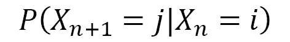

在这些假设中，假设我们有以下几点：

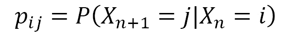

所有联合概率都可以通过知道数字 pij 和以下初始分布来计算：

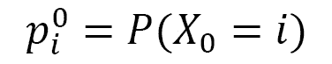

该概率表示零时间过程的分布。概率 pij 称为转移概率，*p*ij 是每个时间阶段从*i*到*j*的转移概率。

## 转移矩阵

通过采用矩阵表示，齐次马尔可夫链的应用很容易。通过这一点，前面的方程所表达的公式变得更具可读性。我们可以通过以下转移矩阵来表示马尔可夫链的结构：

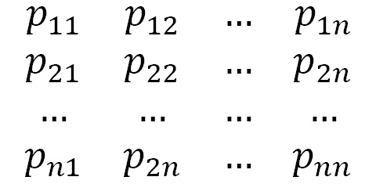

这是一个正矩阵，其中每行元素之和为酉。事实上，*i*第行的元素是在瞬间 t 处于状态 Si 的链通过*S*1*或 S*2*的概率。或者下一个瞬间的 S*n。这种转变是相互排斥的，并且是所有可能的。这种单位和线的正矩阵是随机的。我们将每个向量正直线 x 称为随机线，使得 T=[x1 x2…xn]，其中元素之和假设为单位值：


通过执行单个实验，转移矩阵具有从结果 i 传递到结果 j 的位置（i，j）。

## 过渡图

转移矩阵不是描述马尔可夫链的唯一解。另一种选择是称为过渡图的定向图，其中顶点由状态*S*1*、S*2*、*n 标记，当且仅当从 Si 到 Sj 的转移概率为正时，存在一条连接顶点 Si 和顶点 Sj 的直边。

重要提示

转移矩阵和转移图包含表示相同马尔可夫链所需的相同信息。

让我们来看看一个例子：考虑一个具有三种可能状态的马尔可夫链——1, 2 和 3——由下面的转移矩阵表示：

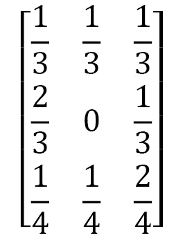

如前所述，转换矩阵包含与转换图相同的信息。让我们学习如何绘制这个图表。有三种可能的状态–1、2 和 3–从每个状态到其他状态的直接边界显示了转变概率 pij。当状态*i*到状态*j*没有箭头时，表示 pij=0：


图 5.3–过渡矩阵图

在前面的转换图中，状态中的箭头加起来总是正好为 1，就像转换矩阵中的每一行一样。

# 马尔可夫链的应用

现在，让我们来看一系列使用马尔可夫链可以实现的实际应用。我们将介绍这个问题，然后分析 Python 代码，让我们仿真它的工作方式。

## 引入随机游动

**随机游动**识别一类用于仿真由一系列随机步骤组成的路径的数学模型。模型的复杂性取决于我们想要仿真的系统特征，这些特征由自由度和方向表示。这个词的作者是卡尔·皮尔森，他在 1905 年第一次提到了“随意散步”这个词。在该模型中，每个步骤都有一个随机方向，该方向通过一个随机过程演变，该过程涉及遵循精确统计分布的已知量。随时间追踪的路径不一定是真实运动的描述：它只是返回变量随时间的演化。这就是该模型在所有科学领域广泛使用的原因：化学、物理、生物学、经济学、计算机科学和社会学。

一维随机游动

一维随意行走仿真了一个准时粒子的运动，该粒子必然沿着直线运动，因此只有两个运动：右运动和左运动。每一个移动都与一步的随机移动相关联，向右移动的概率为*p*，向左移动的概率为*q*。每一步的长度相同，并且独立于其他步骤。下图显示了准时粒子绑定到的路径，以及允许的方向和两个顶点：

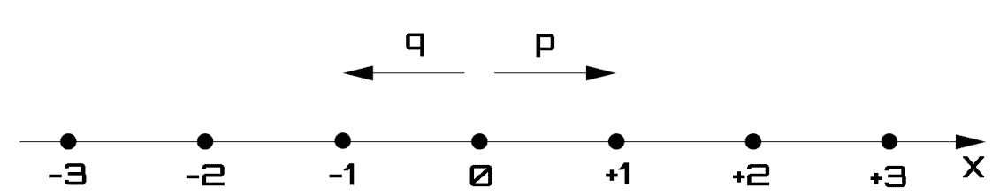

图 5.4–一维步行

n 次通过后，该点的位置将由其横坐标*X（n）*确定，其特征为随机项。我们的目标是计算在*n*步之后粒子返回起点的概率。

重要提示

该点将实际返回其起始位置的想法并不确定。为了表示点在直线上的位置，我们将采用 X（n）变量，该变量表示粒子移动 n 步后直线的横坐标：该变量是一个具有二项式分布的离散随机变量。

点粒子的路径可以概括为：对于每个瞬间，粒子根据随机变量*Z**（n）*返回的值向右或向左移动一步。此随机变量仅取两个二分法值：

*   +1，概率 p>0
*   -概率为 q 的 1

这两种概率通过以下等式相互关联：


让我们考虑随机变量 Po.t0，z，Po.t1，n，与 Po.t2，n，t3，t＝1, 2，…假设这些变量是独立的且分布均匀。瞬间*n*的粒子位置将由以下等式表示：


在前面的公式中，*X*n 是行走中的下一个值，*X*n-1 是前一个时间段的观察值，*Z*n 是该步骤中的随机波动。

重要提示

*X*n 变量标识马尔可夫链；也就是说，下一时刻粒子处于某个位置的概率仅取决于当前位置，即使我们知道当前位置之前的所有时刻。

## 仿真一维随机游动

一次随意行走的仿真并不代表一个随机数的小序列，因为当前一步的下一步代表了它的进化。接下来两个步骤之间的依赖性保证了从一个通道到下一个通道的某种一致性。这在一个平庸的独立随机数生成中是不能保证的，相反，它会返回一个数字到另一个数字之间的巨大差异。让我们学习如何通过以下伪代码在简单的随意行走模型中表示要执行的动作序列：

1.  从 0 位置开始。
2.  随机选择一个二分法值（-1，1）。
3.  将此值添加到上一时间步。
4.  继续重复*步骤 2*。

这个简单的迭代过程可以在 Python 中通过处理随机行走的 1000 个时间步列表来实现。让我们来看一看：

1.  Let's start by loading the necessary libraries:

    ```py
    from random import seed
    from random import random
    from matplotlib import pyplot
    ```

    `random`模块实现各种分布的伪随机数生成器。随机模块基于 Mersenne Twister 算法。Mersenne Twister 是一种伪随机数生成器。最初开发用于生成蒙特卡罗仿真的输入，通过 Mersenne Twister 生成几乎一致的数字，使其适用于广泛的应用。

    从`random`模块导入两个库：`seed`和`random`。在这段代码中，我们将生成随机数。要做到这一点，我们将使用`random()`函数，它在每次调用时生成不同的值。任何数字重复都有很长的一段时间。这对于生成唯一的值或变体非常有用，但有时，以不同的方式处理相同的数据集非常有用。这对于确保实验的再现性是必要的。为此，我们可以使用`seed`库中包含的`random.seed()`函数。此函数用于初始化基本随机数生成器。

    `matplotlib`库是用于打印高质量图形的 Python 库。使用`matplotlib`可以通过几个命令生成图形、直方图、条形图、功率谱、误差图、散点图等。这是一组命令行函数，类似于 MATLAB 软件提供的那些函数。

2.  Now, we will investigate the individual operations. Let's start with setting the seed:

    ```py
    seed(1)
    ```

    如果我们希望以不同的方式处理相同的数据集，`random.seed()`功能非常有用，因为这可以使仿真重现。

    重要提示

    此函数用于初始化基本随机数生成器。如果在两个连续的仿真中使用相同的种子，则始终会得到相同的数字对序列。

3.  Let's move on and initialize the crucial variable of the code:

    ```py
    RWPath= list()
    ```

    `RWPath`变量表示一个列表，其中包含代表随机游动的值序列。列表是值的有序集合，可以是各种类型。它是一个可编辑的容器，意味着我们可以添加、删除和修改现有值。出于我们的目的，当我们希望通过路径的后续步骤不断更新我们的值时，列表表示最合适的解决方案。`list()`函数接受一系列值并将其转换为列表。使用前面的命令，我们只是初始化了当前为空的列表，并使用以下代码开始填充它：

    ```py
    RWPath.append(-1 if random() < 0.5 else 1)
    ```

    我们添加到列表中的第一个值是二分法值。这只是决定要添加的值是`1`还是`-1`的问题。然而，选择是随机的。在这里，我们使用`random()`函数生成一个介于 0 和 1 之间的随机数，然后检查它是否为`<0.5`。如果是，则添加`-1`；否则，我们添加`1`。此时，我们将使用一个`for`循环的迭代循环，该循环将重复 1000 个步骤：

    ```py
    for i in range(1, 1000):
    ```

    在每个步骤中，我们将生成一个随机项，如下所示：

    ```py
    	ZNValue = -1 if random() < 0.5 else 1
    ```

    重要提示

    正如我们选择要添加到列表中的第一个值时所做的那样，我们使用`random()`函数生成一个随机值，因此如果返回的值低于`0.5`，则`ZNValue`变量采用`-1`值；否则，`1`。

4.  Now, we can calculate the value of the random walk at the current step:

    ```py
    XNValue = RWPath[i-1] + ZNValue
    ```

    `XNValue`变量表示当前步长上横坐标的值。它由两个术语组成：第一个术语表示前一状态中横坐标的值，第二个术语表示生成随机值的结果。必须将此值添加到列表中：

    ```py
    RWPath.append(XNValue) 
    ```

    对于我们要执行的 1000 个步骤，将重复此过程。在循环结束时，我们将把整个序列存储在列表中。

5.  Finally, we can visualize it through the following piece of code:

    ```py
    pyplot.plot(RWPath)
    pyplot.show()
    ```

    `pyplot.plot()`函数使用*x*作为索引数组，在*y*轴上绘制`RWPath`列表中包含的值，其值如下：*0..N-1*。`plot()`函数用途极其广泛，可以接受任意数量的参数。

    最后，`pyplot.show()`函数显示创建的图形，如下所示：


图 5.5–随机行走路径的趋势图

在前面的图中，我们可以分析随机过程中点粒子跟随的路径。该曲线可以描述一般功能的趋势，不一定与道路路线相关。正如预期的那样，该过程被配置为马尔可夫过程，因为下一步独立于上一步的位置，并且仅取决于当前步骤。散散步是一种广泛应用于金融领域的数学模型。事实上，它被广泛用于仿真来自市场的信息的效率：价格随着新信息的到来而变化，这与我们已经知道的无关。

## 仿真天气预报

马尔可夫链的另一个潜在应用是开发天气预报模型。让我们学习如何在 Python 中实现该算法。首先，我们可以用一个简化的模型进行工作：我们只考虑两个气候条件/状态，即晴天和雨天。我们的模型将假设明天的天气条件将受到今天天气条件的影响，使该过程具有马尔可夫特征。这两个状态之间的联系将由以下过渡矩阵表示：

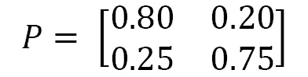

转移矩阵返回条件概率 P（A | B），表示事件 A 发生在事件 B 发生之后的概率。因此，该矩阵包含以下条件概率：

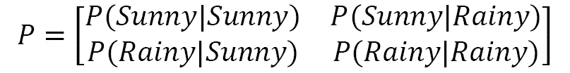

在上一个转移矩阵中，每行包含一个完整的分布。因此，所有数字必须是非负的，且总和必须等于 1。气候条件显示出抵抗变化的趋势。因此，在一个晴天之后，另一个晴天–*P（晴天）*的概率大于一个雨天–*P（晴天）*的概率。明天的气候条件与昨天的气候条件没有直接关系；因此，这个过程是马尔可夫过程。前面的转移矩阵等价于以下内容：


图 5.6–过渡图

我们要详细说明的仿真模型必须计算未来几天下雨的概率。它还必须允许您恢复一段时间内晴天和雨天比例的统计数据。如前所述，该过程是马尔可夫过程，我们在前面章节中分析的工具允许我们获得所需的信息。让我们开始：

1.  Let's see the Python code that alternates sunny and rainy days, starting from a specific initial condition. As always, we will analyze it line by line, starting with loading the necessary libraries:

    ```py
    import numpy as np
    import matplotlib.pyplot as plt
    ```

    `numpy`库是一个 Python 库，它包含许多函数，可以帮助我们管理多维矩阵。此外，它还包含大量高级数学函数，我们可以在这些矩阵上使用这些函数。我们将使用两个函数：`random.seed()`和`random.choose()`。

    `matplotlib`库是用于打印高质量图形的 Python 库。使用`matplotlib`可以通过几个命令生成图形、直方图、条形图、功率谱、误差图、散点图等。它是一组命令行函数，类似于 MATLAB 软件提供的那些函数。让我们继续说明代码：

    ```py
    np.random.seed(3)
    ```

    `random.seed()`函数初始化随机数生成器的种子。这样，使用随机数的仿真将是可复制的。实验的再现性将通过以下事实得到保证：将生成的随机数始终相同。

2.  Now, let's define the possible states of the weather conditions:

    ```py
    StatesData = ['Sunny','Rainy']
    ```

    提供两种状态：晴天和雨天。表示天气条件之间转换的转换矩阵将设置如下：

    ```py
    TransitionStates = [['SuSu','SuRa'],['RaRa','RaSu']]
    TransitionMatrix = [[0.80,0.20],[0.25,0.75]]
    ```

    转移矩阵返回条件概率*P（A|B）*，表示事件*B*发生后事件*A*发生的概率。一行中的所有数字必须是非负的，且总和必须等于 1。让我们继续并设置将包含状态转换列表的变量：

    ```py
    WeatherForecasting = list()
    ```

    `WeatherForecasting`变量将包含天气预报的结果。此变量将为`list`类型。

    重要提示

    列表是值的有序集合，可以是各种类型。它是一个可编辑的容器，允许我们添加、删除和修改现有值。

    对于我们的目的，即通过路径的后续步骤不断更新我们的值，列表表示最合适的解决方案。`list()`函数接受一系列值并将其转换为列表。

3.  现在，我们决定预测天气状况的天数：

    ```py
    NumDays = 365
    ```

4.  目前，我们已决定仿真 1 年时间范围内的天气预报；即 365 天。让我们修复一个包含当天预测的变量：

    ```py
    TodayPrediction = StatesData[0]
    ```

5.  此外，我们还使用包含可能状态的第一个向量值初始化它。该值对应于`Sunny`条件。我们在屏幕上打印此值：

    ```py
    print('Weather initial condition =',TodayPrediction)
    ```

6.  此时，我们可以预测`NumDays`变量设定的每一天的天气条件。为此，我们将使用一个`for`循环，该循环将执行同一段代码，执行次数等于我们预先设置的天数：

    ```py
    for i in range(1, NumDays):
    ```

7.  现在，我们将分析整个程序的主要部分。在`for`循环中，通过一个附加的条件结构`if`语句来预测连续每一天的时间。从`TodayPrediction`变量中包含的气象条件开始，我们必须预测第二天的天气。我们有两种情况：晴天和下雨。实际上有两种控制条件，如下代码所示：

    ```py
    if TodayPrediction == 'Sunny':        
            TransCondition = np.random.choice(TransitionStates[0],replace=True,p=TransitionMatrix[0])
            if TransCondition == 'SuSu':
                pass
            else:
                TodayPrediction = 'Rainy'

     elif TodayPrediction == 'Rainy':
            TransCondition = np.random.choice(TransitionStates[1],replace=True,p=TransitionMatrix[1])
            if TransCondition == 'RaRa':
                pass
            else:
                TodayPrediction = 'Sunny'
    ```

8.  If the current state is `Sunny`, we use the `numpy random.choice()` function to forecast the weather condition for the next state. A common use for random number generators is to select a random element from a sequence of enumerated values, even if these values are not numbers. The `random.choice()` function returns a random element of the non-empty sequence passed as an argument. Three arguments are passed:

    `TransitionStates[0]`：第一行过渡态

    `replace=True`：该样品为替换品

    `p=TransitionMatrix[0]`：与通过状态下的每个条目相关联的概率

    `random.choise()`函数根据`TransitionStates`矩阵中包含的值返回`SuSu`、`SuRa`、`RaRa`和`RaSu`类型的随机样本。前两个将从晴天开始返回，其余两个将从雨天开始返回。这些值将存储在`TransCondition`变量中。

    在每个`if`语句中，还有一个额外的`if`语句。这用于确定是更新天气预报的当前值还是保持不变。让我们看看如何：

    ```py
    if TransCondition == 'SuSu':
                pass
            else:
                TodayPrediction = 'Rainy' 
    ```

    如果`TransCondition`变量包含`SuSu`值，则当天的天气条件保持不变。否则，将其替换为`Rainy`值。`elif`条款从降雨条件开始执行类似程序。在`for`循环的每次迭代结束时，更新天气预报列表，并打印当前预报：

    ```py
    WeatherForecasting.append(TodayPrediction) 
    print(TodayPrediction)
    ```

    现在，我们需要预测未来 365 天的天气预报。

9.  Let's draw a graph with the sequence of forecasts for the next 365 days:

    ```py
    plt.plot(WeatherForecasting)
    plt.show()
    ```

    打印以下图表：

    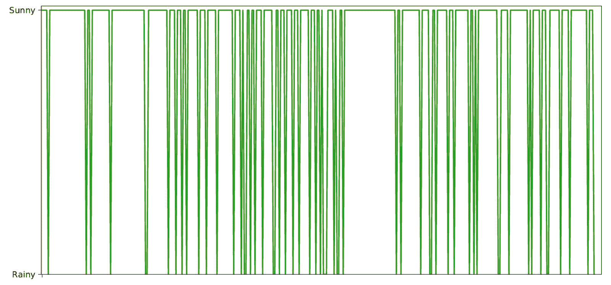

    图 5.7–天气预报图

    在这里，我们可以看到晴天的天气预报比雨天的天气预报更为普遍。

    重要提示

    顶部的平坦点代表所有的晴天，而中间的凹陷点代表雨天。

10.  To quantify this prevalence, we can draw a histogram. In this way, we will be able to count the occurrences of each condition:

    ```py
    plt.figure()
    plt.hist(WeatherForecasting)
    plt.show()
    ```

    以下是未来 365 天天气状况的柱状图：

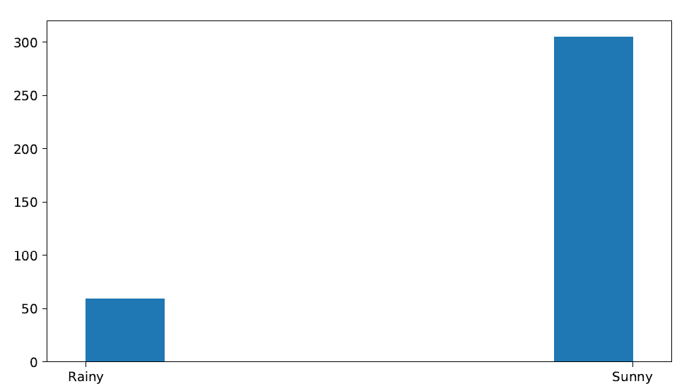

图 5.8–天气预报直方图

有了这个，我们可以确认晴天的普遍性。我们得到的结果来自于转移矩阵。事实上，我们可以看到，太阳状况持续的概率大于降雨的概率。此外，初始条件已设置为阳光条件。我们还可以尝试看看当初始条件设置为降雨条件时会发生什么。

# 解释了贝尔曼方程

1953 年，理查德·贝尔曼（Richard Bellman）引入了动态规划原理，以有效地解决顺序决策问题。在这类问题中，决策会定期执行，并影响模型的大小。反过来，这些因素会影响未来的决策。Bellman 阐述的优化原则允许通过智能应用程序有效处理决策和模型大小之间交互的复杂性。动态规划技术也从一开始就应用于没有时间或顺序方面的问题。

重要提示

虽然通过提供一个通用的抽象模型，动态规划可以应用于广泛的问题，但从实用的角度来看，许多问题需要这样的维度的模型来排除任何计算方法。这种不便后来被称为“维度诅咒”，并且是对计算复杂性概念的一种预期，用仍然非正式的术语来说。

动态规划的最大成功在于序列决策模型，特别是随机类型的决策模型，如马尔可夫决策过程，但也包括一些组合模型。

## 动态规划概念

**动态规划**（**DP**是一种规划技术，旨在基于以**MDP**形式的环境完美模型计算最优策略。动态规划的基础是使用状态值和行动值来确定好的政策。

DP方法应用于马尔可夫决策过程，使用两个相互作用的过程，称为政策评估和政策改进：

*   **政策评估**是通过迭代过程来完成的，该过程旨在求解贝尔曼方程。k 过程的收敛性→ ∞ 施加近似规则，从而引入停止条件。
*   **策略改进**基于当前值改进策略。

在策略迭代技术中，刚才描述的两个阶段是交替的，每个阶段在另一个阶段开始之前结束。

重要提示

评估策略时的迭代过程要求我们通过一个迭代过程在每一步评估策略，该迭代过程的收敛性是未知的，取决于起始策略。为了解决这个问题，我们可以在某个时刻停止评估策略，同时仍然确保我们收敛到最佳值。

## 最优性原则

动态优化程序的有效性由 Bellman 的最优性原则保证：*最优策略的性质是，无论初始状态和初始决策是什么，剩余决策必须构成与第一个决策产生的状态相关的最优策略。*

基于这一原则，可以使用动态确定的目标函数值，将问题分为多个阶段，并按顺序解决这些阶段，而不考虑导致这些阶段的决策。这允许我们一次优化一个阶段，将初始问题减少为一系列更小的子问题，因此更容易解决。

## 贝尔曼方程

贝尔曼方程通过寻找最优策略和价值函数，帮助我们求解 MDP。最优值函数 V*（S）是返回状态最大值的函数。该最大值是对应于在每个状态下使最佳行动的奖励值最大化的行动的最大值。然后，通过递归过程，将贴现因子乘以下一状态的值，再乘以贝尔曼方程。以下是贝尔曼方程的一个示例：

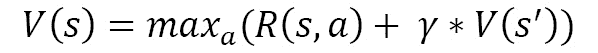

在上一个等式中，我们有以下等式：

*   为*s*状态下的功能值。
*   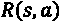是我们在*s*状态下扮演一个角色后得到的奖励。
*   γ是贴现系数。
*   为下一状态的功能值。

对于一个随机系统，当我们采取行动时，并不是说我们将在以后的状态中结束，而是我们只能指出在那个状态中结束的概率。

# 多智能体仿真

agent 可以定义为任何能够通过传感器感知环境并通过执行器在其中起作用的事物。人工智能关注的是理性代理的概念，或者总是试图优化适当性能度量的代理。rational agent 可以是人类 agent、机器人 agent 或软件 agent。在下图中，我们可以看到代理和环境之间的交互：


图 5.9–代理和环境之间的交互

当 agent 能够灵活、独立地选择要采取的行动以实现其目标，而无需不断地求助于外部决策系统的干预时，它被认为是自治的。请注意，在大多数复杂域中，代理只能部分获取信息并在其插入的环境中拥有控制权，因此最多只能对其施加一定的影响。

如果代理具有以下特征，则可以将其视为自治和智能代理：

*   **反应性**：它必须感知环境，设法及时适应所发生的变化。
*   **主动性**：必须表现出以主动性为目标的行为。
*   **社交技能**：它必须能够与其他代理人互动，以实现他们的目标。

在许多情况下，多个代理共存于同一环境中，并以不同的方式相互作用。事实上，代理表示一个孤立的系统是非常罕见的。我们可以将**多智能体系统**（**MAS**定义为一组可能相互交互的智能体。MAS 可以是竞争性的，即每个代理都试图完全最大化自己的利益，甚至牺牲其他代理的利益，而不是合作性的，即代理愿意放弃部分目标，试图最大化系统的全球效用。

可能的交互类型如下所示：

*   **协商**：当代理必须就分配给某些变量的值寻求一致时，会发生。
*   **合作**：这发生在有共同目标的情况下，代理人试图调整和协调他们的行动。
*   **协调**：这是一种旨在避免代理之间冲突的交互。

MAS 系统的使用带来了一系列优势：

*   **效率和速度**：由于可以并行执行计算。
*   **鲁棒性**：系统能够克服单 agent 故障。
*   **灵活性**：向系统中添加新代理非常简单。
*   **模块化**：在软件设计阶段非常有用，因为可以重用代码。
*   **成本**：与整个系统相比，单个单元代理的成本非常低。

基于决策过程处理问题的多智能体系统越来越受到重视，这与它们的一些区别特征有关，例如灵活性和通过相互交互的不同计算单元表示独立实体的可能性。事实上，决策系统的各个利益相关者可以建模为自治代理。一些实际应用程序最近采用了一种基于问题的方法，例如满足和优化分布式约束，以及识别在集中（最优）和非协调（坏）约束之间具有中间效率的规则。

# 总结

在本章中，我们学习了马尔可夫过程的基本概念。在这一点上，过程的未来演变只取决于对系统的即时观察，而决不取决于过去。我们已经看到了一个代理和周围环境是如何相互作用的，以及描述其行为特征的元素。我们现在了解了决策背后的奖励和政策概念。然后，我们继续通过分析控制其演化的矩阵和转移图来探索马尔可夫链。

然后，我们讨论了一些应用程序，以便将我们学到的概念付诸实践。我们采用一种基于马尔可夫链的方法来处理一次随意散步和天气状况的预测模型。接下来，我们研究了 Bellman 方程作为最优值函数的一致性条件来确定最优策略。最后，我们引入了多智能体系统，它允许我们在决策过程中考虑不同的利益相关者。

在下一章中，我们将了解如何获得总体参数的置信区间和标准误差的稳健估计，以及如何估计统计量的失真和标准误差。然后，我们将了解如何执行统计显著性测试以及如何验证预测模型。*