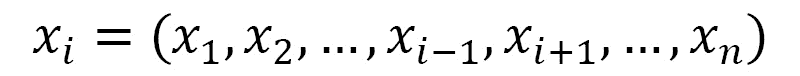
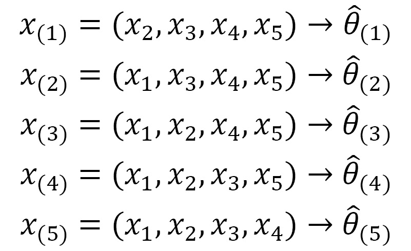
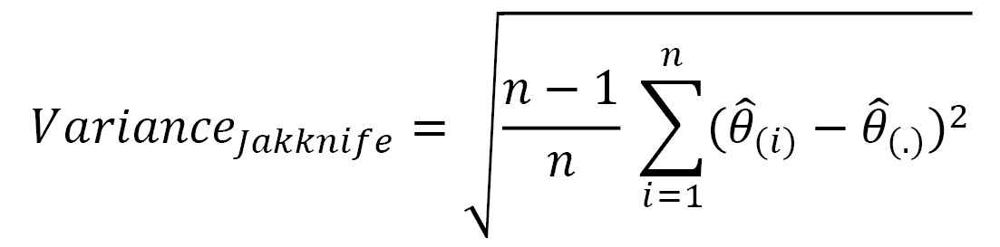
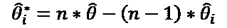
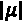
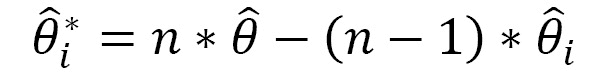
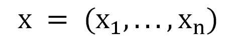
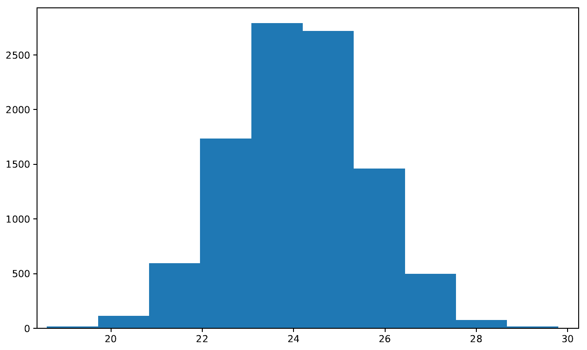
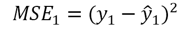
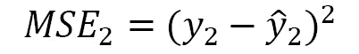

# 六、重采样方法

重采样方法是随机仿真和随机数最有趣的推理应用之一。它们在非参数领域特别有用，因为传统的推理方法无法正确应用。它们生成随机数，分配给随机变量或随机样本。它们需要与重复操作增长相关的机器时间。它们的实现非常简单，一旦实现，它们就会自动执行。选择所需元素必须提供代表总体的样本，或者至少可以提供代表总体的样本。为了实现这一点，样本中必须包含人口的所有特征。在本章中，我们将尝试推断从整个人口的代表性样本中获得的结果。鉴于此推断可能出错，有必要评估样本的准确度和得出错误预测的风险。在本章中，我们将学习如何应用重采样方法来近似样本分布的某些特征，以便验证统计模型。我们将分析最常见的重采样方法的基础知识，并通过解决一些实际案例来学习如何使用它们。

在本章中，我们将介绍以下主要主题：

*   介绍重采样方法
*   jackknife 技术初探
*   解谜引导
*   解释置换测试
*   交叉验证技术探讨

# 技术要求

在本章中，我们将讨论重采样方法技术。为了处理本章中的主题，您必须具备代数和数学建模的基本知识。要使用本章中的 Python 代码，您需要以下文件（可在 GitHub 上通过以下 URL 获得：[https://github.com/PacktPublishing/Hands-On-Simulation-Modeling-with-Python](https://github.com/PacktPublishing/Hands-On-Simulation-Modeling-with-Python) ：

*   `JackknifeEstimator.py`
*   `BootstrapEstimator.py`
*   `KfoldCrossValidation.py`

# 介绍重采样方法

重采样方法是一套基于使用数据子集的技术，可以随机提取，也可以根据系统程序提取。这项技术的目的是近似样本分布的某些特征——统计、测试或估计器——以验证统计模型。

重采样方法是随机仿真和随机数生成最有趣的推理应用之一。这些方法在 20 世纪 60 年代开始流行，起源于蒙特卡罗方法的基本概念。蒙特卡罗方法的发展主要发生在 20 世纪 80 年代，随着信息技术的进步和计算机能力的提高。在经典推理方法无法正确应用的情况下，它们的有用性与非参数方法的发展有关。

从重采样方法可以观察到以下细节：

*   他们多次重复简单的操作。
*   它们生成随机数，分配给随机变量或随机样本。
*   随着重复操作数量的增加，它们需要更多的机器时间。
*   它们的实现非常简单，一旦实现，它们就会自动执行。

随着时间的推移，各种重采样方法已经开发出来，并且可以根据某些特征进行分类。

重要提示

可以在基于随机抽取样本数据子集的方法和根据非随机程序进行重采样的方法之间进行第一分类。

可按如下方式进行进一步分类：

*   bootstrap 方法及其变体（如子抽样）属于随机抽取类别。
*   刀切和交叉验证等程序属于非随机类别。
*   统计测试，称为置换或精确测试，也包括在重采样方法家族中。

## 抽样概念概述

**抽样**是所有统计研究的基础课题之一。采样生成一组基本单元，即总体的子集，其属性与整个总体相同，至少具有定义的错误风险。

所谓总体，我们指的是所有基本单位的集合，有限的或无限的，这些基本单位具有一定的特征，这表明它们是同质的。

重要提示

例如，这可以是每个地方的温度值总体，时间跨度可以是每天、每月或每年。

**抽样理论**是统计推断的一个完整的和准备部分，以及由此产生的抽样技术，允许我们识别要分析变量的单位。

**统计抽样**是一种用于随机选择项目的方法，以使总体中的每个项目都有已知的非零概率包含在样本中。随机选择被认为是构建代表性样本的有力手段，该样本的结构和多样性反映了所考虑的群体。统计抽样使我们能够获得一个客观的样本：元素的选择不取决于出于研究便利性或可用性的原因而定义的标准，也不系统地排除和支持群体中的任何元素组。

在与概率计算相关的随机抽样中，执行以下操作：

*   通过数学公式外推结果并估计相关误差
*   控制得出与现实相反结论的风险
*   通过公式计算获得给定精度和精密度所需的最小样本量

## 关于抽样的推理

现在，让我们来了解为什么可能更倾向于分析样本的数据而不是整个人群的数据：

*   Consider a case in which the statistical units do not present variability. Here, it is useless to make many measurements because the population parameters are determined with few measurements. For example, if we wanted to determine the average of 1,000 identical statistical units, this value would be equal to that obtained if we only considered 10 units.

    重要提示

    如果并非所有人口要素都可用，则使用抽样。例如，对过去的调查只能根据现有的历史数据进行，而这些数据往往是不完整的。

*   在获得结果时，如果节省了大量时间，则表示采样。这是因为，即使使用电子计算机，如果调查仅限于总体人口的几个要素，数据输入阶段也会大大缩短。

## 抽样的利弊

收集信息后，对构成研究人群的所有单位进行调查。当对收集到的信息进行分析时，可以只对构成人口的部分单位进行分析。

抽样的优点如下：

*   降低成本
*   缩短时间
*   减轻组织负担

抽样的缺点如下：

*   抽样基数并不总是可用或容易知道

在参考群体的组成或大小部分未知的情况下，可通过强制选择进行抽样。抽样并不总能取代完整的调查，例如关于婚姻状况、出生和死亡的调查：所有个案都必须知道。

## 概率抽样

在概率抽样中，必须提取人口的每个单位的概率是已知的。相比之下，在非概率抽样中，必须提取人口的每个单位的概率是未知的。

让我们来看一个例子。如果我们通过抽签的方式从任何一天在校的大学生中抽取样本，我们无法获得概率样本，原因如下：未入学的学生没有进入的机会，而入学人数最多的学生比随后几年的其他学生更有可能被抽取。

## 抽样工作原理

抽样程序涉及一系列需要适当遵循的步骤，以便提取能够充分代表总体的数据。抽样工作如下：

1.  在检测统计中定义目标总体。
2.  定义采样单位。
3.  确定样本的大小。
4.  根据抽样方法，选择一个或多个样本，对其上的载荷进行统计检测。
5.  最后，对样本的优劣做出判断。

# 探索刀切技术

此方法用于估计统计数据的失真和标准偏差等特征。这种技术使我们能够获得所需的估计，而无需借助参数假设。Jackknife 是基于计算我们获得的子样本的感兴趣的统计数据，一次忽略一个样本观察。刀切估计对于各种样本统计是一致的，例如均值、方差、相关系数、最大似然估计等。

## 定义刀切法

Jackknife 方法由 M.H.Quenouille 于 1949 年提出，由于当时的计算能力较低，他创建了一种需要固定数量账户的算法。

重要提示

该方法的主要思想是每次从原始样本中截取不同的观测值，并重新评估感兴趣的参数。该估算值将与在原始样本上计算的同一估算值进行比较。

由于变量的分布未知，估计量的分布也未知。

每次在原始样品外保留一个观察值*x*i，由此构建刀切样品，如下式所示：



然后，获得尺寸为*m*=n-1 的*n*样本。让我们来看一个例子。考虑尺寸 n＝5 的样品，其产生尺寸为 m＝4 的五刀切样品，如下：


伪值在通用*i*th 样本折刀上重新计算。该程序在每个可用的刀切样品上重复*n*次：



下图显示了该初步程序：


图 6.1——折刀法的表示

为了计算刀切估算的方差，将使用以下等式：



在前面的等式中，术语定义如下：


计算出的标准偏差将用于建立参数的置信区间。

为了评估并可能减少估计器失真，失真的刀切估计值计算如下：



本质上，刀切法可以减少偏差，并评估估计器的方差。

## 估计变异系数

为了对不同分布之间的变异性进行比较，我们可以使用**变异系数**（**CV**，因为它考虑了分布的平均值。变异系数是色散的相对度量，是一个无量纲量值。它允许我们评估平均值周围值的分散度，而不考虑测量单位。

重要提示

例如，以美元表示的收入样本的标准差与以欧元表示的相同收入的标准差完全不同，而在这两种情况下，分散系数是相同的。

使用以下方程式计算变异系数：


在前面的等式中，我们使用以下参数：

*   是分布的标准偏差。
*   是分布平均值的绝对值。

方差是一组数据中每个观测值与数据算术平均值之间的差值平方的平均值：


因此，它代表了我们所犯的平方误差，平均而言，用平均的平均值 T0（T1）代替一般的观测席。标准偏差是方差的平方根，因此代表均方误差的平方根：


CV 可以从平均值和标准偏差开始定义，是比较两个性状变异性的合适指标。当您想要比较具有不同测量单位或不同变化范围的数据分散度时，CV 特别有用。

## 使用 Python 应用刀切重采样

现在，让我们看一看一些 Python 代码，将分布的 CV 与根据 Jackknife 方法通过重采样获得的 CV 进行比较：

1.  Let's see the code step by step, starting with loading the necessary libraries:

    ```py
    import random
    import statistics 
    import matplotlib.pyplot as plt
    ```

    `random`模块实现各种分布的伪随机数生成器。`random`模块基于 Mersenne Twister 算法。Mersenne Twister 是一种伪随机数生成器。最初开发用于生成蒙特卡罗仿真的输入，通过 Mersenne Twister 生成几乎一致的数字，使其适用于广泛的应用。

    `statistics`模块包含许多从数值数据计算数理统计的功能。利用本模块中可用的工具，可以计算平均值，并测量中心位置和扩散测量值。

    `matplotlib`库是用于打印高质量图形的 Python 库。使用`matplotlib`可以通过几个命令生成图形、直方图、条形图、功率谱、误差图、散点图等。这是一组命令行函数，类似于 MATLAB 软件提供的那些函数。

2.  We now generate a distribution that represents our data population. We will use this data to extract samples using the sampling methods we are studying. To do this, we first create an empty list that will contain such data:

    ```py
    PopData = list()
    ```

    列表是值的有序集合，可以是各种类型。它是一个可编辑的容器–事实上，它允许我们添加、删除和修改现有值。为了不断更新我们的价值观，该列表代表了最合适的解决方案。`list()`函数接受一系列值并将其转换为列表。使用此命令，我们只需初始化当前为空的列表。

3.  The list will be populated through the generation of random numbers. Then, to make the experiment reproducible, we will fix the seed in advance:

    ```py
    random.seed(5)
    ```

    如果我们想要以不同的方式处理相同的数据集，那么`random.seed ()`函数非常有用，因为这使得仿真具有可再现性。

    重要提示

    此函数用于初始化基本随机数生成器。如果在两个连续的仿真中使用相同的种子，则始终会得到相同的数字对序列。

4.  Now, we can populate the list with 100 randomly generated values:

    ```py
    for i in range(100):
        DataElem = 10 * random.random()
        PopData.append(DataElem)
    ```

    在前一段代码中，我们使用`random()`函数生成了 100 个介于 0 和 1 之间的随机数。然后，对于`for`循环的每个步骤，将该数字乘以 10，以获得 0 到 10 之间的数字分布。

5.  Now, let's define a function that calculates the coefficient of variation, as follows:

    ```py
    def CVCalc(Dat):
        CVCalc = statistics.stdev(Dat)/statistics.mean(Dat) 
        return CVCalc
    ```

    如*估算变异系数*一节所述，该系数只是标准偏差和平均值之间的比率。为了计算标准偏差，我们使用了`statistics.stdev()`函数。此函数计算样本标准偏差，它表示样本方差的平方根。为了计算数据的平均值，我们使用了`statistics.mean`函数。此函数用于计算数据的样本算术平均值。我们可以立即使用新创建的函数来计算我们创建的分布的变异系数：

    ```py
    CVPopData = CVCalc(PopData)
    print(CVPopData)
    ```

    返回以下结果：

    ```py
    0.6569398125747403
    ```

    现在，我们省略了这个结果，但我们稍后将使用它来比较我们通过重采样获得的结果。

6.  Now, we can move on and resample according to the Jackknife method. To begin, we fix the variables that we will need in the following calculations:

    ```py
    N = len(PopData)
    JackVal = list()
    PseudoVal = list()
    ```

    `N`表示起始分布中存在的样本数。`JackVal`列表将包含`Jackknife`样本，`PseudoVal`列表将包含`Jackknife`伪值。

7.  The two newly created lists must be initialized to zero to avoid problems in subsequent calculations:

    ```py
    for i in range(N-1):
        JackVal.append(0)
    for i in range(N):
        PseudoVal.append(0)
    ```

    `JackVal`列表的长度为*N-1*，与我们在*定义刀切法*一节中讨论的内容相关。

8.  At this point, we have all the tools necessary to apply the Jackknife method. We will use two `for` loops to extract the samples from the initial distribution by calculating the pseudo value at each step of the external loop:

    ```py
    for i in range(N):
        for j in range(N):
            if(j < i): 
                JackVal[j] = PopData[j]
            else:
                if(j > i):
                    JackVal[j-1]= PopData[j]
        PseudoVal[i] = N*CVCalc(PopData)-
                           (N-1)*CVCalc(JackVal)
    ```

    Jackknife samples（Apple T0）是通过在外部环路的每个步骤留下原始样品的观察席（为 To.T2。在外部循环的每个步骤结束时，使用以下方程式计算伪值：

    

9.  To analyze the distribution of pseudo values, we can draw a histogram:

    ```py
    plt.hist(PseudoVal)
    plt.show()
    ```

    打印以下图形：

    

    图 6.2–伪值分布

10.  Now, let's calculate the average of the pseudo values that we have obtained:

    ```py
    MeanPseudoVal=statistics.mean(PseudoVal)
    print(MeanPseudoVal)
    ```

    返回以下结果：

    ```py
    0.6545985339842991
    ```

    正如我们所见，我们得到的值与我们从初始分布得到的值是可比的。现在，我们将计算伪值的方差：

    ```py
    VariancePseudoVal=statistics.variance(PseudoVal)
    print(VariancePseudoVal)
    ```

    返回以下结果：

    ```py
    0.2435929299444099
    ```

    最后，让我们评估刀切估计器的方差：

    ```py
    VarJack = statistics.variance(PseudoVal)/N
    print(VarJack)
    ```

    返回以下结果：

    ```py
    0.002435929299444099
    ```

我们将使用这些结果来比较不同的重采样方法。

# 揭开自举的神秘面纱

最著名的重采样技术是 B.Efron 在 1993 年引入的一种定义为自举的技术。bootstrap 方法的逻辑是构建未观察到的样本，但在统计上与观察到的样本相似。这是通过提取过程对观测序列重新采样实现的，我们在提取过程中重新插入观测值。

## 引入自举

这个过程就像从 urn 中提取一个数字，然后在下一次提取之前重新插入该数字。一旦选择了统计检验，则对观察到的样本和大量与观察到的样本大小相同的样本进行计算，并通过重新取样获得。检验统计量的*N*值允许我们定义样本分布；即所选统计数据的经验分布。

重要提示

统计检验是一种区分样本的规则，如果观察到样本，会导致拒绝初始假设，而如果观察到样本，则会导致接受相同假设，直到得到证明。

由于自举样本源于随机抽取过程，并从原始序列重新整合，因此观察序列的任何时间相关结构都不会保留。因此，自举样本具有观察到的样本等属性，但至少大致尊重独立性假设。这使得它们适用于计算测试统计分布，假设没有趋势、变化点或通用系统时间趋势的零假设。

一旦知道零假设下一般检验统计量的样本分布，就可以将观察样本上计算的统计量值与从样本分布中推导出的分位数进行比较，并检查该值是否落入显著性水平为 5%和 10%的关键区域，分别地或者，您可以定义在观察样本上计算的统计值被来自 N 个样本的值超过的时间百分比。该值是观察样本的统计 p 值，并检查该百分比是否远离通常采用的 5%和 10%的含义。

## 引导定义问题

Bootstrap 是一种统计重采样技术，它通过再入来近似统计的样本分布。因此，它允许我们近似估计值的均值和方差，以便我们可以建立置信区间，并在不知道感兴趣的统计分布时计算测试 p 值。

重要提示

Bootstrap 是基于这样一个事实：唯一可用的样本用于生成更多的样本，并构建理论参考分布。使用原始样本的数据计算统计数据并估计其样本分布，而无需对分布模型进行任何假设。

使用插件原理生成分发；也就是说，*θ*的估计是通过替换未知总体分布函数的经验等价物来构建的。样本的分布函数是通过构造其在该实验情况下可以假设的所有值的频率分布来获得的。

在简单随机抽样的简单情况下，操作如下。考虑一个观察到的样品，用如下公式描述：



从该分布中，对 m 个数量等于*n*、例如*x**1、*x***m*的其他恒定样本进行重新采样。在每次引导提取中，可以多次提取样本第一个元素的数据。提供的每一个都有 1/n 的被提取概率。

假设 E 是我们感兴趣研究的θ的估计量，例如，E（x）=θ。该数量是针对每个引导样本 E（x*1），…，E（x*m）计算的。通过这种方式，θ的 m 估计可用，由此可以计算 bootstrap 平均值、bootstrap 方差、bootstrap 百分位数等。这些值是相应未知值的近似值，并携带有关 E（x）分布的信息。因此，从这些估计量开始，可以计算置信区间、检验假设等。

## 使用 Python 进行引导重采样

我们以类似于 Jackknife重采样的方式进行。我们将生成一个随机分布，根据 bootstrap 方法进行重采样，然后比较结果。让我们一步一步地查看代码，以了解过程：

1.  Let's start by importing the necessary libraries:

    ```py
    import random
    import numpy as np 
    import matplotlib.pyplot as plt
    ```

    NumPy 是一个 Python 库，它包含许多函数，可以帮助我们管理多维矩阵。此外，它包含大量高级数学函数，我们可以在这些矩阵上使用这些函数。

2.  Now, we will generate a distribution that represents our data population. We will use this data to start extracting samples using the sampling methods we have studied. To do this, we will create an empty list that will contain such data:

    ```py
    PopData = list()
    ```

    此列表将通过生成随机数来填充。

3.  To make the experiment reproducible, we will fix the seed in advance:

    ```py
    random.seed(7)
    ```

    如果我们想要以不同的方式处理相同的数据集，那么`random.seed``()`函数非常有用，因为它可以使仿真重现。

4.  Now, we can populate the list with 1,000 randomly generated values:

    ```py
    for i in range(1000):
        DataElem = 50 * random.random()
        PopData.append(DataElem)
    ```

    在前一段代码中，我们使用函数`random()`生成了 1000 个介于 0 和 1 之间的随机数。然后，对于`for`循环的每个步骤，将该数字乘以 50，以获得 0 到 50 之间的数字分布。

5.  At this point, we can start extracting a sample of the initial population. The first sample can be extracted using the `random.choices()` function, as follows:

    ```py
    PopSample = random.choices(PopData, k=100)
    ```

    此函数从具有替换的总体中提取大小为*k*元素的样本。我们从 1000 个元素的原始总体中提取了 100 个元素的样本。

6.  Now, we can apply the bootstrap method, as follows:

    ```py
    PopSampleMean = list()
    for i in range(10000):  
        SampleI = random.choices(PopData, k=100)
        PopSampleMean.append(np.mean(SampleI))
    ```

    在这段代码中，我们创建了一个包含示例的新列表。在这里，我们使用了 1000 步的`for`循环。在每个步骤中，使用`random.choices ()`函数从初始总体中提取 100 个元素的样本。然后，我们得到了这个样本的平均值。然后将该值添加到列表的末尾。

    重要提示

    我们使用替换项对数据进行了重采样，从而使重采样大小与原始数据集的大小相等。

7.  We now print a histogram of the sample we obtained to visualize its distribution:

    ```py
    plt.hist(PopSampleMean)
    plt.show()
    ```

    打印以下图表：

    

    图 6.3–样本分布直方图

    在这里，我们可以看到样本具有正态分布。

8.  We can now calculate the mean of the three distributions that we have generated. Let's start with the bootstrap estimator:

    ```py
    MeanPopSampleMean = np.mean(PopSampleMean)
    print("The mean of the Bootstrap estimator is ",MeanPopSampleMean)
    ```

    返回以下结果：

    ```py
    The mean of the Bootstrap estimator is  24.105354873028915
    ```

    然后，我们可以计算初始总体的平均值：

    ```py
    MeanPopData = np.mean(PopData)
    print("The mean of the population is ",MeanPopData)
    ```

    返回以下结果：

    ```py
    The mean of the population is  24.087053989747968
    ```

    最后，我们计算从初始总体中提取的简单样本的平均值：

    ```py
    MeanPopSample = np.mean(PopSample)
    print("The mean of the simple random sample is ",MeanPopSample)
    ```

    返回以下结果：

    ```py
    The mean of the simple random sample is  23.140472976536497
    ```

我们现在可以比较结果了。在这里，总体和自举样本均值实际上是相同的，而一般样本均值偏离这些值。这告诉我们，与从中提取的一般样本相比，引导样本更能代表初始总体。

## 比较 Jackknife 和 bootstrap

在本节中，我们将通过强调两种研究的抽样方法的优缺点来比较它们：

*   引导需要大约 10 倍的计算工作量。至少从理论上讲，折刀可以手工完成。
*   自举在概念上比折刀简单。Jackknife 需要对 n 个样本进行*n*次重复，而 bootstrap 需要一定数量的重复。这导致选择一个数字来使用，这并不总是一件容易的事情。一般的经验法则是这个数字是 1000，除非你有足够的计算能力。
*   引导引入了错误，这是由于完成了重新采样而产生了额外的变化源。请注意，对于大尺寸或仅使用特定引导样本集的情况，此错误会减少。
*   Jackknife 比 bootstrap 更保守，因为它会产生稍大的估计标准误差。
*   由于复制品之间的微小差异，Jackknife 始终提供相同的结果。另一方面，引导在每次运行时提供不同的结果。
*   Jackknife最适合于估计配对一致性度量的置信度区间。
*   Bootstrap 对于扭曲的分布执行得更好。
*   Jackknife 最适合原始数据的小样本。

# 解释排列测试

当观察一个属于一组可能结果的现象时，我们会问自己概率定律是什么，我们可以分配给这个集合。统计检验提供了一条规则，允许我们根据样本观察结果决定是否拒绝假设。

参数方法对于实验计划和总体模型非常不确定。如果不遵守这些假设，尤其是当数据法则不符合测试的需要时，参数结果的可靠性就会降低。如果假设不是基于数据分布的知识，并且假设没有得到验证，则使用非参数检验。非参数检验提供了一个非常重要的选择，因为它们需要更少的假设。

置换测试是随机测试的一个特例，它使用从统计推断中得出的一系列随机数。现代计算机的计算能力使其广泛应用成为可能。这些方法不要求满足其关于数据分布的假设。

通过以下步骤执行置换测试：

1.  定义的统计值与所研究过程或关系的强度成正比。
2.  定义了一个零假设*H*0。
3.  数据集是基于对实际观测数据的置乱而创建的。根据零假设定义混合模式。
4.  重新计算参考统计数据，并将该值与观察到的值进行比较。
5.  最后两个步骤重复多次。
6.  如果观察到的统计数据大于 95%的基于随机洗牌的情况下获得的限值，则拒绝*H*0。

两个实验使用相同样本空间中的值，分别分布在*P*1 和*P*2 下，这两个分布都是未知总体分布的成员。假设同一数据集为*x*，如果使用相同的检验统计量获得的*x*上的推理条件相同，则假设在无效假设中满足各组的可交换性。排列测试的重要性在于其健壮性和灵活性。使用这些方法的想法是从数据中生成参考分布，并参考产生的离散规律重新计算数据每个排列的测试统计数据。

# 接近交叉验证技术

交叉验证是一种基于预测准确性原则的模型选择程序中使用的方法。样本分为两个子集，其中第一个子集（训练集）用于构建和估计，而第二个子集（验证集）用于验证估计模型预测的准确性。通过对重复预测的综合，获得了模型精度的度量。交叉验证方法就像折刀，每次只留下一个观察结果。在另一种称为 K-fold 验证的方法中，样本被划分为 K 个子集，而每个子集又被作为一个验证集忽略。

重要提示

交叉验证可用于估计统计学习技术的**均方误差**（**MSE**）测试（或一般而言，任何精度度量），以评估其性能或选择其灵活性水平。

交叉验证可用于回归和分类问题。仿真模型的三种主要验证技术是验证集方法、**遗漏交叉验证**（**LOOCV**）和 k-折叠交叉验证方法。在以下部分中，我们将更详细地了解这些概念。

## 验证集方法

此技术包括将可用数据集随机分成两部分：

*   训练器材
*   一个验证集，称为保持集

统计学习模型适用于训练数据，并随后用于使用验证集的数据进行预测。

对产生的测试误差的测量，通常是回归情况下的 MSE，提供了实际测试误差的估计值。事实上，验证集是抽样程序的结果，因此不同的抽样会导致对测试误差的不同估计。

这种验证技术有各种优点和缺点。让我们来看看几个：

*   该方法具有较高的变异性；也就是说，结果可以随着所选测试集的变化而发生实质性变化。
*   只有一部分可用单位用于功能估算。这可能导致函数估计的精度降低，并高估测试误差。

**LOOCV**和 k-fold 交叉验证技术试图克服这些问题。

## 在交叉验证中遗漏一项

LOOCV 还将观察集分为两部分。但是，我们不创建两个大小相当的子集，而是执行以下操作：

1.  使用单个观察（*x*1、*y*1）进行验证，剩余观察组成训练集。
2.  该函数基于训练集的*n-1*观察值进行估计。
3.  The prediction  is made using *x*1\. Since (*x*1, *y*1) was not used in the function estimate, an estimate of the test error is as follows:

    

    但是，即使*MSE*1 对测试误差是公平的，这也是一个很差的估计，因为它是非常可变的。这是因为它是基于单个观察（*x*1、*y*1）。

4.  The procedure is repeated by selecting for validation (*x*2, *y*2), where a new estimate of the function is made based on the remaining *n-1* observations, and calculating the test error again, as follows:

    

5.  重复此方法 n 次会产生*n*测试错误。
6.  The LOOCV estimate for the MSE test is the average of the *n* MSEs available, as follows:

    

与验证集方法相比，LOOCV 具有一些优势：

*   使用*n-1*单元估计函数的偏差较小。因此，LOOCV 方法不会高估测试误差。
*   由于测试集的选择不存在随机性，因此相同初始数据集的结果不存在可变性。

LOOCV 可能是计算密集型的，因此对于大型数据集，计算需要很长时间。然而，在线性回归的情况下，存在计算强度低的直接计算公式。

## K-折叠交叉验证

在**k-折叠交叉验证**（**k-折叠 CV**中），观察集被随机分为大小大致相同的*k*组或文件夹。将第一个文件夹视为验证集，并对其余 k-1 文件夹的功能进行估计。然后根据所保留文件夹的观测值计算均方误差*MSE*1。该程序重复 k 次，每次选择不同的文件夹进行验证，从而获得测试误差的*k*估计值。通过平均这些值计算 k 倍 CV 估计值，如下所示：


如果 k<< n. Furthermore, the k-fold CV tends to have less variability than the LOOCV on different size datasets *n*，该方法具有计算量小的优点。

选择*k*是 k-折叠交叉验证的关键。当交叉验证中*k*发生变化时会发生什么？让我们看看*k*的极端选择意味着什么：

*   较高的*k*值会导致更大的训练集，从而减少偏差。这意味着验证集较小，因此差异较大。
*   较低的*k*值会导致较小的训练集，从而导致更大的偏差。这意味着验证集更大，因此方差更低。

## 使用 Python 进行交叉验证

在本节中，我们将看一个应用交叉验证的示例。首先，我们将创建一个示例数据集，其中包含要识别的简单数据，以便验证算法正在执行的过程。然后，我们将应用 k-折叠交叉验证并分析结果：

1.  As always, we start by importing the necessary libraries:

    ```py
    import numpy as np
    from sklearn.model_selection import KFold
    ```

    `numpy`是一个 Python 库，其中包含许多函数，可帮助我们管理多维矩阵：此外，它还包含大量可用于这些矩阵的高级数学函数。

    Scikit learn 是一个开源 Python 库，它为机器学习提供了多种工具。特别是，它包含许多分类、回归和聚类算法；支持向量机；逻辑回归；还有更多。自 2007 年发布以来，Scikit learn 已成为机器学习领域中使用最多的库之一，无论是有监督的还是无监督的，这要归功于它提供的工具的广泛性，也要归功于它的 API，它是有文档记录的、易于使用的和多功能的。

    重要提示

    **应用程序编程接口**（**API**）是应用软件创建和集成的一组定义和协议。它们允许产品或服务与其他产品或服务进行通信，而不知道它们是如何实现的，从而简化了应用程序开发，并实现了时间和金钱的净节约。在创建新工具和产品或管理现有工具和产品时，API 提供了灵活性；简化设计、管理和使用；提供创新机会。

    scikit 学习 API将功能用户界面与众多分类和元分类算法的优化实现结合在一起。它还提供了各种各样的数据预处理、交叉验证、优化和模型评估功能。Scikit learn 在学术研究中特别受欢迎，因为开发人员只需更改几行代码，就可以使用工具来试验不同的算法。

2.  Now, let's generate the starting dataset:

    ```py
    StartedData=np.arange(10,110,10)
    print(StartedData)
    ```

    这里，我们生成了一个包含 10 个整数的向量，从值 10 到 100，步长等于 10。为此，我们使用了 NumPy`arange()`函数。此函数在一定范围内生成等距值。已通过三个参数，如下所示：

    `10`：间隔的开始。包括该值。如果省略此值，则使用默认值 0。

    `110`：范围结束。除了浮点数的情况外，此值不包括在范围内。

    `10`：值之间的间距。这是两个相邻值之间的距离。默认情况下，此值等于 1。

    返回了以下数组：

    ```py
    [ 10  20  30  40  50  60  70  80  90 100]
    ```

3.  Now, we can set the function that will allow us to perform k-fold cross validation:

    ```py
    kfold = KFold(5, True, 1)
    ```

    Sklearn 的`KFold()`函数通过将数据集划分为 k 个连续折叠来执行 k 折叠交叉验证，默认情况下不进行洗牌。然后，每个折叠被用作一次验证，而剩余的 k-1 折叠形成训练集。通过了三个参数，如下所示：

    `5`：需要的折叠次数。此数字必须至少为 2。

    `True`：可选布尔值。如果等于`True`，则将数据混合后再分批。

    `1`：随机数生成器使用的种子。

4.  Finally, we can resample the data by using k-fold cross validation:

    ```py
    for TrainData, TestData in kfold.split(StartedData):
    	print("Train Data :", StartedData[TrainData],"Test Data :", StartedData[TestData])
    ```

    为此，我们对`kfold.split()`方法生成的元素使用了一个循环，返回数据集划分的索引。然后，对于每个步骤（等于折叠次数），打印绘制的子集的元素。

    返回以下结果：

    ```py
    Train Data : [ 10  20  40  50  60  70  80  90] 
    Test Data : [ 30 100]
    Train Data : [ 10  20  30  40  60  80  90 100] 
    Test Data : [50 70]
    Train Data : [ 20  30  50  60  70  80  90 100] 
    Test Data : [10 40]
    Train Data : [ 10  30  40  50  60  70  90 100] 
    Test Data : [20 80]
    Train Data : [ 10  20  30  40  50  70  80 100] 
    Test Data : [60 90]
    ```

    这些数据对（`Train Data`、`Test Data`将依次用于训练模型和验证模型。这样，您可以避免过度拟合和偏差问题。每次评估模型时，都会使用数据集的提取部分，数据集的其余部分用于训练。

# 总结

在本章中，我们学习了如何对数据集重新采样。我们分析了几种不同的解决问题的技术。首先，我们分析了抽样的基本概念，了解了促使我们使用从人群中提取的样本的原因。然后我们分析了这一选择的利弊。我们还分析了重采样算法的工作原理。

然后我们解决了第一种重采样方法：折刀法。我们首先定义了该方法背后的概念，然后进入过程，该过程允许我们从原始总体中获取样本。为了将我们学到的概念付诸实践，我们将 Jackknife 重采样应用于一个实际案例。

然后，我们探索了 bootstrap 方法，该方法与观察样本一样，构建了未观察到但具有统计意义的样本。这是通过提取过程对观测序列进行重新采样来实现的，在提取过程中，我们重新插入观测值。在定义了方法之后，我们通过一个示例来强调过程的特征。此外，还对 Jackknife 和 bootstrap 进行了比较。

在分析了置换测试的基本概念之后，我们通过查看各种交叉验证方法来总结本章。通过一个例子加深了我们对 k-折叠交叉验证方法的了解。

在下一章中，我们将学习各种优化技术的基本概念以及如何实现它们。我们将了解数值优化技术和随机优化技术之间的区别，并将学习如何实现随机梯度下降。然后，我们将发现如何估计缺失或潜在变量并优化模型参数。最后，我们将了解如何在实际应用中使用优化方法。