# 八、将仿真模型用于金融工程

基于人工智能和机器学习的系统的爆炸性进入为金融部门开辟了新的前景。这些方法可以带来诸如用户权利保护等好处，以及宏观经济效益。

蒙特卡罗方法在金融领域找到了一个自然的应用，可以用数值方法解决有保障看涨期权的定价和问题。从本质上说，这些方法包括使用给定的数学定律和足够大的数据集仿真给定的过程或现象，这些数据是从充分代表真实变量的分布中随机创建的。其想法是，如果不可能进行分析研究，或者不可能或不方便进行充分的实验取样，则使用现象的数值仿真。在本章中，我们将介绍在金融环境中使用仿真方法的实际案例。您将学习如何使用蒙特卡罗方法预测股票价格，以及如何评估与股票组合相关的风险。

在本章中，我们将介绍以下主题：

*   理解几何布朗运动模型
*   用蒙特卡罗方法预测股票价格
*   投资组合管理的风险模型研究

# 技术要求

在本章中，我们将学习如何在金融工程中使用仿真模型。为了理解这些主题，需要代数和数学建模的基础知识。

要使用本章中的 Python 代码，您需要以下文件（可在 GitHub 的[上获得）https://github.com/PacktPublishing/Hands-On-Simulation-Modeling-with-Python](https://github.com/PacktPublishing/Hands-On-Simulation-Modeling-with-Python) ：

*   `StandardBrownianMotion.py`
*   `AmazonStockMontecarloSimulation.py`
*   `ValueAtRisk.py`

# 理解几何布朗运动模型

苏格兰植物学家罗伯特·布朗于 1827 年在显微镜下观察了悬浮在水中的花粉颗粒如何以随机和不可预测的方式连续运动，并由此命名为**布朗**是。1905 年，爱因斯坦对布朗观察到的运动现象给出了分子解释。他认为粒子的运动是可以用数学描述的，假设各种跳跃是由于花粉粒子与水分子的随机碰撞造成的。

今天，布朗运动首先是概率论背景下的一种数学工具。这一数学理论被用来描述一系列不断扩大的现象，这些现象是由与物理学截然不同的学科研究的。例如，金融证券的价格、热的传播、动物种群、细菌、疾病、声音和光线都是使用同一工具建模的。

重要提示

布朗运动是一种由小颗粒或胶粒大小的颗粒所产生的不间断和不规则运动组成的现象，也就是说，这些颗粒太小，肉眼无法观察到，但在浸入流体中时比原子大得多。

## 定义标准布朗运动

构造布朗运动模型有多种方法和布朗运动的各种等价定义。让我们从标准布朗运动（维纳过程）的定义开始。标准布朗运动的基本性质包括：

*   标准布朗运动从零开始。
*   标准布朗运动采用连续路径。
*   布朗过程所遭受的增加是独立的。
*   布朗过程在时间间隔*dt*中所受的增加表示高斯分布，平均值等于零，方差等于时间间隔*dt*。

基于这些性质，我们可以把这个过程看作是大量极小增量的总和。在选择两个瞬间*t*和*s*后，随机变量*Y（s）-Y（t）*遵循正态分布，mean 为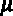（s-t），方差为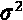*（s-t）*，我们可以用以下等式表示：


正态性假设在线性变换中非常重要。事实上，标准布朗运动的名称来源于标准正态分布的分布类型，参数为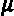=0 和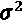=1。

因此，可以说，具有单位均值和方差的布朗运动*Y（t）*可以表示为标准布朗运动的线性变换，根据以下等式：


在前面的等式中，我们可以观察到以下情况：

*   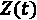是标准的布朗运动。

该方程的弱点在于*Y（t）*假设负值的概率为正值；事实上，由于*Z（t）*具有独立增量的特征，可以采用负号，因此*Y（t）*的负性风险不是零。

现在，考虑足够小的时间间隔的 Brownian 运动（Wiener 过程）。该过程的无穷小增量如下表所示：

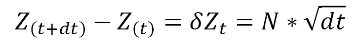

前面的公式可以改写如下：

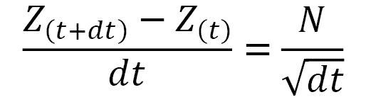

这一过程不受变化的限制，因此在经典分析的背景下无法区分。事实上，对于区间*dt*，前一个趋于无穷大。

## 将维纳过程称为随机游动

维纳过程可被视为随机游动的边界情形。我们在[*第 5 章*](05.html#_idTextAnchor118)**基于仿真的马尔可夫决策过程*中处理了一个随机游走。我们已经看到，一个粒子在瞬间*n*的位置将由以下等式表示：*

 *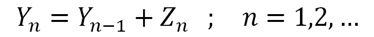

在前面的公式中，我们可以观察到以下情况：

*   *Y*n 是行走中的下一个值。
*   *Y*n-1 为前一时间段的观测值。
*   *Z*n 是该步骤中的随机波动。

如果*n*随机数*Z*n 的均值等于零，方差等于 1，那么对于*n*的每个值，我们可以使用以下等式定义一个随机过程：


上述公式可用于迭代过程。对于非常大的*n*值，我们可以编写以下内容：

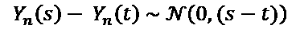

前面的公式是由于我们在[*第 4 章*](04.html#_idTextAnchor095)、*蒙特卡罗仿真*中介绍的中心极限定理。

## 执行标准布朗运动

那么，让我们演示如何在 Python 环境中生成简单的布朗运动。让我们从最简单的情况开始，在这种情况下，我们定义时间间隔、要执行的步骤数和标准偏差：

1.  We start by importing the following libraries:

    ```py
    import numpy as np
    import matplotlib.pyplot as plt
    ```

    `numpy`库是一个 Python 库，包含许多函数，可以帮助我们管理多维矩阵。此外，它还包含大量高级数学函数，我们可以使用这些函数对这些矩阵进行运算。

    `matplotlib`库是用于打印高质量图形的 Python 库。有了`matplotlib`，只需几个命令就可以生成图形、直方图、条形图、功率谱、误差图、散点图等。这包括一组类似于 MATLAB 软件提供的命令行函数。

2.  Now, let's proceed with some initial settings:

    ```py
    np.random.seed(4)
    n = 1000
    SQN = 1/np.math.sqrt(n)
    ZValues = np.random.randn(n)
    Yk = 0
    SBMotion=list()
    ```

    在第一行代码中，我们使用`random.seed()`函数初始化随机数生成器的种子。这样，使用随机数的仿真将是可复制的。实验的再现性将通过以下事实得到保证：生成的随机数始终相同。我们设置迭代次数（*n*，并计算以下等式的第一项：

    

    然后，我们使用`random.randn()`函数生成*n*随机数。此函数返回平均值为 0、方差为 1 的*n*样本的标准正态分布。最后，我们根据属性*（Y*（0）*=0）*的要求设置布朗运动的第一个值，并初始化包含布朗运动位置坐标的列表。

3.  At this point, we will use a `for` loop to calculate all of the *n* positions:

    ```py
    for k in range(n):
        Yk = Yk + SQN*ZValues[k]
        SBMotion.append(Yk)
    ```

    我们只需将当前随机数乘以 SQN，添加到包含累积和的变量中。然后将当前值附加到 SBMotion 列表中。

4.  Finally, we draw a graph of the Brownian motion created:

    ```py
    plt.plot(SBMotion)
    plt.show()
    ```

    打印以下图表：


图 8.1–布朗运动图

因此，我们创建了我们的第一个布朗运动仿真。它的使用特别适合于金融仿真。在下一节中，我们将演示如何做到这一点。

# 利用蒙特卡罗方法进行股价预测

正如我们在[*第 4 章*](04.html#_idTextAnchor095)*、**蒙特卡罗仿真*中所探讨的，蒙特卡罗方法使用事件在特定条件下可能发生的不同概率来仿真受检过程的不同演变。这些仿真探索了现象的整个参数空间，并返回了一个具有代表性的样本。对于获得的每一个样本，都要对感兴趣的数量进行测量，以评估其性能。正确的仿真意味着过程结果的平均值收敛到预期值。

## 探索亚马逊股价走势

股票市场提供了一个快速赚大钱的机会，也就是说，至少在一个没有经验的用户眼中是这样。股票市场上的交易所可以引起价格的大幅波动，吸引世界各地投机者的注意。为了从股票市场的投资中获得收入，有必要从多年对这一现象的深入研究中获得扎实的知识。在这种情况下，拥有一种预测股票市场证券的工具的可能性代表了所有人都感到的需要。

让我们演示如何开发世界上最著名公司之一的股票仿真模型。亚马逊由杰夫·贝佐斯（Jeff Bezos）在 20 世纪 90 年代创立，是世界上最早通过互联网销售产品的公司之一。自 1997 年以来，亚马逊股票在证券交易所上市，代号为 AMZN。AMZN 股票的历史价值可以从过去 10 年来一直在处理股票市场的各种互联网网站上获得。我们将参考 AMZN 股票在**2010-04-08**至**2020-04-07**纳斯达克 GS 股票报价中的表现。为了从**2020-04-07**获取数据，我们需要选择雅虎网站上的**2020-04-08**作为结束日期。

可从雅虎财经网站[下载`.csv`格式的数据 https://finance.yahoo.com/quote/AMZN/history/](https://finance.yahoo.com/quote/AMZN/history/) 。

在以下屏幕截图中，您可以看到 AMZN 股票的 Yahoo Finance 部分，其中突出显示的按钮用于下载数据：

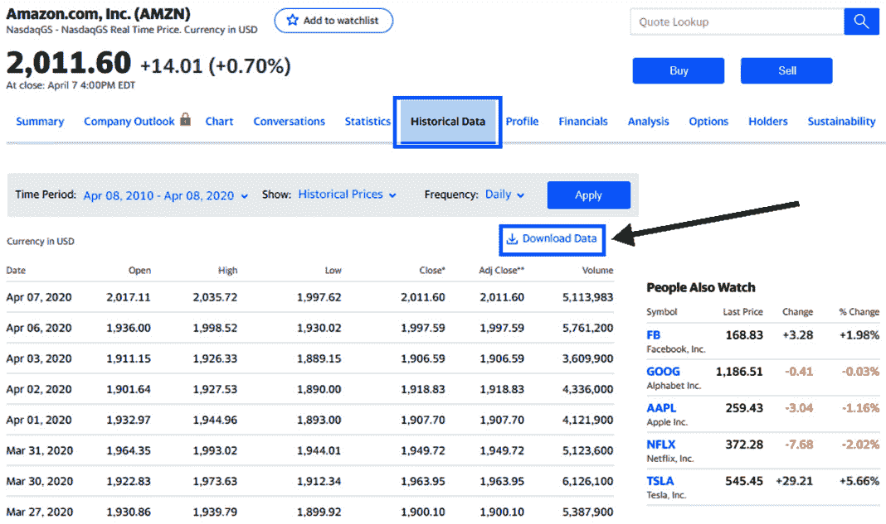

图 8.2–雅虎财经的亚马逊数据

下载的`AMZN.csv`文件包含很多功能，但我们只使用其中两个，如下所示：

*   **日期**：报价日期
*   **收盘**：收盘价

我们将逐行分析代码，以充分了解整个过程，这将引导我们仿真亚马逊股价表现的一系列预测场景：

1.  As always, we start by importing the libraries:

    ```py
    import numpy as np
    import pandas as pd
    import matplotlib.pyplot as plt
    from scipy.stats import norm
    from pandas.plotting import register_matplotlib_converters
    register_matplotlib_converters()
    ```

    已导入以下库：

    `pandas`库是一个开放源码的 BSD 许可库，它包含用于为 Python 编程语言处理高性能数值的数据结构和操作。

    SciPy 是基于 NumPy 的数学算法和函数的集合。它有一系列命令和高级类来操作和显示数据。有了 SciPy，Python 就增加了功能，使其成为一个类似于商业系统（如 MATLAB）的数据处理和系统原型环境。

2.  Now, let's import the data contained in the `AMZN.csv` file:

    ```py
    AmznData = pd.read_csv('AMZN.csv',header=0, 
               usecols = ['Date',Close'],parse_dates=True,
               index_col='Date')
    ```

    我们使用了`pandas`库的`read_csv`模块，该模块将数据加载到名为`DataFrame`的`pandas`对象中。传递以下参数：

    `'AMZN.csv'`：文件名。

    `header=0`：包含列名和数据开头的行号。默认情况下，如果传递了非标题行（`header=0`），则从文件的第一行推断列名。

    `usecols=['Date',Close']`：此参数通过指定列名提取数据集的子集。

    `parse_dates=True`：布尔值；如果`True`，请尝试解析索引。

    `index_col='Date'`：这允许我们指定将用作数据帧索引的列的名称。

3.  Now we will explore the imported dataset to extract preliminary information. To do this, we will use the `info()` function, as follows:

    ```py
    print(AmznData.info())
    ```

    打印以下信息：

    ```py
    <class 'pandas.core.frame.DataFrame'>
    DatetimeIndex: 2518 entries, 2010-04-08 to 2020-04-07
    Data columns (total 1 columns):
    Close    2518 non-null float64
    dtypes: float64(1)
    memory usage: 39.3 KB
    None
    ```

    在这里，返回了很多有用的信息：对象类、存在的记录数（2518）、索引的起始值和结束值（`2010-04-08`到`2020-04-07`）、列数及其包含的数据类型，以及其他信息。

    我们还可以打印数据集的前五行，如下所示：

    ```py
    print(AmznData.head())
    ```

    打印以下数据：

    ```py
                     Close
    Date                  
    2010-04-08  140.960007
    2010-04-09  140.059998
    2010-04-12  141.199997
    2010-04-13  140.160004
    2010-04-14  144.279999
    ```

    如果我们想要打印不同数量的记录，那么通过指示要打印的行数就足够了。同样，我们可以打印数据集的最后 10 条记录：

    ```py
    print(AmznData.tail())
    ```

    打印以下记录：

    ```py
                      Close
    Date                   
    2020-04-01  1907.699951
    2020-04-02  1918.829956
    2020-04-03  1906.589966
    2020-04-06  1997.589966
    2020-04-07  2011.599976
    ```

    通过对头部和尾部的初步快速比较，我们可以验证过去 10 年亚马逊股票的价值从 140 美元左右上升到 2011 美元左右。这对亚马逊股东来说是一笔极好的交易。

    使用`describe()`功能，我们将使用基本统计数据提取数据预览：

    ```py
    print(AmznData.describe())
    ```

    返回以下结果：

    ```py
                 Close
    count  2518.000000
    mean    723.943074
    std     607.588565
    min     108.610001
    25%     244.189995
    50%     398.995011
    75%    1006.467514
    max    2170.219971
    ```

    我们可以确认在过去 10 年中价值的显著增长，但我们也可以看到，鉴于标准差的值非常高，股票如何经历了显著的波动。这告诉我们，那些忠于股票并长期持有股票的股东从股票上涨中获益最大。

4.  After analyzing the preliminary data statistics, we can take a look at the performance of the Amazon shares in the last 10 years by drawing a simple graph:

    ```py
    plt.figure(figsize=(10,5))
    plt.plot(AmznData)
    plt.show()
    ```

    使用了以下`matplotlib`功能：

    `figure()`：此函数创建一个新的图形，该图形暂时为空。我们使用`figsize`参数设置框架的大小，该参数以英寸为单位设置宽度和高度。

    `plot()`：此函数用于绘制`AmznData`数据集。

    `show()`：此功能在 IPython 和 PyLab 模式下运行时，显示所有图形并返回 IPython 提示符。

    打印以下图：

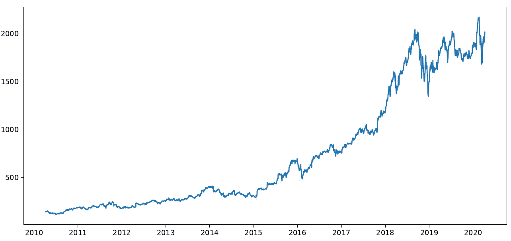

图 8.3–亚马逊份额图

亚马逊股票在过去 10 年中的显著增长是显而易见的。此外，应该注意的是，自 2015 年以来，增长幅度最大，但我们将尝试从数据中提取更多信息。

## 将股价走势作为时间序列处理

亚马逊股票价格随时间的趋势，如上图所示，配置为有序数据序列。这类数据可以方便地作为时间序列处理。让我们考虑一个简单的定义：时间序列包含一个变量的实验观测的时间序列。此变量可以与不同来源的数据相关。通常，它涉及失业率、利差、股市指数和股价趋势等金融数据。

将该问题作为时间序列处理将使我们能够从数据中提取有用的信息，以便开发用于管理未来情景的预测模型。比较不同年份同一时期的股票价格趋势，或者更简单地说，比较连续时期之间的股票价格趋势，可能很有用。

假设*Y*1、*Y*t、*Y*n 是时间序列的元素。让我们首先比较两个不同时间的数据，分别用*t*和*t+1*表示。因此，它是两个连续的时期；我们感兴趣的是评估被观察现象所经历的变化，其可通过以下比率定义：


这个百分比称为百分比变化。可定义为时间*t+1*的*Y*相对于上一次*t*的百分比变化率。此描述符返回有关数据在一段时间内如何发生更改的信息。百分比变化允许您监控股票价格和市场指数，而不仅仅是比较不同国家的货币：

1.  To evaluate this useful descriptor, we will use the `pct_change()` function contained in the `pandas` library:

    ```py
    AmznDataPctChange = AmznData.pct_change()
    ```

    此函数返回当前元素和上一个元素之间的百分比变化。默认情况下，该函数计算前一行的百分比变化。

    时间序列百分比变化的概念与股票价格回报的概念相联系。基于回报的方法允许数据的标准化，这是在评估以不同度量为特征的变量之间的关系时具有根本重要性的操作。

    我们将在对数尺度上处理收益，因为这种选择将给我们带来几个优势：正态分布结果；返回的值（返回的对数）非常接近初始值（返回），至少对于非常小的值；随着时间的推移，会产生累加的结果。

2.  To pass the return on a logarithmic scale, we will use the `log()` function of the `numpy` library, as follows:

    ```py
    AmznLogReturns = np.log(1 + AmznDataPctChange) 
    print(AmznLogReturns.tail(10))
    ```

    打印以下结果：

    ```py
                   Close
    Date                
    2020-03-25 -0.028366
    2020-03-26  0.036267
    2020-03-27 -0.028734
    2020-03-30  0.033051
    2020-03-31 -0.007272
    2020-04-01 -0.021787
    2020-04-02  0.005817
    2020-04-03 -0.006399
    2020-04-06  0.046625
    2020-04-07  0.006989
    ```

3.  为了更好地理解收益是如何随时间分布的，让我们画一个图表：

    ```py
    plt.figure(figsize=(10,5))
    plt.plot(AmznLogReturns)
    plt.show()
    ```

打印以下图表：


图 8.4–收益的对数值

前面的图表显示，对数收益率在整个周期内呈正态分布，平均值稳定。

## 介绍 Black-Scholes 模型

**布莱克-斯科尔斯**（**BS**）模型无疑代表了量化金融史上最重要、最具革命性的工作。在传统金融文献中，假设几乎所有金融资产价格（股票、货币和利率）都是由布朗漂移运动驱动的。

该模型假设资产的预期收益等于无风险利率*r*。这种方法能够仿真资产对数规模的回报。假设我们在瞬间观察到一个资产：*t（0），t（1）…，t（n）*。我们注意到，使用*s（i）=s（ti）*，资产在*t（i）*的价值。基于这些假设，我们可以使用以下等式计算回报：

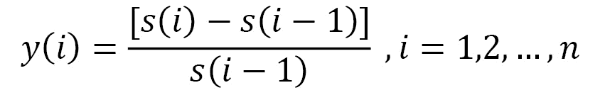

然后，我们将对数标度上的收益率进行转换，如下所示：

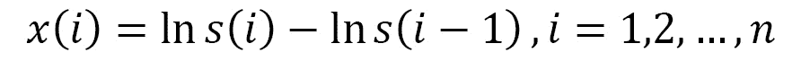

通过将 BS 方法应用于布朗几何运动，股票价格将满足以下随机微分方程：

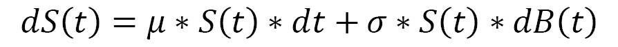

在前面的方程中，*dB（t）*是标准布朗运动，μ和σ是实常数。前面的方程在假设*s（i）-s（i-1）*很小的情况下有效，当股票价格发生轻微变化时，就会出现这种情况。这是因为如果*z*很小，ln*（1+z）*大致等于*z*。上一个方程的解析解如下：

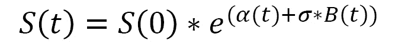

通过在对数尺度上传递前面的方程，我们得到以下方程：


在前面的等式中，我们可以观察到以下情况：

*   α是漂移。
*   B（t）是标准布朗运动。
*   为标准偏差。

我们引入了漂移的概念，它代表了股票市场中长期资产的趋势。为了理解漂移，我们将使用河流水流的概念。如果我们把液体颜色倒入河流中，它会沿着河流水流的方向扩散。类似地，漂移表示股票跟随长期资产趋势的趋势。

## 应用蒙特卡罗仿真

使用上一节讨论的 BS 模型，我们可以评估从前一天开始的资产日价格乘以基于系数*r*的指数贡献。这个系数是一个周期性的回报率。它转化为以下等式：


前面的式中的第二项，呃，叫做**日收益率**，根据 BS 模型，由下式给出：


无法预测资产的回报率。表示它的唯一方法是把它看作一个随机数。因此，为了预测资产的价格趋势，我们可以使用基于随机运动的模型，如 BS 方程所表示的模型。

BS 模型假设股票价格的变化取决于一段时间内的预期回报。日收益率有两项：固定漂移率和随机变量。这两个术语规定了波动的确定性和不确定性。

为了计算漂移，我们将使用预期收益率，即最可能发生的收益率，使用对数收益和方差的历史平均值，如下所示：


根据前面的等式，资产的日变化率是收益的平均值，小于一段时间内方差的一半。我们继续我们的工作，计算在*处理股票价格趋势作为时间序列*部分中计算的亚马逊证券回归的漂移：

1.  To evaluate the drift, we need the mean and variance of the returns. Since we also calculate the standard deviation, we will need the calculation of the daily return:

    ```py
    MeanLogReturns = np.array(AmznLogReturns.mean())
    VarLogReturns = np.array(AmznLogReturns.var()) 
    StdevLogReturns = np.array(AmznLogReturns.std())
    ```

    使用了三个`numpy`功能：

    `mean()`：计算沿指定轴的算术平均值，并返回数组元素的平均值。

    `var()`：计算沿指定轴的方差。它返回数组元素的方差，该方差是分布范围的度量。

    `std()`：计算沿指定轴的标准偏差。

    现在我们可以计算漂移如下：

    ```py
    Drift = MeanLogReturns - (0.5 * VarLogReturns)
    print("Drift = ",Drift)
    ```

    返回以下结果：

    ```py
    Drift =  [0.00086132]
    ```

    这是布朗运动的固定部分。漂移返回预期值的年化变化，并补偿与直接布朗运动相比结果的不对称性。

2.  为了计算布朗运动的第二个分量，我们将使用随机变量。这对应于平均值和事件之间的距离，表示为标准偏差的数量。在执行此操作之前，我们需要设置间隔和迭代次数。间隔的数量将等于观测的数量（2518），而迭代的数量（代表我们打算开发的仿真模型的数量）为 20:

    ```py
    NumIntervals = 2518
    Iterations = 20
    ```

3.  Before generating random values, it is recommended that you set the seed to make the experiment reproducible:

    ```py
    np.random.seed(7)
    ```

    现在，我们可以生成随机分布：

    ```py
    SBMotion = norm.ppf(np.random.rand(NumIntervals, Iterations))
    ```

    返回一个 2518×20 矩阵，包含我们要执行的 20 个仿真的随机贡献和我们要考虑的 2518 个时间间隔。回想一下，这些区间对应于过去 10 年的每日价格。

    使用了两个功能：

    `norm.ppf()`：此 SciPy 函数给出了累积概率具有给定值的变量的值。

    `np.random.rand()`：此 NumPy 函数计算给定形状中的随机值。它创建给定形状的数组，并使用[0，1]上均匀分布的随机样本填充该数组。

    我们将按以下方式计算每日回报：

    ```py
    DailyReturns = np.exp(Drift + StdevLogReturns * SBMotion)
    ```

    每日收益率是衡量股票价格变化的一个指标。它以前一天收盘价的百分比表示。正回报意味着股票增值，而负回报意味着它失去了价值。`np.exp()`函数用于计算输入数组中所有元素的指数。

4.  After long preparation, we have arrived at a crucial moment. We will be able to carry out predictions based on the Monte Carlo method. The first thing to do is to recover the starting point of our simulation. Since we want to predict the trend of Amazon stock prices, we recover the first value present in the `AMZN.csv` file:

    ```py
    StartStockPrices = AmznData.iloc[0]
    ```

    pandas`iloc()`函数用于使用基于位置的索引返回纯整数进行选择。然后，我们将初始化包含预测的数组：

    ```py
    StockPrice = np.zeros_like(DailyReturns)
    ```

    `numpy``zeros_like()`函数用于返回与给定数组形状和类型相同的零数组。现在，我们将设置`StockPrice`数组的起始值，如下所示：

    ```py
    StockPrice[0] = StartStockPrices
    ```

5.  To update the predictions of the Amazon stock prices, we will use a `for` loop that iterates for a number that is equal to the time intervals we are considering:

    ```py
    for t in range(1, NumIntervals):
        StockPrice[t] = StockPrice[t - 1] * DailyReturns[t]
    ```

    对于更新，我们将根据以下等式使用 BS 模型：


最后，我们可以查看结果：

```py
plt.figure(figsize=(10,5))
plt.plot(StockPrice)   
AMZNTrend = np.array(AmznData.iloc[:, 0:1])
plt.plot(AMZNTrend,'k*')   
plt.show()
```

打印以下图表：


图 8.5–亚马逊趋势图

在上一张图中，黑色突出显示的曲线代表了过去 10 年亚马逊股票价格的趋势。其他曲线是我们的仿真。我们可以看到，一些曲线偏离预期曲线，而另一些曲线看起来更接近实际趋势。

# 投资组合管理风险模型研究

良好的风险度量在金融学中至关重要，因为它是评估金融资产的主要工具之一。这是因为它允许您监控证券，并为投资组合的构建提供了标准。多年来被广泛使用的一个衡量标准是**方差**。

## 使用差异作为风险度量

多元化投资组合在风险和预期价值方面的优势使我们能够为证券找到正确的配置。我们的目标是在相同的风险下获得最高的期望值，或者最小化获得相同期望值的风险。为了实现这一点，有必要将风险的概念追溯到一个可测量的数量，通常称为方差。因此，通过最大化每个方差水平的投资组合收益预期值，可以重建一条称为有效边界的曲线，该曲线确定了可用于构建每个风险水平的投资组合的证券所能获得的最大预期值。

最小方差投资组合表示具有最低可能方差值的投资组合，而不考虑预期值。该参数的目的是优化由投资组合方差表示的风险。仅当收益分布为正态时，仅将风险追踪到方差度量才是最优的。事实上，正态分布具有一些特性，使得方差成为足以代表风险的度量。它完全可以通过两个参数（均值和方差）来确定。因此，知道均值和方差就足以确定分布的任何其他点。

## 引入风险价值度量

在非正态和极限值的情况下，考虑方差作为唯一的风险度量。一个被广泛使用了二十多年的风险度量是**风险价值**（**VaR**。VaR 的诞生与金融机构管理风险并因此能够衡量风险的需求日益增长有关。这是因为金融市场的结构日益复杂。

事实上，引入这一指标并不是为了阻止方差极限作为风险指标，因为计算 VaR 值的方法正是从正态性假设开始的。然而，为了更容易理解，让我们通过对不同类型的风险采用单一指标，将证券的总体风险包含在单个数字或金融资产组合中。

在金融环境中，VaR 是给定置信区间的一种估计，即在每个时间范围内，证券或投资组合的损失可能有多高。因此，VaR 侧重于收益分布的左尾，即实现概率较低的事件所在的位置。指出损失，而不是预期价值周围收益的分散，使其更接近于风险而非方差的一般概念。

重要提示

摩根大通被认为是将 VaR 作为一个广泛衡量标准的银行。1990 年，摩根大通总裁丹尼斯·韦瑟斯通（Dennis Weatherstone）对每天收到的冗长的风险分析报告感到不满。他想要一份简单的报告，总结银行在整个交易组合中的总风险敞口。

在计算 VaR 后，我们可以说，根据置信区间给出的概率，我们在未来 N 天内的损失不会超过投资组合的 VaR。VaR 是不超过置信区间给定概率的损失水平。

例如，在 95%的置信水平下，一年 100 万欧元的 VaR 意味着在 95%的情况下，下一年投资组合的最大损失将为 100 万欧元。没有什么能告诉我们剩下的 5%的病例发生了什么。

以下图显示了投资组合收益的概率分布，并显示了 VaR 的价值：


图 8.6——投资组合收益的概率分布

VaR 是以下两个参数的函数：

*   时间范围
*   信心水平

必须指定 VaR 的某些特征：

*   VaR 不能描述最严重的损失。
*   VaR 没有说明损失在左尾的分布情况。
*   VaR is subject to sampling errors.

    重要提示

    采样误差告诉我们采样值与实际总体值的偏差有多大。这种偏差是因为样本不能代表总体或存在扭曲。

VaR 是一种广泛使用的风险度量，用一个数字概括了金融工具组合风险的重要方面。它的计量单位与计算它所依据的投资组合的回报相同，并且很容易理解，回答了一个简单的问题：*金融投资会有多糟糕？*

现在让我们来看一个计算 VaR 的实际案例。

## 估计一些纳斯达克资产的 VaR

纳斯达克是世界上最著名的股票市场指数之一。其名称是全国证券交易商协会报价单的首字母缩写。这是代表美国科技行业股票的指数。考虑到投资者心目中的纳斯达克（NASDAQ），美国主要科技和社交机构的品牌很容易出现。想想谷歌、亚马逊、Facebook 和其他许多公司；他们都在纳斯达克上市。

在这里，我们将学习如何恢复纳斯达克上市的六家公司的报价数据，然后我们将演示如何评估与购买这些证券的股票组合相关的风险：

1.  As always, we start by importing the libraries:

    ```py
    import datetime as dt
    import numpy as np
    import pandas_datareader.data as wb
    import matplotlib.pyplot as plt
    from scipy.stats import norm
    ```

    已导入以下库：

    `datetime`库包含用于处理日期和时间的类。它包含的函数使我们能够轻松提取用于格式化和操作日期的属性。

    熊猫图书馆的`pandas_datareader.data`模块包含的功能允许我们提取财务信息，而不仅仅是从一系列提供此类数据的网站中提取。收集的数据以数据帧格式返回。`pandas`库是一个开放源代码的 BSD 许可库，它包含用于为 Python 编程语言处理高性能数值的数据结构和操作。

2.  We will set the stocks we want to analyze by defining them with tickers. We also decide the time horizon:

    ```py
    StockList = ['ADBE','CSCO','IBM','NVDA','MSFT','HPQ'] 
    StartDay = dt.datetime(2019, 1, 1)
    EndDay = dt.datetime(2019, 12, 31)
    ```

    一个数据帧中包含了六个代码。股票代码是一个缩写，用于唯一标识特定股票市场上特定证券在证券交易所上市的股票。它由字母、数字或两者的组合组成。这些股票用于指代全球科技行业的六家领先公司：

    `ADBE`：Adobe Systems Inc.——世界上最大、最具差异化的软件公司之一。

    `CSCO`：思科系统公司——基于**互联网协议**（**IP**）的网络和其他通信和信息技术产品的生产。

    `IBM`：国际商用机器——信息技术相关产品的生产和咨询。

    `NVDA`：Nvidia 公司-视觉计算技术。这就是发明 GPU 的公司。

    `MSFT`：微软公司——这是该行业最重要的公司之一，也是全球营业额最大的软件生产商之一。

    `HPQ`：惠普公司——全球领先的产品、技术、软件、解决方案和服务提供商，面向个人消费者和大型企业。

    在确定股票行情之后，我们设定了分析的时间范围。通过定义 2019 年全年，我们只需设置分析的开始日期和结束日期。

3.  Now we can recover the data:

    ```py
    StockData =  wb.DataReader(StockList, 'yahoo',
                               StartDay,EndDay)
    StockClose = StockData["Adj Close"]
    print(StockClose.describe())
    ```

    为了检索数据，我们使用了`pandas_datareader.data`模块的`DataReader()`功能。此函数用于将来自各种 internet 源的数据提取到数据帧中。已通过以下主题：

    `StockList`：待回收存货清单

    `'yahoo'`：收集数据的网站

    `StartDay`：监测开始日期

    `EndDay`：监测结束日期

    恢复的数据输入到熊猫数据框中，该数据框将包含 36 列，对应于 6 种股票中每种股票的 6 条信息。每个记录将包含每天的以下信息：高值、低值、打开值、关闭值、音量和调整后的关闭。

    对于投资组合的风险评估，只有一个值足够：调整后的收盘价。此列从起始数据帧中提取并存储在`StockData`变量中。然后，我们使用`describe()`函数为每只股票开发了基本统计数据。已返回以下统计信息：

    

    图 8.7-投资组合统计

    分析前面的表，我们可以注意到有 252 条记录。这是 2019 年证券交易所开张的日子。让我们注意到这一点，因为这些数据以后会很有用。我们还注意到，由于股票的价值不同，列中的值具有非常不同的范围。更容易理解股票的走势，最好画图表。让我们接下来做这个：

    ```py
    fig, axs = plt.subplots(3, 2)
    axs[0, 0].plot(StockClose['ADBE'])
    axs[0, 0].set_title('ADBE')
    axs[0, 1].plot(StockClose['CSCO'])
    axs[0, 1].set_title('CSCO')
    axs[1, 0].plot(StockClose['IBM'])
    axs[1, 0].set_title('IBM')
    axs[1, 1].plot(StockClose['NVDA'])
    axs[1, 1].set_title('NVDA')
    axs[2, 0].plot(StockClose['MSFT'])
    axs[2, 0].set_title('MSFT')
    axs[2, 1].plot(StockClose['HPQ'])
    axs[2, 1].set_title('HPQ')
    ```

    为了在 6 只股票的趋势之间进行简单的比较，我们追踪了 6 个子批次，这些子批次按 3 行 2 列顺序排列。我们使用了`matplotlib`库的`subplots()`函数。此函数返回包含地物对象和轴的元组。所以，当你使用`fig`、`axs = plt.subplots()`时，你将这个元组解压成`fig`和`axs`变量。如果您想在地物级别更改属性或稍后将地物保存为图像文件，则拥有`fig`非常有用。变量`axs`允许我们设置每个子批次的轴的属性。事实上，我们调用这个变量是为了通过调用图表矩阵的行-列索引来定义在每个子图中绘制什么。此外，对于每个图表，我们还打印了标题，这使我们能够了解它所指的股票代码。

    完成此操作后，我们绘制图形：

    ```py
    plt.figure(figsize=(10,5))
    plt.plot(StockClose)
    plt.show()
    ```

    使用了以下`matplotlib`功能：

    `figure()`：此函数创建一个新的图形，目前为空，我们使用`figsize`参数设置框架的大小，该参数以英寸为单位设置宽度和高度。

    `plot()`：此函数用于绘制`AmznData`数据集。

    `show()`：此功能在 PyLab 模式下以 IPython 运行时，显示所有图形并返回 IPython 提示符。

    打印以下图表：

    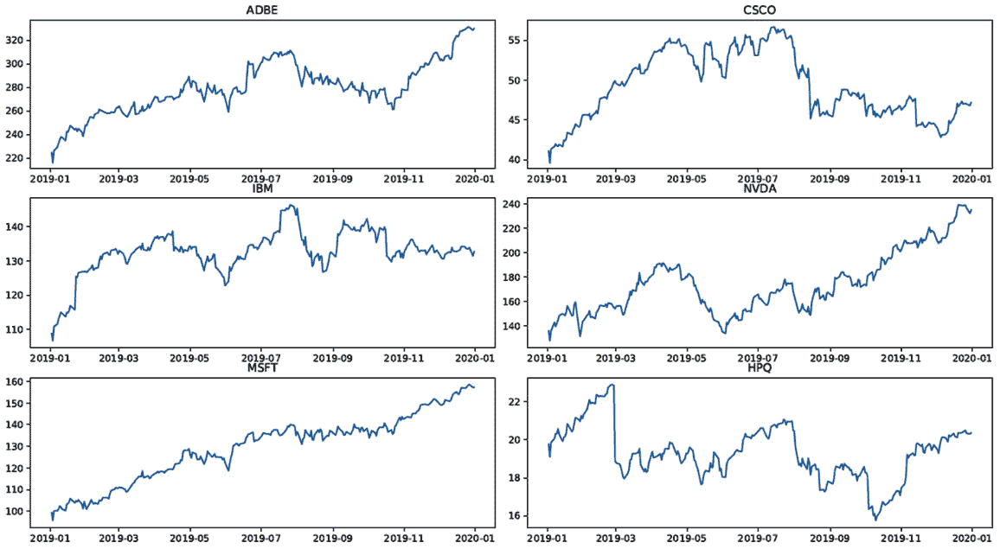

    图 8.8–统计图

    分析前面的数字，一切都更清楚了。股票走势明显。撇开绝对值不谈，每个股票的绝对值差异很大，我们可以注意到，在整个监测期间，只有微软股票记录了几乎增加的趋势。相反，其他股票表现出波动趋势。我们还注意到，HPQ 股票记录了三次突然下跌。

4.  After taking a quick look at the trend of stocks, the time has come to evaluate the returns:

    ```py
    StockReturns = StockClose.pct_change()
    print(StockReturns.tail())
    ```

    `pct.change()`函数返回当前收盘价与上一个值之间的百分比变化。默认情况下，该函数计算前一行的百分比变化。

    时间序列百分比变化的概念与股票价格回报的概念相联系。基于回报的方法提供了数据的标准化，这对于评估以不同度量为特征的变量之间的关系具有根本重要性。这些概念已在本章*使用蒙特卡罗方法进行股票价格预测*一节中进行了探讨。请注意，我们只提到了其中的一些。

    然后我们打印返回的数据帧的队列，以分析其内容。返回以下结果：

    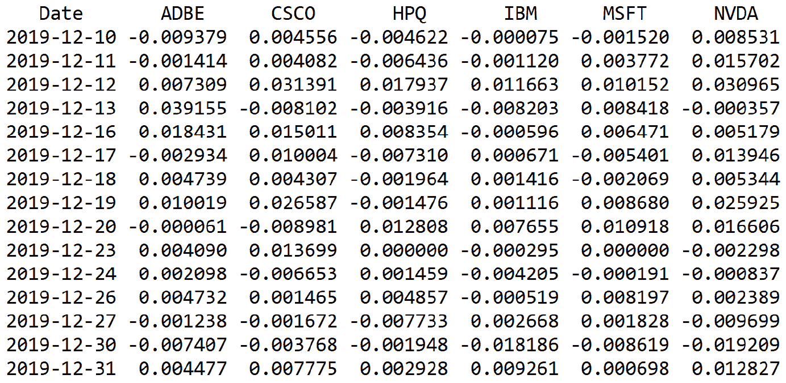

    图 8.9–库存返回数据帧

    在上表中，减号表示负回报或亏损。

5.  Now we are ready to assess the investment risk of a substantial portfolio of stocks of these prestigious companies. To do this, we need to set some variables and calculate others:

    ```py
    PortfolioValue = 1000000000.00
    ConfidenceValue = 0.95
    Mu = np.mean(StockReturns)
    Sigma = np.std(StockReturns)
    ```

    首先，我们设定投资组合的价值；这是十亿美元。这些数字不应该吓到你。对于一家管理着众多投资者的银行来说，实现这一投资价值并不困难。因此，我们设置了置信区间。之前，我们说过 VaR 是基于这个值的。随后，我们开始计算 VaR 计算的一些基本量。我指的是回报的平均值和标准差。为此，我们使用了相关的`numpy`函数：`np.mean ()`和`np.std`。

    我们继续设置计算 VaR 所需的参数：

    ```py
    WorkingDays2019 = 252.
    AnnualizedMeanStockRet = MeanStockRet/WorkingDays2019
    AnnualizedStdStockRet = 
                    StdStockRet/np.sqrt(WorkingDays2019)
    ```

    之前，我们看到从雅虎网站的财务部分提取的数据包含 252 条记录。这是 2019 年证券交易所的工作日数，所以我们设置了这个值。那么，让我们继续对刚刚计算的平均值和标准偏差进行年化。这是因为我们要计算股票的年度风险指数。对于平均值的年化，除以工作天数就足够了，而对于标准差，我们必须除以工作天数的平方根。

6.  Now we have all the data we need to calculate the VaR:

    ```py
    INPD = norm.ppf(1-ConfidenceValue,AnnualizedMeanStockRet,
                       AnnualizedStdStockRet)
    VaR = PortfolioValue*INPD
    ```

    首先，我们计算置信度、均值和标准差的风险水平为 1 的逆正态概率分布。这项技术涉及从我们提到的三个参数开始构建概率分布。在本例中，我们从一些分布统计数据开始向后工作，并尝试重建起始分布。为此，我们使用 SciPy 库的`norm.ppf()`函数。

    `norm()`函数返回一个正常的连续随机变量。首字母缩略词**ppf**代表**百分点函数**，这是分位数函数的另一个名称。与随机变量概率分布相关的分位数函数规定了随机变量的值，以便变量小于或等于该值的概率等于给定概率。

    此时，VaR 的计算方法是将获得的逆正态概率分布乘以投资组合的价值。为了使获得的值更具可读性，将其四舍五入到小数点后的前两位：

    ```py
    RoundVaR=np.round_(VaR,2)
    ```

    最后，打印获得的结果，每行一个，以简化比较：

    ```py
    for i in range(len(StockList)):
        print("Value-at-Risk for", StockList[i], 
                       "is equal to ",RoundVaR[i])
    ```

    返回以下结果：

    ```py
    Value-at-Risk for ADBE is equal to  -1547.29
    Value-at-Risk for CSCO is equal to  -1590.31
    Value-at-Risk for IBM is equal to  -2047.22
    Value-at-Risk for NVDA is equal to  -1333.65
    Value-at-Risk for MSFT is equal to  -1286.01
    Value-at-Risk for HPQ is equal to  -2637.71
    ```

回报风险最高的股票是惠普和 IBM，而回报风险最低的股票是微软股票。

# 总结

在本章中，我们应用了基于蒙特卡罗方法的仿真概念，更一般地，将随机数的生成应用到与金融工程领域相关的实际案例中。我们首先定义了基于布朗运动的模型，该模型描述了小颗粒在流体中不间断和不规则的运动。我们学习了如何描述数学模型，然后导出了一个实际应用程序，将随机行走仿真为维纳过程。

随后，我们讨论了另一个相当有趣的实际案例，即如何使用蒙特卡罗方法预测著名亚马逊公司的股票价格。在过去 10 年中，我们开始探索亚马逊共享的趋势，并进行简单的统计，以提取我们通过视觉分析确认的任何趋势的初步信息。随后，我们学会了将股票价格趋势视为时间序列，计算每日回报。然后，我们用 BS 模型解决了这个问题，定义了漂移和标准布朗运动的概念。最后，我们应用蒙特卡罗方法预测与股票价格趋势相关的可能情景。

作为最后一个实际应用，我们评估了一些在纳斯达克市场上市的最著名科技公司的股票组合的风险。我们首先定义了与金融资产相关的转介概念，然后引入了 VaR 的概念。随后，我们实现了一种算法，在给定置信区间和时间范围的情况下，根据股票价格历史数据返回的每日回报计算 VaR。

在下一章中，我们将学习人工神经网络的基本概念，如何将前馈神经网络方法应用于数据，以及神经网络算法如何工作。然后，我们将了解深层神经网络的基本概念，以及如何使用神经网络仿真物理现象。*