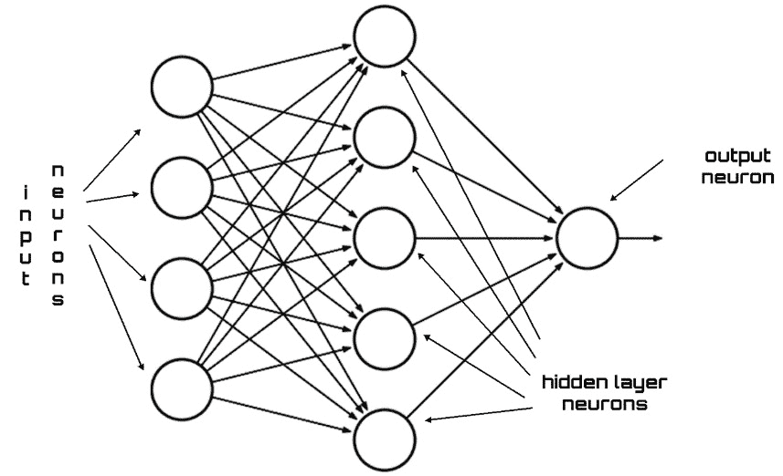
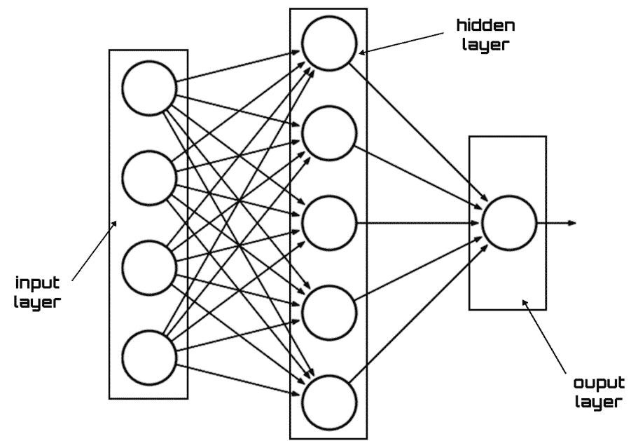
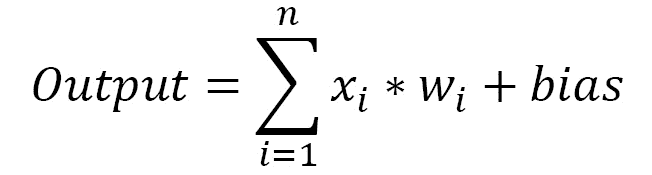
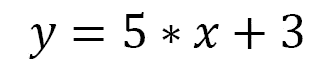
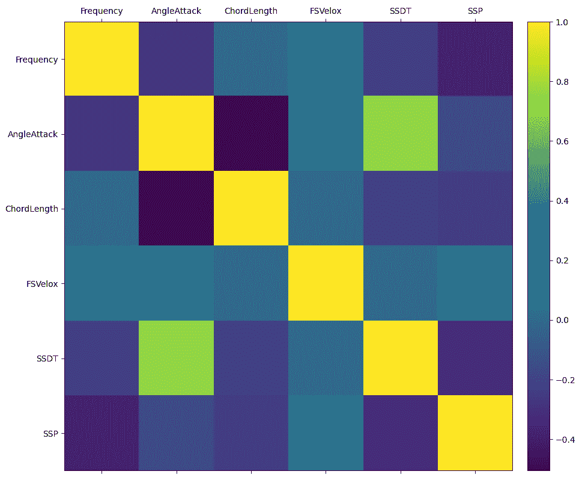
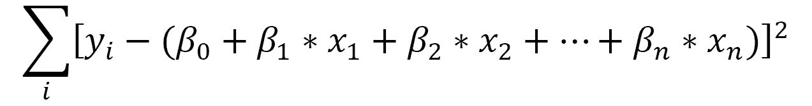
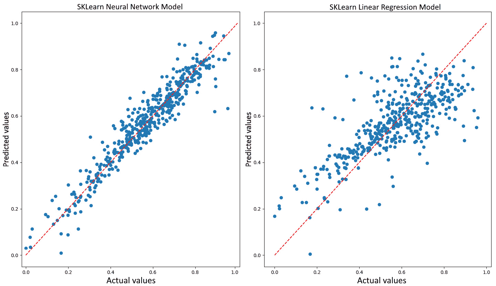

# 九、使用神经网络仿真物理现象

神经网络在获得高度结构化数据的良好特性方面非常有效。物理现象受到许多变量的制约，这些变量可以通过现代传感器轻松测量。这样，就产生了难以用经典技术处理的大数据。神经网络适于仿真复杂环境。

在本章中，我们将学习如何开发基于**人工神经网络**（**人工神经网络**）的模型来仿真物理现象。我们将从探索神经网络的基本概念开始，然后我们将研究它们的体系结构和主要元素。我们将演示如何训练网络以更新其权重。然后，我们将把这些概念应用到一个实际用例中，以解决回归问题。在本章的最后一部分，我们将分析深层神经网络。

在本章中，我们将介绍以下主题：

*   介绍神经网络的基础知识
*   理解前馈神经网络
*   用人工神经网络仿真翼型自噪声
*   探索深层神经网络

# 技术要求

在本章中，我们将学习如何使用 ANN 仿真复杂环境。要理解这些主题，需要代数和数学建模的基础知识。

要使用本章中的 Python 代码，您需要以下文件（可在 GitHub 的[上获得）https://github.com/PacktPublishing/Hands-On-Simulation-Modeling-with-Python](https://github.com/PacktPublishing/Hands-On-Simulation-Modeling-with-Python) ：

*   `Airfoil Self-Noise.py`

# 介绍神经网络的基础知识

人工神经网络是一种数值模型，旨在再现人脑的简单神经活动，如物体识别和语音识别。神经网络的结构是由节点组成的，这些节点与人脑中的神经元类似，通过加权连接相互连接，从而重现神经元之间的突触。

系统输出将更新，直到通过连接权重迭代收敛。从实验活动中获得的信息用作输入数据，网络处理的结果作为输出返回。输入节点代表预测变量，输出神经元代表因变量。我们使用预测变量来处理因变量。

人工神经网络在仿真回归和分类问题方面用途广泛。他们可以通过分析一系列例子来学习解决问题的过程。通过这种方式，研究人员从建立物理系统的数学模型的困难任务中解脱出来，在某些情况下，这是不可能表示的。

## 理解生物神经网络

人工神经网络基于一个模型，该模型从人脑的功能原理以及人脑如何处理来自周围器官的信息中获得灵感。事实上，人工神经网络由一系列神经元组成，这些神经元可以被认为是独立的处理器，因为它们的基本任务是处理输入端提供给它们的信息。这种处理类似于生物神经元的功能，生物神经元接收电信号，对其进行处理，然后将结果传输给下一个神经元。生物神经元的基本元素包括以下内容：

*   树突
*   突触
*   体细胞
*   轴突

该信息由生物神经元按照以下步骤进行处理：

1.  树突以电信号的形式从其他神经元获取信息。
2.  信息的流动是通过突触进行的。
3.  树突将这些信息传递给细胞体。
4.  在单元体中，信息被添加到一起。
5.  如果结果超过阈值限制，该单元将通过将信号传递给另一个单元来作出反应。信息通过轴突传递。

下图显示了生物神经元结构的基本元素：


图 9.1–神经元的结构

突触扮演神经递质的角色；事实上，它们可以对紧随其后的神经元施加兴奋或抑制作用。这种效应由突触通过与其相关的重量进行调节。通过这种方式，每个神经元可以对输入进行加权和，如果这个和超过某个阈值，它就会激活下一个神经元。

重要提示

神经元执行的处理过程持续几毫秒。从计算的角度来看，它代表了一个相对较长的时间。所以，我们可以说，这个处理系统，单独来看，是相对缓慢的。然而，我们知道，这是一个基于数量的模型；它是由大量同时并行工作的神经元和突触组成的。

这样，执行的处理操作非常有效，并且允许我们在相对较短的时间内获得结果。我们可以说神经网络的力量在于神经元的团队合作。单独来看，它们并不代表一个特别有效的处理系统；然而，综合起来，它们代表了一个非常高性能的仿真模型。

大脑的功能是由神经元调节的，它代表了一种优化的机器，甚至可以解决复杂的问题。这是一个简单的结构，随着时间的推移，通过物种的进化而得到改善。它没有中央控制；大脑的各个区域都在积极地执行一项旨在解决问题的任务。大脑所有部分的工作都是以一种有贡献的方式进行的，每个部分都对结果有贡献。除此之外，人脑还配备了一个非常有效的误差调节系统。事实上，如果大脑的一部分停止工作，整个系统的操作将继续进行，即使性能较低。

## 探索人工神经网络

如前所述，一个基于人工神经网络的模型从人脑的功能中获得灵感。事实上，人工神经元与生物神经元相似，它接收来自另一个神经元的信息作为输入。神经元的输入表示神经元的输出，该输出在基于神经网络的模型结构中被发现。

然后将神经元的每个输入信号乘以相应的权重。然后将其添加到其他神经元获得的结果中，以处理下一个神经元的激活水平。基于 ANN 的模型架构的基本要素包括与输入神经元不同的神经元，以及通过突触层数和这些神经元之间的连接区分的输出神经元。下图显示了 ANN 的典型体系结构：



图 9.2–人工神经网络的体系结构

表示环境检测到的信息的输入信号被发送到 ANN 的输入层。通过这种方式，它们与连接一起并行移动，通过系统的内部节点，直至输出。因此，网络的体系结构从系统返回响应。简单地说，在神经网络中，每个节点只能处理局部信息，不知道处理的最终目标，也不保留对后者的任何记忆。获得的结果取决于网络的结构和人工突触假设的值。

在某些情况下，单个突触层无法对输入端提供的信号返回适当的网络响应。在这些情况下，需要多层突触，因为单层是不够的。这些网络称为深层神经网络。网络响应是通过一次处理一层神经元的激活，然后从输入到输出，通过中间层获得的。

重要提示

ANN 目标是所有神经元输出计算的结果，因此 ANN 被表示为一组数学函数近似。

在 ANN 架构中，以下元素是必不可少的：

*   砝码
*   偏见
*   层
*   激活函数

在以下部分中，我们将加深对这些概念的理解。

### 描述层的结构

在 ANN 的体系结构中，可以识别代表神经元的节点，这些神经元以提供一系列层的形式分布。在 ANN 的简单结构中，可以识别输入层、中间层（隐藏层）和输出层，如下图所示：



图 9.3–ANN 的各个层

每一层都有它自己的任务，它通过它所包含的神经元的动作来执行。输入层旨在将初始数据引入系统，以便后续层进一步处理。从输入级开始，ANN 的工作流程。

重要提示

在输入层，人工神经元以某种被动的方式扮演着不同的角色，因为它们不接收来自先前层次的信息。一般来说，它们接收一系列输入，并首次将信息引入系统。然后这个级别将数据发送到下一个级别，在那里神经元接收加权输入。

ANN 中的隐藏层介于输入级和输出级之间。隐藏层的神经元接收一组加权输入，并根据从激活函数接收到的指示产生输出。它代表了整个网络的重要部分，因为正是在这里，输入数据转化为输出响应的魔力才得以实现。

隐藏级别可以以多种方式操作。在某些情况下，输入随机加权，而在另一些情况下，通过迭代过程对其进行校准。一般来说，隐藏层的神经元在大脑中起着生物神经元的作用。也就是说，它接收概率输入信号，对其进行处理，并将其转换为与生物神经元轴突对应的输出。

最后，输出层为模型生成某些输出。尽管它们与神经网络中的其他人工神经元非常相似，但输出层神经元的类型和数量取决于系统必须提供的响应类型。例如，如果我们正在设计一个用于对象分类的神经网络，输出层将由一个节点组成，该节点将为我们提供该值。事实上，该节点的输出必须简单地提供输入数据中存在或不存在目标的正或负指示。例如，如果我们的网络必须执行对象分类任务，那么该层将只包含一个注定要返回该值的神经元。这是因为这个神经元必须返回一个二进制信号，也就是说，在作为输入提供的数据中，一个正向或负向的响应表示对象的存在或不存在。

### 分析权重和偏差

在神经网络中，权重代表将输入信号转换为系统响应的关键因素。它们表示一个因子，例如线性回归线的斜率。事实上，权重乘以输入，结果与其他贡献相加。这些是决定单个神经元在输出形成中的贡献的数值参数。

如果输入为*x*1、*x*2、*x*n，并且要应用于它们的突触权重表示为*w*1、*w*2、*w*n，则神经元返回的输出通过以下公式表示：


前面的公式是一个矩阵乘法，以达到加权和。神经元细化可表示如下：



在前面的公式中，偏差在线性方程中假设了截距的作用。偏差代表一个额外的参数，用于调节输出以及神经元输入的加权和。

下一层的输入是前一层神经元的输出，如下图所示：


图 9.4–神经元的输出

上图所示的模式解释了权重在神经元形成中所起的作用。注意，提供给神经元的输入用一个真实的数字进行加权，该数字再现了生物神经元突触的活动。当权重值为正值时，信号具有兴奋性活动。另一方面，如果该值为负值，则该信号为抑制信号。权重的绝对值表示对系统响应形成的贡献强度。

### 解释激活函数的作用

神经网络处理的抽象主要通过激活函数获得。这是一个将输入转换为输出并控制神经网络过程的数学函数。如果没有激活函数的贡献，神经网络可以被同化为线性函数。当输出与输入成正比时，出现线性函数。例如，让我们分析以下等式：



在前面的等式中，x 的指数等于 1。这是函数线性的条件：它必须是一次多项式。这是一条没有曲线的直线。不幸的是，大多数现实问题本质上是非线性和复杂的。为了处理非线性，在神经网络中引入了激活函数。回想一下，对于一个非线性函数，它是一个比第一个高次的多项式函数就足够了。例如，以下等式定义了三次非线性函数：


非线性函数的图形是弯曲的，增加了复杂性因素。激活函数赋予神经网络非线性特性，使其成为真正的普适函数逼近器。

有许多激活函数可供神经网络使用。此处列出了最常用的激活功能：

*   **Sigmoid**：Sigmoid 函数是一个数学函数，它产生一条 S 形曲线，这是其 S 形的特征曲线。这是最早和最常用的激活功能之一。这会将输入压缩为 0 到 1 之间的任何值，并使模型在本质上具有逻辑性。
*   **单位步**：单位步激活函数是神经网络中常用的特征。输出假定负变元的值为 0，正变元的值为 1。范围在（0,1）之间，输出本质上是二进制的。这些类型的激活函数对于二进制方案很有用。
*   **双曲正切**：这是一个非线性函数，定义在值的范围（-1，1）内，所以您不需要担心激活爆炸。需要澄清的一件事是，tanh 的梯度比 sigmoid 的更大。选择 S 形和 tanh 将取决于您的梯度强度要求。和乙状结肠一样，tanh 也有缺失坡度的问题。
*   **整流线性单元**（**ReLU**）：这是一个对存在域的部分具有线性特性的函数，如果输入为正则直接输出；否则，它将输出零。输出的范围在 0 和无穷大之间。ReLU 利用深度神经网络在计算机视觉和语音识别中得到应用。

下图显示了前面列出的激活功能：


图 9.5–激活功能的表示

现在我们来看看神经网络的简单结构，它向我们展示了信息流是如何进行的。

# 了解前馈神经网络

从输入层到隐藏层再到输出层的处理称为前馈传播。在每个隐藏层应用传递函数，然后将激活函数值传播到下一层。下一层可以是另一个隐藏层或输出层。

重要提示

术语“前馈”用于表示每个节点仅从较低层接收连接的网络。这些网络对每个输入模式发出响应，但无法捕获输入信息的可能时间结构或表现出内生时间动态。

## 探索神经网络训练

ANN 的学习能力体现在训练过程中。这代表了整个算法的关键阶段，因为正是通过训练期间提取的特征，网络才获得了泛化能力。通过比较与已知输出相对应的一系列输入和模型提供的输入，进行培训。至少，在有监督的算法中会发生这种情况，其中标记的数据与模型提供的数据进行比较。

模型获得的结果受训练阶段使用的数据的影响，为了获得良好的性能，使用的数据必须充分代表该现象。由此，我们可以理解此阶段使用的数据集的重要性，称为训练集。

为了理解神经网络从数据中学习的过程，让我们考虑一个简单的例子。我们将分析单隐层神经网络的训练。假设输入层有一个神经元，网络将不得不面对一个二进制分类问题，只有两个输出值 0 或 1。

网络培训将按照以下步骤进行：

1.  以数据矩阵的形式输入输入。
2.  使用随机值初始化权重和偏差。此步骤仅在程序开始时执行一次。稍后的权重和偏差将通过误差传播过程进行更新。
3.  将输入应用到网络。
4.  计算每个神经元从输入电平到隐藏电平再到输出电平的输出。
5.  计算输出上的误差。
6.  使用输出误差计算前一层的误差信号。激活函数的偏导数用于计算误差信号。
7.  使用错误信号计算重量调整。
8.  应用重量调整。
9.  重复步骤*4*至*9*直到误差最小化。

步骤*3*和*4*表示直接传播阶段，步骤*5*和*8*表示反向传播阶段。

通过调整神经元权重来训练网络最常用的方法是 delta 规则，它将网络输出与期望值进行比较。减去这两个值，差值用于更新所有输入权重，这些权重具有不同的零值。重复该过程，直到达到收敛。

下图显示了重量调整程序：


图 9.6–重量调整程序

培训过程非常简单：它是计算值和标记值之间的简单比较。通过比较计算加权输入值和预期输出值之间的差值。该差值表示计算值和预期值之间的评估误差，用于重新计算所有输入权重。这是一个重复的过程，直到预期值和计算值之间的误差接近零。

# Si利用人工神经网络仿真翼型自噪声

翼型产生的噪音是由于湍流气流和飞机翼型叶片之间的相互作用。预测这些情况下的声场需要能够在复杂环境中运行的气动声学方法。此外，所使用的方法必须避免形成关于几何形状、紧凑性和声源频率内容的粗略假设。因此，湍流产生的声音预测必须正确仿真声音传播的物理现象和湍流。由于这两种现象表现出非常不同长度的能量和尺度，因此湍流产生的声音的正确预测不容易建模。

飞机噪声是航空航天工业的一个重要课题。NASA 兰利研究中心资助了几项研究，以有效地研究自噪声翼型的各种机制。其对宽带直升机旋翼、风力涡轮机和电池噪音的重要性激发了人们的兴趣。这些研究的目标是将飞机整个单元产生的外部噪音降低 10 分贝。

在本例中，我们将详细介绍一个基于 ANN 的模型，以根据风洞中测量的一系列翼型数据预测自噪声翼型。

重要提示

我们将使用的数据集由美国宇航局于 1989 年开发，可在 UCI 机器学习库网站上获得。UCI 机器学习库位于[处 https://archive.ics.uci.edu/ml/datasets/Airfoil+自噪声](https://archive.ics.uci.edu/ml/datasets/Airfoil+Self-Noise)。

该数据集是利用在消声风洞中对气动叶片截面进行的一系列气动和声学测试的结果建立的。

以下列表显示了数据集的功能：

*   实例数：1503
*   属性数：6
*   数据集特征：多变量
*   属性特征：真实
*   数据集日期：2014-03-04

以下列表给出了属性的简要说明：

*   `Frequency`：频率单位为赫兹（Hz）
*   `AngleAttack`：攻角（度）
*   `ChordLength`：弦长单位为米
*   `FSVelox`：以米/秒为单位的自由流速度
*   `SSDT`：**吸入侧位移厚度（SSDT）**单位：米
*   `SSP`：标度声压级（分贝）

在我们列出的六个属性中，前五个表示预测值，最后一个表示我们要仿真的系统的响应。因此，这是一个回归问题，因为答案具有连续值。事实上，它代表了自噪声机翼，以分贝为单位，在风洞中测量。

## 使用熊猫导入数据

我们将执行的第一个操作是导入数据，正如我们已经提到的，可以在 UCI 网站上找到这些数据。一如既往，我们将逐行分析代码：

1.  We start by importing the libraries. In this case, we will operate differently from what has been done so far. We will not import all of the necessary libraries at the beginning of the code, but we will introduce them in correspondence with their use and we will illustrate their purposes in detail:

    ```py
    import pandas as pd
    ```

    `pandas`库是一个开放源码、BSD 许可的库，为 Python 编程语言提供高性能、易于使用的数据结构和数据分析工具。它提供数据结构和操作，以简单的方式处理数值数据。我们将使用此库导入从 UCI 网站检索的数据集中包含的数据。

    UCI 数据集不包含标题，因此需要在另一个变量中插入变量名称。现在，让我们将这些变量名放在下面的列表中：

    ```py
    ASNNames= ['Frequency','AngleAttack','ChordLength','FSVelox','SSDT','SSP']
    ```

2.  Now we can import the dataset. This is available in `.dat` format, and, to make your job easier, it has already been downloaded and is available in this book's GitHub repository:

    ```py
    ASNData = pd.read_csv('airfoil_self_noise.dat', delim_whitespace=True, names=ASNNames)
    ```

    为了导入`.dat`数据集，我们使用了`pandas`库的`read_csv`模块。在这个函数中，我们传递了文件名和其他两个属性，即`delim_whitespace`和`names`。第一个指定是否将空格用作`sep`，第二个指定要使用的列名列表。

    重要提示

    记住设置路径，以便 Python 可以找到要打开的`.dat`文件。

    在通过 ANN 回归进行数据分析之前，我们先进行探索性分析，以确定数据是如何分布的，并提取初步知识。要显示导入数据帧的前 20 行，我们可以使用`head()`功能，如下所示：

    ```py
    print(ASNData.head(20))
    ```

    pandas`head()`函数获取 pandas 数据帧的第一*n*行。在本例中，它根据位置返回`ASNData`对象的前 20 行。用于快速测试我们的数据集中是否有正确类型的数据。此函数不带参数，从数据帧获取前五行数据。

    打印以下数据：

    

    图 9.7–数据帧输出

    要提取更多信息，我们可以使用`info()`函数，如下所示：

    ```py
    print(ASNData.info())
    ```

    `info()`方法返回一个`ASNData`数据帧的简明摘要，包括`dtypes`索引和`dtypes`列、非空值和内存使用情况。

    返回以下结果：

    ```py
    <class 'pandas.core.frame.DataFrame'>
    RangeIndex: 1503 entries, 0 to 1502
    Data columns (total 6 columns):
    Frequency      1503 non-null int64
    AngleAttack    1503 non-null float64
    ChordLength    1503 non-null float64
    FSVelox        1503 non-null float64
    SSDT           1503 non-null float64
    SSP            1503 non-null float64
    dtypes: float64(5), int64(1)
    memory usage: 70.5 KB
    None
    ```

    通过读取`info`方法返回的信息，可以确认为 1503 个实例和 6 个变量。除此之外，返回给我们的变量类型是 5 个`float64`变量和 1 个`int64`变量。

3.  To obtain a first screening of the data contained in the `ASNData` DataFrame, we can compute a series of basic statistics. We can use the `describe()` function in the following way:

    ```py
    BasicStats = ASNData.describe()
    BasicStats = BasicStats.transpose()
    print(BasicStats)
    ```

    `describe()`函数生成描述性统计，返回数据集分布的中心趋势、分散度和形状，不包括**非数字**（**NaN**值。用于数字和对象系列，以及包含混合数据类型的数据帧列。输出将根据所提供的内容而变化。除此之外，我们还转换了统计数据，以便更好地显示在屏幕上，并使数据更易于读取。

    统计数字如下：


图 9.8–数据帧的基本统计数据

从上表的分析中，我们可以提取有用的信息。首先，我们可以注意到数据显示出很大的可变性。平均值范围约为 0.14 至 2886。不仅如此，有些变量的标准差也很大。对于每个变量，我们可以轻松地恢复最小值和最大值。通过这种方式，我们可以注意到分析频率的间隔在 200 到 20000 Hz 之间。这只是一些考虑,；我们可以找到很多其他的。

## 使用 sklearn 缩放数据

在使用`describe()`函数提取的统计数据中，我们发现预测变量（频率、迎角、弦长、自由流速度和 SSDT）具有重要的可变性。在不同范围的预测值的情况下，数值范围较大的变量对系统响应的影响可能大于数值范围较小的变量对系统响应的影响。这种不同的影响可能会影响预测的准确性。实际上，我们想要做的恰恰相反，也就是说，提高预测精度，降低模型的敏感性，因为这些特征可能会影响预测，因为数值范围很广。

为了避免这种现象，我们可以减少这些值，使它们落在一个共同的范围内，从而保证初始数据集具有相同的可变性特征。通过这种方式，我们将能够比较属于不同分布的变量和以不同度量单位表示的变量。

重要提示

回想一下，在训练回归算法之前，我们是如何重新缩放数据的。这是一个很好的做法。使用重缩放技术，数据单元被移除，使我们能够轻松地比较来自不同位置的数据。

然后我们继续进行数据重缩放。在本例中，我们将使用 min-max 方法（通常称为**特征缩放**）来获取[0,1]范围内的所有缩放数据。实现这一目标的公式如下：


为了进行特征缩放，我们可以应用`sklearn`库提供的预处理包。该库是 Python 编程语言的自由软件机器学习库。`sklearn`库支持各种机器学习技术，如分类、回归和聚类算法，包括**支持****向量****机器****支持向量机**、随机森林、梯度提升、k 均值和 DBSCAN。创建`sklearn`是为了使用各种 Python 数字和科学库，如 NumPy 和 SciPy：

重要提示

要导入不是 Python 初始发行版一部分的库，可以使用`pip``install`命令，后跟库的名称。此命令只应使用一次，而不是每次运行代码时都使用。

1.  The `sklearn.preprocessing` package contains numerous common utility functions and transformer classes to transform the features in a way that works with our requirements. Let's start by importing the package:

    ```py
    from sklearn.preprocessing import MinMaxScaler
    ```

    要在最小值和最大值之间缩放特征，可以使用`MinMaxScaler`功能。在本例中，我们希望重新缩放介于 0 和 1 之间的日期，以便将每个特征的最大绝对值缩放为单位大小。

2.  让我们首先设置 scaler 对象：

    ```py
    ScalerObject = MinMaxScaler()
    ```

3.  To get validation of what we are doing, we will print the object just created in order to check the set parameters:

    ```py
    print(ScalerObject.fit(ASNData))
    ```

    返回以下结果：

    ```py
    MinMaxScaler(copy=True, feature_range=(0, 1))
    ```

4.  Now, we can apply the `MinMaxScaler()` function, as follows:

    ```py
    ASNDataScaled = ScalerObject.fit_transform(ASNData)
    ```

    `fit_transform()`方法适用于数据，然后对其进行转换。在应用该方法之前，将计算用于以后缩放的最小值和最大值。此方法返回一个 NumPy 数组对象。

5.  回想一下，最初的数据是以熊猫`DataFrame`格式导出的。缩放数据还应在 mdoo 中转换为相同的格式，以便能够应用数据帧可用的功能。转换过程易于执行；只需按如下方式应用熊猫`DataFrame()`功能：

    ```py
    ASNDataScaled = pd.DataFrame(ASNDataScaled, columns=ASNNames)
    ```

6.  At this point, we can verify the results obtained with data scaling. Let's compute the statistics using the `describe()` function once again:

    ```py
    summary = ASNDataScaled.describe()
    summary = summary.transpose()
    print(summary)
    ```

    统计数字如下：


图 9.9-带缩放数据的输出

从上表的分析来看，数据缩放的结果似乎很明显。现在所有六个变量的值都在0 和 1 之间。

## 使用 matplotlib 查看数据

现在，我们将尝试通过可视化方法确认数据的分布：

1.  To start, we will draw a boxplot, as follows:

    ```py
    import matplotlib.pyplot as plt
    boxplot = ASNDataScaled.boxplot(column=ASNNames)
    plt.show()
    ```

    箱线图（也称为晶须图）是一种图形描述，用于说明使用分散度和位置指数的数据分布。矩形（框）由第一个四分位数（第 25 个百分位数）和第三个四分位数（第 75 个百分位数）分隔，并除以中值（第 50 个百分位数）。此外，有两个晶须，一个上一个下，表示最大和最小分布值，不包括任何异常值。

    `matplotlib`是用于打印高质量图形的 Python 库。有了`matplotlib`，只需几个命令就可以生成图形、直方图、条形图、功率谱、误差图、散点图等。这是一组命令行函数，类似于 MATLAB 软件提供的那些函数。

    如前所述，缩放数据采用熊猫`DataFrame`格式。因此，建议您使用`pandas.DataFrame.boxplot`功能。此函数生成 DataFrame 列的箱线图，这些列可以选择由其他一些列分组。

    打印以下图表：

    

    图 9.10–数据框的方框图

    在上一张图中，您可以看到，在每个框的底部和极端晶须侧面有一些由小圆圈表示的异常值。三个变量具有这些值，称为异常值，它们的存在可能会在模型构建中产生问题。此外，我们可以验证所有变量都包含在等于 0 和 1 的极值中；这是数据缩放的结果。最后，与其他变量相比，`FSVelox`等变量的值具有很大的可变性，例如 SSDT。

    我们现在测量预测因子和响应变量之间的相关性。一种测量两个变量之间关系的技术是通过相关性提供的，相关性可以通过协方差获得。为了在 Python 中计算相关系数，我们可以使用`pandas.DataFrame.corr()`函数。此函数计算列的成对相关性，不包括 NA/null 值。提供了三种程序，如下所示：

    `pearson`（标准相关系数）

    `kendall`（肯德尔陶相关系数）

    `spearman`（斯皮尔曼等级相关性）

    重要提示

    请记住，两个随机变量的相关系数是其线性相关性的度量。

2.  Let's calculate the correlation coefficients for the data scaled:

    ```py
    CorASNData = ASNDataScaled.corr(method='pearson')
    with pd.option_context('display.max_rows', None,  
        'display.max_columns', CorASNData.shape[1]):
    print(CorASNData)
    ```

    为了在屏幕截图中显示所有数据列，我们使用了`option_context`函数。返回以下结果：

    

    图 9.11–数据框中的数据列

    我们感兴趣的是研究预测器和系统响应之间可能的相关性。因此，要做到这一点，分析上一个表的最后一行就足够了。回想一下，各种相关指数的值在-1 和+1 之间变化；两个极值都表示变量之间的完美关系，而 0 表示没有关系。这是如果我们考虑线性关系。基于此，我们可以说，与响应（**SSP**）具有更大相关性的预测因子是**频率**和**SSDT**。两者呈负相关。

    为了查看变量之间相关性的视觉证据，我们可以绘制相关图。相关图以图形方式表示相关矩阵。它用于关注数据表中最相关的变量。在相关图中，相关系数显示为取决于我们的值的细微差别。在图表旁边，将提出一个彩色条，其中可以读取相关系数的相应细微值。为了绘制相关图，我们可以使用`matplotlib.pyplot.matshow()`函数，它将数据帧显示为新图形窗口中的矩阵。

3.  Let's plot a correlogram, as follows:

    ```py
    plt.matshow(CorASNData)
    plt.xticks(range(len(CorASNData.columns)), CorASNData.columns)
    plt.yticks(range(len(CorASNData.columns)), CorASNData.columns)
    plt.colorbar()
    plt.show()
    ```

    返回下图：



图 9.12–数据帧的相关图

正如我们已经在相关矩阵的情况下所做的那样，在这种情况下，为了分析预测因子与系统响应之间的相关性，也就足以考虑 Apple T0-图的底行。从相关矩阵中已经得到的趋势得到了确认。

## 拆分数据

基于机器学习的算法的训练是整个模型精化过程的关键阶段。在同一数据集上对 ANN 进行训练（随后将用于测试网络）表示方法错误。这是因为该模型将能够完美地预测用于测试的数据，在训练阶段已经看到了这些数据。然而，当它被用来预测以前从未见过的新案例时，它将不可避免地犯下评估错误。这个问题称为数据过度拟合。为了避免这种错误，训练神经网络使用与测试阶段不同的数据集是一种很好的做法。因此，在继续进行培训阶段之前，建议您对数据进行正确的划分。

数据拆分用于将原始数据拆分为两组：一组用于训练模型，另一组用于测试模型的性能。培训和测试程序代表了预测分析中模型设置的起点。在具有 100 个预测变量和响应变量观测值的数据集中，会出现一个数据拆分示例，将该数据拆分为 70 行用于培训，30 行用于测试。要执行良好的数据拆分，必须随机选择观测值。提取训练数据时，数据将用于上传权重和偏差，直到达到适当的收敛。

下一步是测试模型。为此，测试集中包含的剩余观察值将用于检查实际输出是否与预测输出匹配。要执行此检查，可以采用几个指标来验证模型：

1.  我们将使用`sklearn`库拆分`ASNDataScaled`数据帧。首先，我们将导入`train_test_split`函数：

    ```py
    from sklearn.model_selection import train_test_split
    ```

2.  现在，我们可以将起始数据分为两组：包含预测器的`X`集和包含目标的`Y`集。我们将使用`pandas.DataFrame.drop()`功能，如下所示：

    ```py
    X = ASNDataScaled.drop('SSP', axis = 1)
    print('X shape = ',X.shape)
    Y = ASNDataScaled['SSP']
    print('Y shape = ',Y.shape)
    ```

3.  Using the `pandas.DataFrame.drop()` function, we can remove rows or columns indicating label names and the corresponding axis or the index or column names. In this example, we have removed the target column (`SSP`) from the starting DataFrame.

    将打印以下形状：

    ```py
    X shape = (1503, 5)
    Y shape = (1503,)
    ```

    正如我们的意图一样，两个数据集`X`和`Y`现在分别包含 5 个预测值和系统响应。

4.  Now we can divide the two datasets, `X` and `Y`, into two further datasets that will be used for the training phase and the test phase, respectively:

    ```py
    X_train, X_test, Y_train, Y_test = train_test_split(X, Y, test_size = 0.30, random_state = 5)
    print('X train shape = ',X_train.shape)
    print('X test shape = ', X_test.shape)
    print('Y train shape = ', Y_train.shape)
    print('Y test shape = ',Y_test.shape)
    ```

    通过传递以下四个参数来使用`train_test_split()`功能：

    `X`：预测因子。

    `Y`：目标。

    `test_size`：此参数表示要包含在测试拆分中的数据集的比例。以下类型可用：浮点、整数或无，以及可选（默认值=0.25）。

    `random_state`：此参数设置随机数生成器使用的种子。这样，就保证了操作的重复拆分。

    返回以下结果：

    ```py
    X train shape =  (1052, 5)
    X test shape =  (451, 5)
    Y train shape =  (1052,)
    Y test shape =  (451,)
    ```

正如预期的那样，我们最终将初始数据集划分为四个子集。前两个`X_train`和`Y_train`将在培训阶段使用。其余两个`X_test`和`Y_test`将在测试阶段使用。

## 解释多元线性回归

在本节中，我们将使用人工神经网络处理回归问题。为了有效地评估结果，我们将其与基于不同技术的模型进行比较。这里，我们将对基于多元线性回归的模型和基于人工神经网络的模型进行比较。

在多元线性回归中，因变量（响应）与两个或多个自变量（预测因子）相关。以下方程式是该模型的一般形式：


在前面的方程式中，x1，x2。。。xn 是预测因子，y 是响应变量。βi 系数定义了与席发生的变化相关的模型响应的变化，当其他变量保持不变时。在简单线性回归模型中，我们寻找最适合数据的直线。在多元线性回归模型中，我们正在寻找最适合数据的平面。因此，在后者中，我们的目标是最小化这个平面和响应变量之间的总平方距离。

为了估计系数β，我们希望最小化以下项：



要执行多元线性回归研究，我们可以轻松使用 sklearn 库。`sklearn.linear_model`模块是包含多个函数的模块，作为`LinearRegression`类解决线性问题，实现普通最小二乘线性回归：

1.  To start, we will import the function as follows:

    ```py
    from sklearn.linear_model import LinearRegression
    ```

    然后，我们使用`LinearRegression()`功能和以下命令设置模型：

    ```py
    Lmodel = LinearRegression()
    ```

2.  Now, we can use the `fit()` function to fit the model:

    ```py
    Lmodel.fit(X_train, Y_train)
    ```

    传递以下参数：

    `X_train`：培训数据。

    `Y_train`：目标数据。

    最后，可以传递第三个参数；这是`sample_weight`参数，包含每个样本的单个权重。

    该函数使用一系列系数拟合线性模型，以最小化预期目标和预测目标之间的剩余平方和。

3.  Finally, we can use the linear model to predict the new values using the predictors contained in the test dataset:

    ```py
    Y_predLM = Lmodel.predict(X_test)
    ```

    在这一点上，我们有了预测。

    现在，我们必须对模型进行首次评估，以验证预测接近预期值的程度。

    有几个描述符用于评估预测模型。在本例中，我们将使用**均方误差**（**MSE**）。

    重要提示

    MSE 返回误差平方的平均值。这是预期值和预测值之间的平均平方差。MSE 返回估计器质量的度量；这是一个非负值，值越接近零，预测效果越好。

4.  为了计算 MSE，我们将使用`sklearn.metrics`模块中包含的`mean_squared_error()`函数。此模块包含分数函数、性能指标和成对指标以及距离计算。我们首先导入函数，如下所示：

    ```py
    from sklearn.metrics import mean_squared_error
    ```

5.  然后，我们可以将该函数应用于数据：

    ```py
    MseLM = mean_squared_error(Y_test, Y_predLM)
    print('MSE of Linear Regression Model')
    print(MseLM)
    ```

6.  Two parameters were passed: the expected values (`Y_test`) and the values that were predicted (`Y_predLM`). Then, we print the results, as follows:

    ```py
    MSE of Linear Regression Model
    0.015826467113949756
    ```

    获得的值很低，非常接近于零。然而，目前，我们无法添加任何内容。稍后，我们将使用这个值，将其与我们为基于神经网络的模型计算的值进行比较。

## 理解多层感知器回归模型

多层感知器至少包含三层节点：输入节点、隐藏节点和输出节点。除了输入节点外，每个节点都是一个使用非线性激活函数的神经元。多层感知器采用有监督学习技术和反向传播方法对网络进行训练。多层和非线性的存在将多层感知器与简单感知器区分开来。当数据不能线性分离时，应用多层感知器：

1.  To build a multilayer perceptron-based model, we will use the sklearn `MLPRegressor` function. This regressor proceeds iteratively in the data training. At each step, it calculates the partial derivatives of the loss function with respect to the model parameters and uses the results obtained to update the parameters. There is a regularization term added to the loss function to reduce the model parameters to avoid data overfitting.

    首先，我们将导入函数：

    ```py
    from sklearn.neural_network import MLPRegressor
    ```

    `MLPRegressor()`函数实现了一个多层感知器回归器。该模型通过使用有限内存版本的**Broyden–Fletcher–Goldfarb–Shanno**（**BFGS**）算法或随机梯度下降算法优化平方损失。

2.  Now, we can set the model using the `MLPRegressor` function, as follows:

    ```py
    MLPRegModel = MLPRegressor(hidden_layer_sizes=(50),
               activation='relu', solver='lbfgs',
               tol=1e-4, max_iter=10000, random_state=0)
    ```

    传递以下参数：

    `hidden_layer_sizes=(50)`：此参数设置隐藏层中的神经元数量；默认值为 100。

    `activation='relu'`：此参数设置激活功能。以下激活功能可用：标识、逻辑、tanh 和 ReLU。最后一个是默认设置的。

    `solver='lbfgs'`：此参数设置权重优化的解算器算法。以下解算器算法可用：LBFGS、**随机梯度下降**（**SGD**）和SGD 优化器（`adam`）。

    `tol=1e-4`：此参数设置优化的容差。默认情况下，`tol`等于`1e-4`。

    `max_iter=10000`：此参数设置最大迭代次数。解算器算法进行迭代，直到通过公差或此迭代次数强制收敛。

    `random_state=1`：此参数设置随机数生成器使用的种子。这样，就可以复制相同的模型并获得相同的结果。

3.  After setting the parameters, we can use the data to train our model:

    ```py
    MLPRegModel.fit(X_train, Y_train)
    ```

    `fit()`函数使用预测因子（`X_train`的训练数据和响应（`Y_train`的训练数据来拟合模型。最后，我们可以使用经过培训的模型预测新值：

    ```py
    Y_predMLPReg = MLPRegModel.predict(X_test)
    ```

    在本例中，使用了测试数据集（`X_test`。

4.  Now, we will evaluate the performance of the MLP model using the MSE metric, as follows:

    ```py
    MseMLP = mean_squared_error(Y_test, Y_predMLPReg)
    print(' MSE of the SKLearn Neural Network Model')
    print(MseMLP)
    ```

    返回以下结果：

    ```py
    MSE of the SKLearn Neural Network Model
    0.003315706807624097
    ```

    此时，我们可以对我们建立的两个模型进行初步比较：基于多元线性回归的模型和基于神经网络的模型。我们将通过比较通过评估两个模型的 MSE 获得的结果来实现这一点。

5.  We obtained an MSE of 0.0158 for the multiple linear regression-based model, and an MSE of 0.0033 for the ANN-based model. The last one returns a smaller MSE than the first by an order of magnitude, confirming the prediction that we made where neural networks return values much closer to the expected values.

    最后，我们对两个模型进行了相同的比较；然而，这一次，我们采用了视觉方法。我们将绘制两个散点图，分别在两个轴上报告实际值（预期值）和预测值：

    ```py
    # SKLearn Neural Network diagram
    plt.figure(1)
    plt.subplot(121)
    plt.scatter(Y_test, Y_predMLPReg)
    plt.plot((0, 1), "r--")
    plt.xlabel("Actual values")
    plt.ylabel("Predicted values")
    plt.title("SKLearn Neural Network Model")
    # SKLearn Linear Regression diagram
    plt.subplot(122)
    plt.scatter(Y_test, Y_predLM)
    plt.plot((0, 1), "r--")
    plt.xlabel("Actual values")
    plt.ylabel("Predicted values")
    plt.title("SKLearn Linear Regression Model")
    plt.show()
    ```

    通过报告两个轴上的实际值和预期值，可以检查此数据的排列方式。为了帮助分析，可以追踪象限的平分线，即方程的直线，Y=X。

    打印以下图表：



图 9.13–神经网络模型的散点图

假设所有观测值都应该精确地定位在平分线上（图中的虚线），但当数据接近这条线时，我们就可以满足要求。大约一半的数据点必须在直线下方，另一半必须在直线上方。显著偏离此线的点表示可能的异常值。

分析前面图表中报告的结果，我们可以看到，在与基于 ANN 的模型相关的图表中，点更接近虚线。这证实了该模型比基于多元线性回归的模型返回更好的预测的想法。

# 探索深层神经网络

深度学习被定义为一类具有一定特征的机器学习算法。这些模型使用多个隐藏的非线性级联层来执行特征提取和转换工作。每一级接收上一级的输出。这些算法可以在监督下处理分类问题，也可以在无监督下处理模式分析。后者基于多层次的数据特征和表示。这样，从较低层的特征中获得较高层的特征，从而形成层次结构。此外，他们学习对应于不同抽象层次的多层次表示，直到形成概念层次。

每层的组成取决于需要解决的问题。深度学习技术主要采用人工神经网络的多个隐层，但也采用命题公式集。采用的人工神经网络至少有 2 个隐藏层，但深度学习的应用包含更多的层，例如 10 或 20 个隐藏层。

这一时期的深度学习的发展当然依赖于数据的指数增长，随之而来的是大数据的引入。事实上，随着数据的指数增长，由于学习水平的提高，特别是对于已经存在的算法，性能也有所提高。除此之外，计算机性能的提高也有助于改善可获得的结果，并大大减少计算时间。有几种基于深度学习的模型。在下面的部分中，我们将分析最流行的。

## 熟悉卷积神经网络

将深度学习算法应用于人工神经网络的一个结果是开发了一种新的模型，该模型更为复杂，但结果惊人，即**卷积神经网络**（**CNN**。

CNN 是一种特殊类型的人工前馈神经网络，其中神经元之间的连接模式受人眼视觉皮层组织的启发。在这里，单个神经元的排列方式使它们专注于构成整个视野的各个区域。

这个网络的隐藏层根据所扮演的角色分为各种类型：卷积层、池层、ReLU 层、完全连接层和丢失层。在下面的部分中，我们将详细分析它们。

### 卷积层

这是该模型的主要层。它由一组具有有限视野的学习过滤器组成，但沿输入的整个表面延伸。这里，每个滤波器沿表面维度卷积，形成滤波器输入和输入图像之间的标量积。因此，这将生成一个二维激活函数，如果网络识别某个模式，该函数将被激活。

### 池层

在这一层中，有一个非线性抽取，将输入图像分割成一组非重叠矩形，其值根据非线性函数确定。例如，使用最大池，将为每个区域确定某个值的最大值。这一层背后的想法是，与其他特征相比，特征的准确位置不如其位置重要；因此，省略了多余的信息，也避免了过度拟合。

### 雷卢层

ReLU 层允许您线性化二维激活函数，并将所有负值设置为零。

### 完全连接层

该层通常位于结构的末端。它允许您执行神经网络的高级推理。它被称为“完全连接”，因为这一层中的神经元都与前一层完全连接。

### 损耗层

该层指定训练对预测值和输出中真实值之间的偏差的惩罚程度；因此，它总是位于 the 结构的末端。

## 检验递归神经网络

理解一段文字是被认为是人类的标准任务之一，但对于机器来说难度很大。给定一组有序的单词，如何教机器理解其含义？很明显，在这个任务中，输入数据之间的关系比其他情况下更微妙。在对图像内容进行分类的过程中，机器同时处理整个图像。这在阐述一段文本时没有意义，因为单词的含义不仅取决于单词本身，还取决于它们的上下文。

因此，要理解一段文字，仅仅知道其中所需的一组单词是不够的，但有必要根据阅读顺序将它们联系起来。有必要考虑并随后记住时间上下文。

递归神经网络本质上允许我们记住在我们想要研究的过程中可能重要的数据。

这取决于所使用的传播规则。为了理解这种类型的传播和记忆的功能，我们可以考虑一个递归神经网络：Elman 网络。

Elman 网络与隐藏的单层前馈神经网络非常相似，但在隐藏层中添加了一组称为上下文单元的神经元。对于隐藏层中的每个神经元，添加一个上下文单元，该上下文单元接收相应隐藏神经元的输出作为输入，并将其输出返回给同一个隐藏神经元。

与 Elman 非常相似的一种网络是 Jordan 网络，其中上下文单元保存输出神经元的状态，而不是隐藏神经元的状态。然而，它背后的思想与 Elman 相同，也与许多其他基于以下原则的递归神经网络相同：接收一系列数据作为输入，并处理一系列新的输出数据，这些数据是通过随后重新计算相同神经元的数据获得的。

基于这一原理的递归神经网络是流形的，并且针对不同的问题选择了不同的拓扑结构。例如，如果仅仅记住网络的前一个状态是不够的，但可能需要在之前处理多个步骤的信息，则可以使用**长-短记忆**（**LSTM**）神经网络。

## 分析 LSTM 网络

LSTM 是一种特殊的递归神经网络结构。这些模型特别适合深度学习的环境，因为它们提供了出色的结果和性能。

基于 LSTM 的模型非常适合于时间序列领域的预测和分类，它们正在取代几种传统的机器学习方法。这是因为 LSTM 网络可以解释数据之间的长期依赖关系。例如，这使我们能够跟踪句子中的上下文，以改进语音识别。

基于 LSTM 的模型包含链接在一起的单元，称为 LSTM 块。每个单元提供三种类型的端口：输入门、输出门和忘记门。这些端口分别在单元内存上执行写入、读取和重置功能。这些端口为仿真端口，由[0,1]范围内的 sigmoid 激活函数控制。这里，0 表示完全抑制，1 表示完全激活。这些端口允许 LSTM 单元在未指定的时间内记住信息。

因此，如果输入端口读取的值低于激活阈值，则单元将保持以前的状态，而如果该值高于激活阈值，则当前状态将与输入值组合。当单元格的值为零时，遗忘门恢复单元格的当前状态，而退出门决定是否删除单元格内的值。

# 总结

在本章中，我们学习了如何开发基于 ANN 的模型来仿真物理现象。我们首先分析了神经网络的基本概念，以及它们所基于的、源自生物神经元的原理。我们详细研究了人工神经网络的体系结构，理解了权重、偏差、层和激活函数的概念。

随后，我们分析了前馈神经网络的结构。我们看到了如何使用数据对网络进行训练，并且我们了解了导致网络正确识别新观测值的权重调整过程。

接下来，我们应用通过处理实际案例所学到的概念。我们开发了一个基于神经网络的模型来解决回归问题。我们学习了如何缩放数据，然后如何将数据子集以用于培训和测试。我们学习了如何开发基于线性和 MLP 回归的模型，以及如何评估这些模型的性能以进行比较。

最后，我们探索了深层神经网络。我们通过分析它们的基本概念来定义它们。我们分析了 CNN、递归神经网络和 LSTM 网络的基础知识。

在下一章中，我们将探讨其他实际的模型仿真应用。我们将重点关注项目管理领域的仿真模型。