# 十、项目管理建模与仿真

有时，监控各种项目和部门的资源、预算和里程碑可能会带来挑战。仿真工具帮助我们在项目的各个阶段改进规划和协调，以便我们始终保持对它的控制。此外，项目的预防性仿真可以突出与特定任务相关的关键问题。这有助于我们评估要采取的任何行动的成本。通过对项目开发的预防性评估，可以避免增加项目成本的错误。

在本章中，我们将使用前面章节中学习的工具处理项目管理的实际案例。我们将学习如何评估在使用马尔可夫过程管理森林时所采取行动的结果，然后继续学习如何使用蒙特卡罗仿真评估项目。

在本章中，我们将介绍以下主要主题：

*   介绍项目管理
*   管理一个微小的森林问题
*   用蒙特卡罗仿真法安排项目时间

# 技术要求

在本章中，我们将介绍项目管理的建模示例。要处理这些主题，您必须具备代数和数学建模的基本知识。

要使用本章中的 Python 代码，您需要以下文件（可在 GitHub 上通过以下 URL 获得：[https://github.com/PacktPublishing/Hands-On-Simulation-Modeling-with-Python](https://github.com/PacktPublishing/Hands-On-Simulation-Modeling-with-Python) ：

*   `TinyForestManagement.py`
*   `TinyForestManagementModified.py`
*   `MonteCarloTasksScheduling.py`

# 引入项目管理

为了提前评估战略或战术行动的后果，公司需要可靠的预测系统。预测分析系统基于数据收集和中长期可靠情景预测。通过这种方式，我们可以为复杂的策略提供指示和指导，尤其是那些必须考虑来自不同实体的众多因素的策略。

这使得我们能够以更完整和协调的方式来检查评价结果，因为我们可以同时考虑一系列的值，并因此考虑一系列可能的方案。最后，在管理复杂项目时，人工智能用于解释数据的使用有所增加，从而赋予这些项目以意义。这是因为我们可以对信息进行复杂的分析，以改进我们将进行的战略决策过程。这种方法允许我们搜索和分析来自不同来源的数据，以便我们能够识别可能相关的模式和关系。

## 了解假设分析

假设分析是一种类型的分析，能够显著帮助管理决策更有效、更安全、更知情。它也是基于数据的预测分析的基本层次。假设分析是一种工具，能够阐述不同的情景，提供不同的可能结果。与高级预测分析不同，假设分析的优点是只需要处理基本数据。

这类活动属于预测分析范畴，即从历史基础或趋势出发，对未来进行预测的活动。通过改变一些参数，可以仿真不同的场景，从而了解给定选择对成本、收入、利润等的影响。

因此，这是一种结构化方法，用于确定与战略变化相关的预测可能出错，从而判断在发生之前进行的研究的概率和后果。通过对历史数据的分析，可以创建这样的预测系统，该系统能够根据对一组独立输入变量所做的假设来估计未来结果，从而允许我们制定一些预测场景，以评估真实系统的行为。

通过分析当前的场景，我们可以确定与管理项目相关的预期值。这些分析场景可以以不同的方式应用，其中最典型的是进行多因素分析，即分析包含多个变量的模型：

*   通过确定最大和最小差异，并通过风险分析创建中间方案，实现固定数量的方案。风险分析旨在确定未来结果与平均预期结果不同的概率。为了显示这种可能的变化，对不太可能出现的积极和消极结果进行了估计。

通过使用蒙特卡罗方法进行随机因子分析，从而通过生成适当的随机数并观察服从一个或多个属性的那部分数来解决问题。这些方法有助于获得太复杂而无法解析求解的问题的数值解。

# 管理一个小森林问题

正如我们在[*第 5 章*](05.html#_idTextAnchor118)*【基于仿真的马尔可夫决策过程*中提到的，如果随机的过程从*t*瞬间开始，在该瞬间对系统进行观察，则称为**马尔可夫**。此过程的演化将仅依赖于*t*，因此不会受到前一瞬间的影响。因此，一个过程被称为马尔可夫过程，当这个过程的未来演化只依赖于观察系统的瞬间，而不以任何方式依赖于过去时。MDP 由五个元素组成：决策时代、状态、行动、转移概率和奖励。

## 总结马尔可夫决策过程

马尔可夫过程的关键要素是系统发现自身的状态，以及决策者可以在该状态下执行的可用操作。这些元素确定了两组：可以在其中找到系统的状态集，以及可用于每个特定状态的操作集。决策者选择的行动决定了系统的随机响应，最终使其进入新状态。这种转变会带来回报，决策者可以用它来评估他们选择的好处。

重要提示

在马尔可夫过程中，决策者可以选择在每个系统状态下执行哪些操作。选择的操作将系统带到下一个状态，并返回该选择的奖励。从一个状态到另一个状态的转换具有马尔可夫性：当前状态仅依赖于前一个状态。

马尔可夫过程由以下四个要素定义：

*   *S*：系统状态。
*   *A*：每个状态下可用的动作。
*   *P*：转移矩阵。这包含动作*a*将系统从*s*状态变为*s*状态的概率。
*   *R*：通过*a*动作从*s*状态过渡到*s*状态所获得的奖励。

在 MDP 问题中，采取行动从系统中获得最大回报变得至关重要。因此，这是一个优化问题，其中决策者必须做出的选择序列称为最优策略。

政策将环境状态和要选择的行动映射到这些状态，代表一组对刺激做出反应的规则或关联。该策略的目标是通过系统执行的整个操作序列最大化收到的总回报。通过采用政策获得的总报酬计算如下：

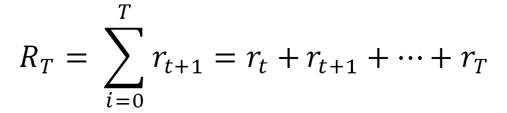

在前面的等式中，*r**T*是将环境带入终端状态*s**T*的行为的回报。为了获得最大的总奖励，我们可以选择为每个单独的状态提供最高奖励的动作。这导致选择使总回报最大化的最优策略。

## 探索优化过程

正如我们在[*第 5 章*](05.html#_idTextAnchor118)*中提到的，基于仿真的马尔可夫决策过程*，MDP 问题可以通过**动态****编程****DP**来解决。DP 是一种编程技术，旨在根据已知的环境模型计算最优策略。DP 的核心是利用国家价值和行动价值来确定好的政策。

在 DP 方法中，使用了两个称为策略评估和策略改进的过程。这些过程相互作用，如下所示：

*   政策评估是通过一个迭代过程来完成的，该过程旨在解决贝尔曼方程。k 过程的收敛性→ ∞ 施加近似规则，从而引入停止条件。
*   策略改进基于当前值改进当前策略。

在 DP 技术中，通过迭代过程，前一阶段交替并在另一阶段开始之前结束。该过程要求在每一步进行策略评估，评估通过迭代方法完成，迭代方法的收敛性先验未知，取决于起始策略；也就是说，我们可以在某个时刻停止评估政策，同时仍然确保收敛到最佳值。

重要提示

我们所描述的迭代过程使用两个向量来保存从策略评估和策略改进过程中获得的结果。我们用*V*表示将包含值函数的向量；即获得的奖励的折扣金额。我们用*政策*指明将包含为获得这些奖励而选择的行动的运营商。

然后，算法通过递归过程更新这两个向量。在策略评估中，值函数更新如下：

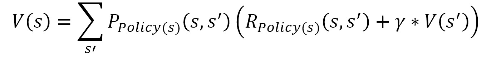

在上一个等式中，我们有以下等式：

*   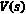为*s*状态下的功能值。
*   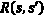是从*s*状态过渡到*s’*状态时返回的奖励。
*   γ是贴现系数。
*   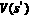为下一状态的功能值。

在策略改进过程中，策略更新如下：


在上一个等式中，我们有以下等式：

*   为*s'*状态下的功能值。
*   是动作*a*从*s*状态过渡到*s’*状态时返回的奖励。
*   γ是贴现系数。
*   是*s*状态下的动作*a*在*s*状态下执行的概率。

现在，让我们看看有哪些工具可以用来处理 Python 中的 MDP 问题。

## 引入 MDPtoolbox

`MDPtoolbox`包包含几个与离散时间马尔可夫决策过程解析相关的函数，即值迭代、有限时间、策略迭代、带有一些变量的线性规划算法，以及几个我们可以用来执行强化学习分析的函数。

该工具箱由法国图卢兹大学应用数学和计算机科学部的研究人员在 Matlab 环境下创建。该工具箱由作者在以下文章中介绍：Chadès，I.，Chapron，G.，Cros，M.J.，Garcia，F.，和 Sabbadin，R.（2014）。*MDPtoolbox：解决随机动态规划问题的多*-*平台工具箱。生态地理学*，37（9），916-920。

重要提示

`MDPtoolbox`包随后在其他编程平台上提供，包括 GNU Octave、Scilab 和 R。S.Cordwell 后来将其提供给 Python 程序员。您可以通过以下 URL 了解更多信息：[https://github.com/sawcordwell/pymdptoolbox](https://github.com/sawcordwell/pymdptoolbox) 。

要使用`MDPtoolbox`包，我们需要安装它。不同的安装程序显示在项目的 GitHub 网站上。按照作者的建议，您可以使用默认的 Python pip 包管理器。**Pip**代表**Python 包索引**，是最大、最正式的 Python 包存储库。在 99%的情况下，任何开发 Python 包的人都可以在这个存储库中使用它。

要使用`pip`安装`MDPtoolbox`包，只需编写以下命令：

```py
pip install pymdptoolbox
```

安装后，只需加载库即可立即使用它。

## 定义小森林经营实例

为了详细分析如何使用马尔可夫过程处理管理问题，我们将使用`MDPtoolbox`包中已有的示例。它涉及管理一个小型森林，其中有两种资源：野生动物和树木。森林里的树木可以砍伐，获得的木材可以出售。决策者有两个动作：等待和停止。第一个动作是等待树木完全生长，然后再切割树木以获得更多的木材。第二项行动是砍树，以便立即赚钱。决策者的任务是每 20 年做出一次决策。

微小的森林环境可能处于以下三种状态之一：

*   **状态 1**：林龄 0-20 年
*   **状态 2**：林龄 21-40 年
*   **状态 3**：林龄超过 40 年

我们可能会认为，最好的行动是等待，直到我们有最大数量的木材来，从而获得最大的收益。等待可能导致失去所有可用的木材。这是因为随着树木的生长，也有可能发生火灾，从而导致木材完全丢失。在这种情况下，微小的森林将恢复到其初始状态（状态 1），因此我们将失去本来可以获得的东西。

在没有发生火灾的情况下，在每个周期*t*（20 年）结束时，如果状态为*s*并且选择了等待动作，则森林将移动到下一个状态，该状态将是以下两个状态中的最小值（*s*+1,3）。如果没有火灾，森林的年龄将永远不会假定状态高于 3，因为状态 3 与最古老的年龄等级匹配。相反，如果在应用操作后发生火灾，则森林会将系统恢复到其初始状态（状态 1），如下图所示：

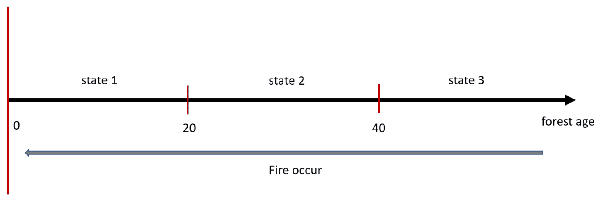

图 10.1——森林年龄状态

将*p*=0.1 设置为*t*期间发生火灾的概率。问题是如何长期管理，以实现回报最大化。这个问题可以作为 MDP 来处理。

现在，让我们继续将问题定义为 MDP。我们已经说过，MDP 的元素是状态、动作、转移矩阵*P*和奖励*R*。然后我们必须定义这些元素。我们已经定义了三个州。我们还定义了操作：等待或剪切。我们通过这些来定义转移矩阵*P*（*s*、*s’*、*a*。它包含系统从一个状态转到另一个状态的机会。我们有两个动作可用（Wait，Cut），所以我们将定义两个转移矩阵。如果我们用*p*表示火灾发生的概率，那么在等待动作的情况下，我们将得到以下转移矩阵：

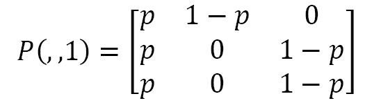

现在，让我们分析一下转移矩阵的内容。每一行都与一个状态相关，即行 1 返回从状态 1 开始，它将保持在状态 1 或传递到状态 2 或 3 的概率。事实上，如果我们处于状态 1，我们将有一个概率*p*保持在该状态，这发生在火灾发生时。始终从状态 1 开始，如果没有发生火灾，我们有剩余的*1-p*概率移动到下一个状态，即状态 2。由此可知，当从状态 1 开始时，传递到状态 3 的概率等于 0——这是不可能的。

转移矩阵的第 2 行包含从状态 2 开始的转移概率。事实上，从状态 2 开始，如果发生火灾，将有相同的概率*p*进入状态 1。始终从状态 2 开始，如果没有发生火灾，我们有剩余的*1-p*概率移动到下一个状态，即状态 3。在这种情况下，保持在状态 2 的概率再次等于 0。

最后，如果我们处于状态 3，如果发生火灾，我们将有一个概率等于*p*进入状态 1，剩余的*1-p*概率保持在状态 3，如果没有发生火灾。进入状态 2 的概率等于 0。

现在，让我们在选择切割动作的情况下定义转换矩阵：


在这种情况下，对先前转移矩阵的分析更为直接。事实上，cut 操作在每个实例中将系统的状态设置为 1。因此，概率始终为 1。然后，对于所有其他转换，该 1 进入状态 1 和 0，因为它们不可能。

现在，让我们定义包含奖励的向量；即向量*R*（*s*、*s’*，我们已经定义过了），从等待动作返回的奖励开始：

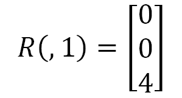

等待森林生长的动作将为前两个状态带来 0 的奖励，而状态 3 的奖励将是最大的。状态 3 中的奖励值等于 4，表示系统默认提供的值。让我们看看如果您选择切割动作，奖励向量是如何修改的：


在这种情况下，在状态 1 下砍伐不会带来任何回报，因为树木还不能供应木材。状态 2 的切割会带来奖励，但这低于最大奖励，我们说如果我们在切割前等待三个时段*t*结束，可以获得最大奖励。如果在第三阶段开始时进行切割，则会出现类似情况。在这种情况下，奖励高于前一状态，但仍低于最大值。

## 使用 MDPtoolbox 解决管理问题

我们的目标是制定一项政策，允许我们管理这片小小的森林，以获得最大的奖励。我们将使用上一节介绍的`MDPtoolbox`包，逐行分析代码：

1.  Let's start as always by importing the necessary library:

    ```py
    import mdptoolbox.example
    ```

    通过这样做，我们导入了包含本例数据的`MDPtoolbox`模块。

2.  To begin, we will extract the transition matrix and the reward vectors:

    ```py
    P, R = mdptoolbox.example.forest()
    ```

    此命令检索存储在示例中的数据。为了确认数据是否正确，我们从转换矩阵开始打印这些变量的内容：

    ```py
    print(P[0])
    ```

    打印以下矩阵：

    ```py
    [[0.1 0.9 0\. ]
     [0.1 0\.  0.9]
     [0.1 0\.  0.9]]
    ```

    这是等待动作的转移矩阵。与*定义小森林管理示例*一节中所述一致，设置了*p=0.1*，我们可以确认过渡矩阵。

    现在，我们打印与切割动作相关的转移矩阵：

    ```py
    print(P[1])
    ```

    打印以下矩阵：

    ```py
    [[1\. 0\. 0.]
     [1\. 0\. 0.]
     [1\. 0\. 0.]]
    ```

    该矩阵也与之前定义的一致。现在，让我们检查奖励向量的形状，从等待操作开始：

    ```py
    print(R[:,0])
    ```

    让我们看看内容：

    ```py
    [0\. 0\. 4.]
    ```

    如果选择切割动作，我们将获得以下奖励：

    ```py
    print(R[:,1])
    ```

    将打印以下向量：

    ```py
    [0\. 1\. 2.]
    ```

    最后，让我们确定折扣系数：

    ```py
    gamma=0.9
    ```

    所有问题数据现已定义。现在，我们可以继续更详细地查看模型。

3.  The time has come to apply the policy iteration algorithm to the problem we have just defined:

    ```py
    PolIterModel = mdptoolbox.mdp.PolicyIteration(P, R, gamma)
    PolIterModel.run()
    ```

    `mdptoolbox.mdp.PolicyIteration()`函数执行折扣 MDP，该 MDP 使用策略迭代算法求解。策略迭代是一种动态规划方法，它采用一个值函数来仿真每对动作状态的预期收益。这些技术在一个称为 bootstrapping 的过程中使用即时奖励和下一个状态的（折扣）值来更新值函数。结果存储在表格中或使用近似函数技术。

    函数从初始的*P0*策略开始，通过迭代过程更新函数值和策略，交替以下两个阶段：

    *   **策略评估**：给定当前策略*P*，估算动作值函数。
    *   **Policy Improvement**: If we calculate a better policy based on the action-value function, then this policy is made the new policy and we return to the previous step.

        当可以精确计算每个动作状态对的值函数时，我们使用贪婪策略改进执行的策略迭代通过返回最优策略而导致收敛。本质上，反复执行这两个过程会使一般过程收敛到最优解。

        在`mdptoolbox.mdp.PolicyIteration()`函数中，我们传递了以下参数：

    *   **P**：转移概率
    *   **R**：奖励
    *   **gamma**: Discount factor

        返回以下结果：

    *   **V**：最优值函数。*V*是一个*S*长度向量。
    *   **策略**：最优策略。策略是一个*S*长度向量。每个元素都是一个整数，对应于使值函数最大化的操作。在本例中，仅预见两个操作：0=等待，1=切割。
    *   **iter**：迭代次数。
    *   **time**: CPU time used to run the program.

        现在模型已经准备好了，我们必须通过检查获得的策略来评估结果。

        首先，我们检查 value 函数的更新：

        ```py
        print(PolIterModel.V)
        ```

        返回以下结果：

        ```py
        (26.244000000000014, 29.484000000000016, 33.484000000000016)
        ```

        值函数指定状态对系统的影响程度。此值表示状态为*s*的系统预期的总奖励。值函数取决于代理为要执行的操作选择的策略。

        让我们继续并提取策略：

        ```py
        print(PolIterModel.policy)
        ```

        策略建议系统在给定时间的行为。它映射检测到的环境状态以及处于这些状态时要采取的操作。这与心理学中所谓的刺激反应的一组规则或关联相对应。策略是 MDP 模型的关键元素，因为它定义了行为。返回以下结果：

        ```py
        (0, 0, 0)
        ```

        在这里，最好的政策是不要在这三个州都砍伐森林。这是因为发生火灾的概率较低，这导致等待动作是执行的最佳动作。通过这种方式，森林有时间生长，我们可以实现两个目标：维护野生动物的老林，并通过出售砍伐的木材来赚钱。

        让我们看看已经进行了多少次迭代：

        ```py
        print(PolIterModel.iter)
        ```

        返回以下结果：

        ```py
        2
        ```

        最后，让我们打印 CPU 时间：

        ```py
        print(PolIterModel.time)
        ```

        返回以下结果：

        ```py
        0.12830829620361328
        ```

        执行数值迭代程序只需 0.13 秒。

## 改变火灾概率

前面例子的分析阐明了如何从一个适定的问题中得出最优策略。我们现在可以通过改变系统的初始条件来定义一个新问题。在我们示例中提供的默认条件下，发生火灾的概率很低。在这种情况下，我们看到最优政策建议我们等待，而不是砍伐森林。但是如果我们增加了火灾发生的概率呢？这是一个真实的情况；只要想想温暖的地方，特别是受强风影响的地方。要仿真这种新情况，只需通过更改概率值*p*来更改问题设置。`mdptoolbox.example.forest()`模块允许我们修改问题的基本特征。让我们开始：

1.  Let's start by importing the example module:

    ```py
    import mdptoolbox.example
    P, R = mdptoolbox.example.forest(3,4,2,0.8)
    ```

    与上一节讨论的示例不同，*解决管理问题*，我们使用了`MDPtoolbox`，在本例中，我们传递了一些参数。让我们详细分析一下。在`mdptoolbox.example.forest ()`函数中，我们传递了以下参数（3、4、2、0.8）。让我们分析一下它们的含义：

    `3`：州数。这必须是大于 0 的整数。

    `4`：森林处于最古老状态且执行等待动作时的奖励。这必须是大于 0 的整数。

    `2`：森林处于最古老状态且执行砍伐动作时的奖励。这必须是大于 0 的整数。

    `0.8`：火灾发生的概率。这必须在[0,1]中。

    通过分析过去的数据，我们可以看到我们确认了前三个参数，而我们只改变了发生火灾的概率，从而将这种可能性从 0.1 增加到了 0.8。

    让我们看看初始数据的变化，因为它改变了转移矩阵：

    ```py
    print(P[0])
    ```

    打印以下矩阵：

    ```py
    [[0.8 0.2 0\. ]
     [0.8 0\.  0.2]
     [0.8 0\.  0.2]]
    ```

    正如我们所看到的，与等待动作相关联的转移矩阵已经改变。现在，跃迁处于非 1 状态的概率显著降低。这是因为火灾发生的概率很高。让我们看看当过渡矩阵链接到切割动作时会发生什么：

    ```py
    print(P[1])
    ```

    打印以下矩阵：

    ```py
    [[1\. 0\. 0.]
     [1\. 0\. 0.]
     [1\. 0\. 0.]]
    ```

    该矩阵保持不变。这是由于剪切操作的结果，该操作将系统返回到其初始状态。同样，奖励向量可能会保持不变，因为传递的奖励与默认问题提供的奖励相同。让我们打印这些值：

    ```py
    print(R[:,0])
    ```

    这是连接到等待操作的奖励向量。将打印以下向量：

    ```py
    [0\. 0\. 4.]
    ```

    在切割动作的情况下，将重新调整以下向量：

    ```py
    print(R[:,1])
    ```

    将打印以下向量：

    ```py
    [0\. 1\. 2.]
    ```

    正如预期的那样，没有任何变化。最后，让我们确定折扣系数：

    ```py
    gamma=0.9
    ```

    所有问题数据现在都已定义。现在，我们可以继续更详细地查看模型。

2.  We will now apply the value iteration algorithm:

    ```py
    PolIterModel = mdptoolbox.mdp.PolicyIteration(P, R, gamma)
    PolIterModel.run()
    ```

    现在，我们可以从 value 函数开始提取结果：

    ```py
    print(PolIterModel.V)
    ```

    将打印以下结果：

    ```py
    (1.5254237288135597, 2.3728813559322037, 6.217445225299711)
    ```

    现在，让我们分析问题的关键部分：让我们看看仿真模型向我们建议了什么策略：

    ```py
    print(PolIterModel.policy)
    ```

    将打印以下结果：

    ```py
    (0, 1, 0)
    ```

    在本例中，与默认示例相比，我们在这里所做的更改是实质性的。如果我们处于状态 1 和状态 3，建议我们采取等待行动，而如果我们处于状态 2，则建议尝试砍伐森林。由于发生火灾的可能性很高，因此在火灾完全摧毁之前，切割现有木材并将其出售是很方便的。

    然后，我们打印问题的迭代次数：

    ```py
    print(PolIterModel.iter)
    ```

    将打印以下结果：

    ```py
    1
    ```

    最后，我们打印 CPU 时间：

    ```py
    print(PolIterModel.time)
    ```

    将打印以下结果：

    ```py
    0.14069104194641113
    ```

    这些示例强调了通过使用 MDP，管理问题的建模过程是多么简单。

# 采用蒙特卡罗仿真法安排项目时间

每个项目需要一个实现的时间，有些活动的开始可以是独立的，也可以依赖于以前的活动结束。计划项目意味着确定项目本身的实现时间。项目是为创造独特的产品、服务或结果而进行的临时工作。术语**项目****管理**是指运用知识、技能、工具和技术来规划、管理和控制项目及其组成的活动。

该领域的关键人物是项目经理，其任务和责任是协调和控制相关的各个组成部分和参与者，以降低项目失败的概率。这一系列活动的主要困难在于，要实现根据项目范围、时间、成本、质量和资源等约束条件设定的目标。事实上，这些都是相互关联的有限方面，需要进行有效的优化。

这些活动的定义是规划阶段的关键时刻之一。在确定了项目的时间、成本和资源目标后，有必要确定并记录成功完成项目所必须进行的活动。

对于复杂的项目，有必要通过将项目分解为更简单的任务来创建有序的结构。对于每个任务，都需要定义活动和执行时间。这从主要目标开始，并将项目分解到构成项目的所有可交付成果或主要子项目的较低级别。

反过来，这些将被分解。这将一直持续到您对最终项目的详细程度感到满意为止。每一次细分都会降低相关方的规模、复杂性和成本。

## 定义调度网格

所有项目管理的一个基本部分是构建调度网格。这是一个定向图，表示项目实现中涉及的活动之间的时间顺序和逻辑依赖关系。除了构建网格外，调度过程还根据持续时间、资源等因素确定活动的开始和结束时间。

在我们正在处理的示例中，我们将考虑评估实现复杂项目所需的时间。让我们从定义调度网格开始。假设通过分解项目结构，我们定义了六个任务。对于每个任务，定义了活动、涉及的人员以及完成工作所需的时间。

某些任务必须以一系列的方式执行，即必须完成上一个任务的活动，以便可以开始下一个任务的活动。然而，其他任务可以并行执行，即两个团队可以同时处理两个不同的任务，以缩短项目交付时间。该任务序列在调度网格中定义如下：

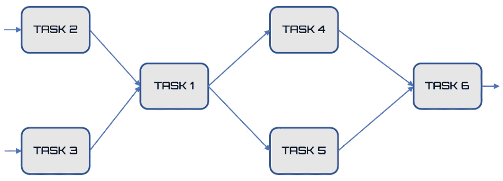

图 10.2–网格中的任务顺序

上图显示了前两个任务是并行开发的，这意味着完成这两个任务所需的时间将由耗时的任务提供。第三项任务是一系列的，而下两项任务又是并行的。最后一项任务仍在本系列中。当我们评估项目时间时，这一顺序是必要的。

## 估计任务的时间

这些任务的持续时间通常很难估计，因为有许多因素可以影响任务的持续时间：资源的可用性和/或生产率、活动之间的技术和物理限制以及合同承诺。

在任何可能的情况下，都可以使用由历史信息支持的专家建议。项目团队成员还将能够通过从类似项目中获取信息，提供关于任务持续时间或最大建议期限的信息。

有几种方法可以估计任务。在本例中，我们将使用三点估计。在三点估计中，可以根据原始估计中的风险量提高活动估计持续时间的准确性。三点估算基于确定以下三种类型的估算：

*   **乐观**：活动的持续时间基于与最可能估计中描述的情况相关的最佳情景。这是完成任务所需的最短时间。
*   **悲观**：活动的持续时间基于与最可能估计中描述的情况相关的最坏情况。这是完成任务所需的最长时间。
*   **更有可能**：活动的持续时间基于对计划活动可用性的现实预期。

可以使用三个估计持续时间的平均值来构建活动持续时间的第一个估计值。该平均值通常比更可能的单一值估计值更准确地估计活动的持续时间。但这不是我们想要做的。

假设项目团队对这六项任务中的每一项都使用了三点估计。下表显示了团队建议的时间：

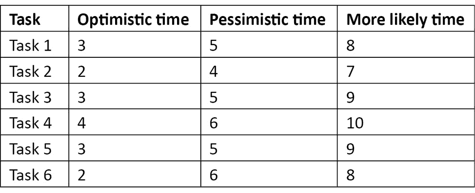

在定义了任务的顺序和执行每个单独任务所需的时间之后，我们可以开发一个算法来估计项目的总体时间。

## 开发项目调度算法

在本节中，我们将分析基于蒙特卡罗仿真的项目调度算法。我们将逐行详细介绍所有命令：

1.  Let's start by importing the libraries that we will be using in the algorithm:

    ```py
    import numpy as np
    import random
    import pandas as pd
    ```

    `numpy`是一个 Python 库，其中包含许多函数，可帮助我们管理多维矩阵。此外，它还包含大量高级数学函数，我们可以在这些矩阵上使用这些函数。

    `random`库为各种分布实现伪随机数生成器。`random`模块基于 Mersenne Twister 算法。

    `pandas`库是一个开放源码的 BSD 许可库，其中包含可用于为 Python 编程语言操作高性能数值的数据结构和操作。

2.  Let's move on and initialize the parameters and the variables:

    ```py
    N = 10000
    TotalTime=[]
    T =  np.empty(shape=(N,6)) 
    ```

    `N`表示我们生成的点数。这些是帮助我们定义任务时间的随机数。`TotalTime`变量是一个列表，其中包含完成项目所需总时间的`N`评估。最后，`T`变量是一个包含`N`行和六列的矩阵，将包含完成每个单独任务所需时间的`N`评估。

3.  Now, let's set the three-point estimation matrix, as defined in the table in the *Estimating the task's time* section:

    ```py
    TaskTimes=[[3,5,8],
               [2,4,7],
               [3,5,9],
               [4,6,10],
               [3,5,9],
               [2,6,8]]
    ```

    此矩阵包含六项任务中每一代表行的三次：乐观、更有可能和悲观。

在这一点上，我们必须确定我们打算采用的时间分配形式。

## 探索三角分布

在开发仿真模型时，有必要引入概率事件。通常，仿真过程在您获得有关输入数据行为的足够信息之前开始。这迫使我们决定分配。适用于不完整数据的是三角分布。当可以对最小值和最大值以及模态值进行假设时，使用三角形分布。

重要提示

概率分布是一种数学模型，它将变量的值与观察到这些值的概率联系起来。概率分布用于仿真与参考人群或研究者观察给定样本的所有案例相关的感兴趣现象的行为。

在[*第 3 章*](03.html#_idTextAnchor076)*【概率和数据生成过程*中，我们分析了最广泛使用的概率分布。当随机变量定义在一定范围内，但有理由相信置信度从中心到极值呈线性下降时，存在所谓的三角分布。这种分布对于计算测量不确定性非常有用，因为在许多情况下，这种类型的模型可能比均匀模型更现实。

让我们考虑一下我们正在分析的项目的第一个任务。为此，我们定义了三次：乐观（3）、更有可能（5）和悲观（8）。我们画了一张图表，其中我们在横坐标上报告了这三次，并在纵坐标上报告了它们出现的概率。使用三角概率分布，事件发生的概率介于极限值之间，在我们的例子中，这是乐观和悲观的。我们这样做的同时假设最大值与更可能出现的值对应。对于我们一无所知的中间值，假设概率从乐观到更有可能线性增加，然后总是从更有可能到悲观线性减少，如下图所示：

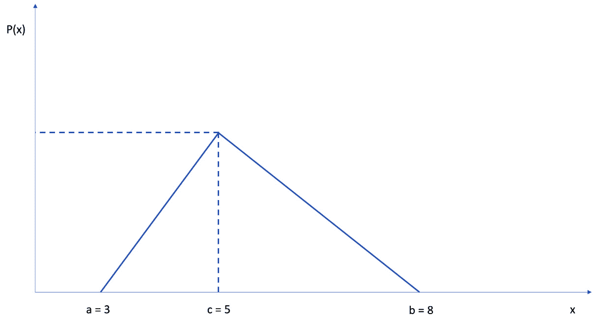

图 10.3–概率图

我们的目标是使用在区间（0，1）内均匀分布的随机变量对每个单独任务的时间进行建模。如果我们用`trand`表示该随机变量，那么三角分布允许我们评估任务在该时间内结束的概率。在三角形分布中，我们确定了两个横坐标与 x=c 相同的三角形。此值用作分布假定的两个值之间的分隔符。让我们用`Lh`来表示它。由以下公式得出：


在上一个等式中，我们有以下等式：

*   *a*：乐观时刻
*   *b*：悲观时间
*   *c*：更有可能的时间

这就是说，我们可以根据三角形分布，通过以下等式产生变化：


前面的方程式允许我们进行蒙特卡罗仿真。让我们看看如何：

1.  First, we generate the separation value of the triangular distribution:

    ```py
    Lh=[]
    for i in range(6):
        Lh.append((TaskTimes[i][1]-TaskTimes[i][0])
                 /(TaskTimes[i][2]-TaskTimes[i][0]))
    ```

    在这里，我们初始化一个列表，然后用一个`for`循环填充它，该循环迭代六个任务，并为每个任务计算`Lh`的值。

    现在，我们使用两个`for`循环和一个`if`条件结构来开发蒙特卡罗仿真：

    ```py
    for p in range(N):
        for i in range(6):
            trand=random.random()
            if (trand < Lh[i]):
                T[p][i] = TaskTimes[i][0] + 
                       np.sqrt(trand*(TaskTimes[i][1]-  
                       TaskTimes[i][0])*
                       (TaskTimes[i][2]-TaskTimes[i][0]))
            else:
                T[p][i] = TaskTimes[i][2] – 
                       np.sqrt((1-trand)*(TaskTimes[i][2]-
                       TaskTimes[i][1])*
                      (TaskTimes[i][2]-TaskTimes[i][0]))
    ```

    第一个`for`循环继续生成随机值*N*次，第二个循环用于对六个任务进行评估。另一方面，条件结构`if`用于区分与*Lh*值不同的两个值，以便它可以使用我们之前定义的两个方程。

    最后，对于*N*次迭代中的每一次，我们计算项目执行的总时间估算值：

    ```py
    TotalTime.append( T[p][0]+        
                     np.maximum(T[p][1],T[p][2]) + 
                     np.maximum(T[p][3],T[p][4]) + T[p][5])
    ```

    对于总时间的计算，我们参考*定义调度网格*部分中定义的调度网格。这个过程很简单：如果任务以一系列的方式展开，那么您可以将时间相加，而如果它们以并行方式展开，那么您可以在任务的时间中选择最大值。

2.  Now, let's take a look at the values we have attained:

    ```py
    Data = pd.DataFrame(T,columns=['Task1', 'Task2', 'Task3', 
                                  'Task4', 'Task5', 'Task6'])
    pd.set_option('display.max_columns', None)  
    print(Data.describe())
    ```

    对于使用蒙特卡罗方法估计的时间的详细统计信息，我们将包含时间的矩阵（*Nx6*转换为数据帧。原因是`pandas`库具有有用的函数，允许我们立即从数据集中提取详细的统计数据。事实上，我们可以通过使用`describe()`函数使用只需一行代码就可以做到这一点。

    `describe()`函数生成一系列描述性统计数据，返回有关数据集分散度和分布形式的有用信息。

    pandas`set.option()`函数用于显示矩阵的所有统计信息，而不是默认情况下显示矩阵的一部分。

    返回以下结果：

    

    图 10.4–数据帧的值

    通过分析这些统计数据，我们确认估计时间介于问题施加的极限值之间：乐观和悲观。事实上，最小和最大时间非常接近这些值。此外，我们可以看到标准偏差非常接近单位。最后，我们可以确认我们已经生成了 10000 个值。

    我们现在可以追踪时间值分布的直方图，以分析其形式：

    ```py
    hist = Data.hist(bins=10)
    ```

    打印以下图表：

    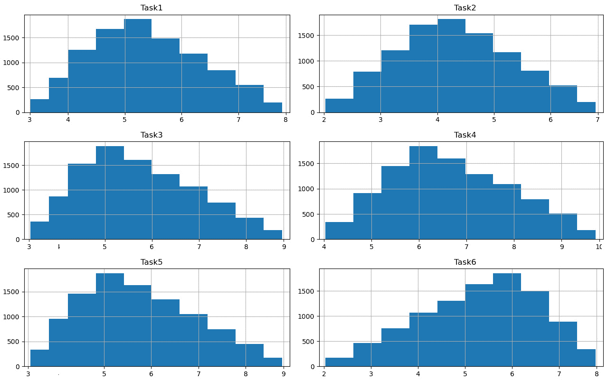

    图 10.5–值的直方图

    通过分析前面的图表，我们可以确认时间估计的三角形分布，正如我们在计算开始时施加的。

3.  At this point, we only need to print the statistics of the total times. Let's start with the minimum value:

    ```py
    print("Minimum project completion time = ",
                            np.amin(TotalTime))
    ```

    返回以下结果：

    ```py
    Minimum project completion time =  14.966486785163458
    ```

    让我们分析一下平均值：

    ```py
    print("Mean project completion time = ",np.mean(TotalTime))
    ```

    返回以下结果：

    ```py
    Mean project completion time =  23.503585938922157
    ```

最后，我们将打印最大值：

```py
print("Maximum project completion time = ",np.amax(TotalTime))
```

将打印以下结果：

```py
Maximum project completion time =  31.90064194829465
```

通过这种方式，我们获得了基于蒙特卡罗仿真完成项目所需时间的估计值。

# 总结

在本章中，我们讨论了几个基于项目管理相关模型的实际模型仿真应用。首先，我们研究了项目管理的基本要素，以及如何仿真这些因素来检索有用的信息。

接下来，我们解决了为木材贸易经营一个小森林的问题。我们将该问题视为 MDP，总结了这些过程的基本特征，然后对其进行了实际讨论。我们定义了问题的要素，然后了解了如何使用政策评估和政策改进算法来获得最佳森林管理政策。这个问题是通过使用 Python 提供的`MDPtoolbox`包解决的。

随后，我们讨论了使用蒙特卡罗仿真评估项目执行时间的问题。首先，我们通过指定哪些任务串联执行，哪些任务并联执行来定义任务执行图。因此，我们通过三点估计介绍了每个任务的时间。在此之后，我们了解了如何使用每个阶段的随机评估，以三角形分布对项目的执行时间进行建模。最后，我们对整个项目时间进行了 10000 次评估。

在下一章中，我们将总结前面几章中介绍的仿真建模过程。然后，我们将探讨在现实生活中使用的主要仿真建模应用程序。最后，我们将发现有关仿真建模的未来挑战。